---

---

# 课程介绍 

课程名称:

Kudu详解

课程目标:

​       通过本模块的学习，能够掌握kudu搭建、kudu整体架构、底层存储、读写原理、java api操作、spark api操作、impala与kudu集成

课程大纲:

1、kudu简介

2、 kudu架构介绍

3、 kudu的安装部署

4、 Java操作KUDU

5、spark操作KUDU

6、impala与kudu的集成与操作

7、kudu存储机制

8、kudu的工作机制


# 课程内容

## 1、kudu简介

1.1、背景介绍

```
在KUDU之前，大数据主要以两种方式存储；	
（1）静态数据：
	以 HDFS 引擎作为存储引擎，适用于高吞吐量的离线大数据分析场景。
这类存储的局限性是数据无法进行随机的读写。 

（2）动态数据：
	以 HBase、Cassandra 作为存储引擎，适用于大数据随机读写场景。
这类存储的局限性是批量读取吞吐量远不如 HDFS，不适用于批量数据分析的场景。

	从上面分析可知，这两种数据在存储方式上完全不同，进而导致使用场景完全不同，但在真实的场景中，边界可能没有那么清晰，面对既需要随机读写，又需要批量分析的大数据场景，该如何选择呢？这个场景中，单种存储引擎无法满足业务需求，我们需要通过多种大数据工具组合来满足这一需求。
```

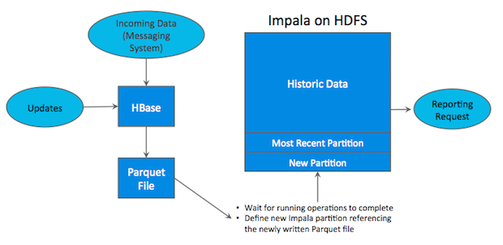

```
如上图所示，数据实时写入 HBase，实时的数据更新也在 HBase 完成，为了应对 OLAP 需求，我们定时（通常是 T+1 或者 T+H）将 HBase 数据写成静态的文件（如：Parquet）导入到 OLAP 引擎（如：HDFS）。这一架构能满足既需要随机读写，又可以支持 OLAP 分析的场景，但他有如下缺点：

(1)架构复杂。从架构上看，数据在HBase、消息队列、HDFS 间流转，涉及环节太多，运维成本很高。并且每个环节需要保证高可用，都需要维护多个副本，存储空间也有一定的浪费。最后数据在多个系统上，对数据安全策略、监控等都提出了挑战。

(2)时效性低。数据从HBase导出成静态文件是周期性的，一般这个周期是一天（或一小时），在时效性上不是很高。

(3)难以应对后续的更新。真实场景中，总会有数据是延迟到达的。如果这些数据之前已经从HBase导出到HDFS，新到的变更数据就难以处理了，一个方案是把原有数据应用上新的变更后重写一遍，但这代价又很高。

	为了解决上述架构的这些问题，KUDU应运而生。KUDU的定位是Fast Analytics on Fast Data，是一个既支持随机读写、又支持 OLAP 分析的大数据存储引擎。
```

### 1.2、kudu是什么？

 Apache Kudu是由Cloudera开源的存储引擎，可以同时提供低延迟的随机读写和高效的数据分析能力。它是一个融合HDFS和HBase的功能的新组件，具备介于两者之间的新存储组件。
   Kudu支持水平扩展，并且与Cloudera Impala和Apache Spark等当前流行的大数据查询和分析工具结合紧密

  简单来说:kudu是一个与hbase类似的列式存储分布式数据库。

  官方给kudu的定位是:在**更新更及时的基础上实现更快的数据分析**

### 1.3、kudu的应用场景

1、实时的数据更新

2、时间序列相关的应用，需要同时支持根据海量历史数据查询，必须非常快地返回关于单个实体的细粒度查询

3、实时预测模型的应用，支持根据所有历史数据周期地更新模型

## 2、架构介绍

### 2.1、基本架构

```
	  与HDFS和HBase相似，Kudu使用单个的Master节点，用来管理集群的元数据，并且使用任意数量的Tablet Server（可对比理解HBase中的RegionServer角色）节点用来存储实际数据。可以部署多个Master节点来提高容错性。一个table表的数据，被分割成1个或多个Tablet，Tablet被部署在Tablet Server来提供数据读写服务。
```

 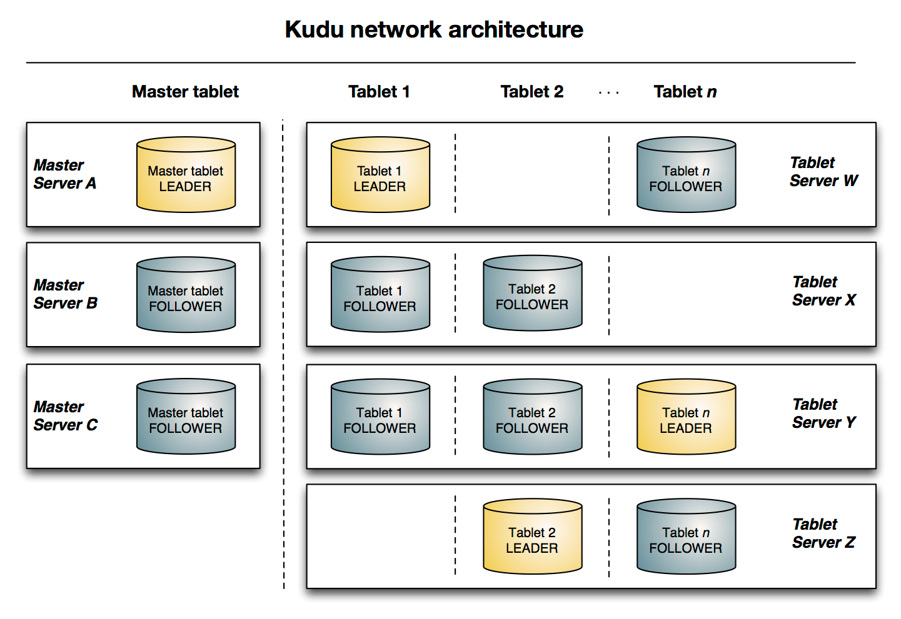 

### 2.1.1、概念

-  **Table**（表）：一张table是数据存储在kudu的位置。Table具有schema和全局有序的primary key(主键)。Table被分为很多段，也就是tablets.


-  **Tablet** (段)：一个tablet是一张table连续的segment，与其他数据存储引擎或关系型数据的partition相似。Tablet存在副本机制，其中一个副本为leader tablet。任何副本都可以对读取进行服务，并且写入时需要在所有副本对应的tablet server之间达成一致性。

-  **Tablet server**：存储tablet和为tablet向client提供服务。对于给定的tablet，一个tablet server充当leader，其他tablet server充当该tablet的follower副本。只有leader服务写请求，leader与follower为每个服务提供读请求。

-  **Master**：主要用来管理元数据(元数据存储在只有一个tablet的catalog table中)，即tablet与表的基本信息，监听tserver的状态

-  **Catalog Table:** 元数据表，用来存储table(schema、locations、states)与tablet（现有的tablet列表，每个tablet及其副本所处tserver，tablet当前状态以及开始和结束键）的信息。

## 3、kudu的搭建

### 3.1、节点规划

| 节点     | Kudu-master | Kudu-tserver |
| -------- | ----------- | ------------ |
| hadoop01 | 是          | 是           |
| hadoop02 | 是          | 是           |
| hadoop03 | 是          | 是           |


### 3.2、配置本地CDH yum源

#### 3.2.1、上传压缩包并解压

```
cd /data02/ 

tar -zxvf cdh5.14.0-centos6.tar.gz
```


#### 3.2.2、制作本地yum源

##### 3.2.2.1、安装httpd

```
yum -y install httpd
```


##### 3.2.2.2、启动httpd服务

```
service httpd start
```


##### 3.2.2.3、指定yum rpm下载地址

```linux
cd /etc/yum.repos.d

vi localimp.repo

 

[localimp]

name=localimp

baseurl=http://hadoop01/5.14.0

gpgcheck=0

enabled=1
```


##### 3.2.2.4、创建httpd读取连接

```
ln -s /data02/cdh/5.14.0 /var/www/html/
```


##### 3.2.2.5、查看yum源是否安装成功

页面访问本地yum源，出现这么界面表明本地yum源制作成功 访问<http://hadoop01/5.14.0/>

```
访问异常：You don't have permission to access /cdh5.14.0/ on this server
需要关闭Selinux服务
	（1）临时关闭
			执行命令：setenforce 0
	 (2) 永久关闭	
	 		vim /etc/sysconfig/selinux
			SELINUX=enforcing 改为 SELINUX=disabled
			重启服务reboot
```

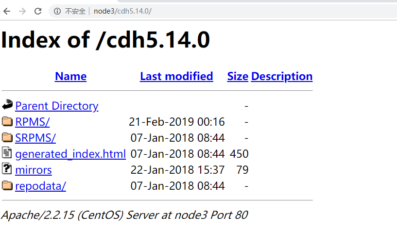                                                  

##### 3.2.2.6、将制作好的localimp.repo 发送到所有待安装kudu的主机上

```
cd /etc/yum.repos.d/

scp localimp.repo hadoop02:$PWD

scp localimp.repo hadoop03:$PWD
```


#### 3.2.3、安装kudu

在不同节点上下载不同的进程即可，

| hadoop01 | yum install -y kudu kudu-master   kudu-tserver kudu-client0 kudu-client-devel |
| -------- | ------------------------------------------------------------ |
| hadoop02 | yum install -y kudu kudu-master   kudu-tserver kudu-client0 kudu-client-devel |
| hadoop03 | yum install -y kudu kudu-master   kudu-tserver kudu-client0 kudu-client-devel |

命令说明:

```shell
yum install kudu # Kudu的基本包 
yum install kudu-master # KuduMaster 
yum install kudu-tserver # KuduTserver 
yum install kudu-client0 #Kudu C ++客户端共享库 
yum install kudu-client-devel # Kudu C ++客户端共享库 SDK
```


#### 3.2.4、配置master和tserver节点

- 修改kudu-master文件

```shell
cat /etc/default/kudu-master


export FLAGS_log_dir=/var/log/kudu

export FLAGS_rpc_bind_addresses=每台master对应的主机名:7051 
```

-  修改kudu-tserver文件

```shell
cat /etc/default/kudu-tserver

export FLAGS_log_dir=/var/log/kudu

export FLAGS_rpc_bind_addresses=每台tserver对应的主机名:7050
```

-  修改master.gflagfile文件

```shell
cat /etc/kudu/conf/master.gflagfile

 

--fromenv=rpc_bind_addresses

--fromenv=log_dir

--fs_wal_dir=/export/servers/kudu/master  #指定wal存储路径

--fs_data_dirs=/export/servers/kudu/master #指定数据存储路径

--master_addresses=hadoop01:7051,hadoop02:7051,hadoop03:7051 #指定所有master
```

-  修改tserver.gflagfile文件

```shell
cat /etc/kudu/conf/tserver.gflagfile

 

--fromenv=rpc_bind_addresses

--fromenv=log_dir

--fs_wal_dir=/export/servers/kudu/tserver 

--fs_data_dirs=/export/servers/kudu/tserver

--tserver_master_addrs=hadoop01:7051,hadoop02:7051,hadoop03:7051
```

**注意**:kudu的默认权限是kudu，如果是root用户，需要将/export/servers/kudu的权限修改为kudu

```shell
mkdir -p /export/servers/kudu
chown -R kudu:kudu /export/servers/kudu
```


#### 3.2.5、权限修改

配置完成后需要将4个配置文件与/export/servers/kudu的权限修改为当前用户的使用权限[**只限普通用户**]

另外:如果使用普通用户，需要为普通用户配置sudo权限，/etc/sudoers中添加

```shell
vi /etc/sudoers
```

   

#### 3.2.6、启动

- 1、启动的时候要注意时间同步

  - 安装ntp服务
    - yum -y install ntp
  - 设置开机启动
    - service ntpd start 
    - chkconfig ntpd on
  - 可以在每台服务器执行
    - /etc/init.d/ntpd restart

- 2、启动命令

  - 在每台服务器上都执行下面脚本

    ```shell
    service kudu-master start
    service kudu-tserver start
    
    或者
    sudo service kudu-master start
    sudo service kudu-tserver start
    ```

#### 3.2.7、关闭kudu

```shell
service kudu-master stop
service kudu-tserver stop

或者

sudo service kudu-master stop
sudo service kudu-tserver stop
```


#### 3.2.8、安装过程中可能出现的问题

1、给用户添加权限时报错

```
sudo: /etc/sudoers is world writable

解决方式:pkexec chmod 555 /etc/sudoers
```

2、启动kudu报错

```
_s.ok()

Bad status: Service unavailable: Cannot initialize clock: Error reading

clock. Clock considered unsynchronized

解决方式:

yum -y install ntp

service ntpd start

chkconfig ntpd on
```

3、启动过程中报错

```
_s.ok() Bad

status: Invalid argument: Unable to initialize catalog manager: Failed to

initialize sys tables async: on-disk master list

解决方式:

1)  停掉所有的master与tserver

2)  删除数据目录所有数据: /export/servers/kudu/master/*和/export/servers/kudu/tserver/*
```

4、启动过程中报错

```
unable to create file

system roots: unable to write instance metadata: Call to mkstemp() failed

on name template /export/servers/kudu/master/instance.kudutmp.XXXXXX:

Permission denied (error 13)

解决方式:这是因为默认使用Kudu权限进行执行，可能遇到文件夹权限不一的情况，修改文件夹权限即可
```


#### 3.2.9、访问kudu webUI界面:http://hadoop01:8051,查看master与tserver是否全部启动

1、kudu webui界面:

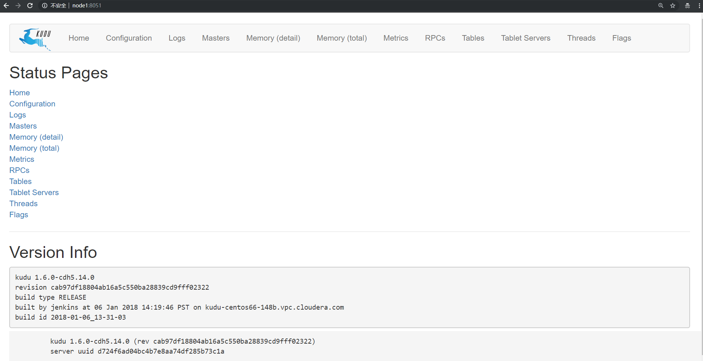

2、master界面:http://hadoop01:8051/masters

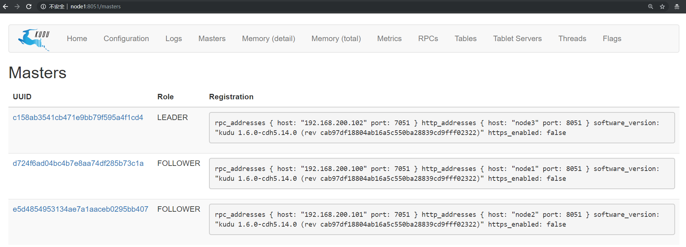

3、tserver界面:http://hadoop01:8051/tablet-servers

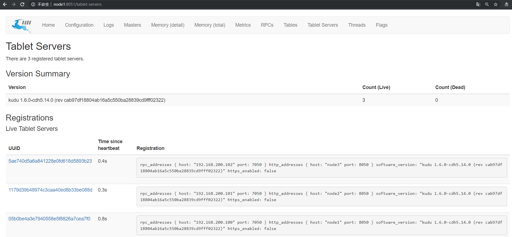

## 4、KUDU的java操作

### 4.1、导入依赖

```xml
<dependencies>     

       <dependency>

            <groupId>org.apache.kudu</groupId>

            <artifactId>kudu-client</artifactId>

            <version>1.6.0</version>

        </dependency>


        <dependency>

            <groupId>junit</groupId>

            <artifactId>junit</artifactId>

            <version>4.12</version>

        </dependency>

</dependencies>
```


### 4.2、JAVA API

#### 4.2.1、表创建

   

```java
 /**

    * 创建表

    * @throws Exception

    */

   public static void createTable() throws Exception{

       //1、创建一个client

       KuduClient client = new KuduClientBuilder(KUDU_MASTER).build();

       //2、创建schema信息

       List<ColumnSchema> columns = new ArrayList<ColumnSchema>();

       columns.add(new ColumnSchema.ColumnSchemaBuilder("id", Type.INT32).key(true).nullable(false).build());

        columns.add(new ColumnSchema.ColumnSchemaBuilder("name", Type.STRING).key(false).nullable(false).build());

        columns.add(new ColumnSchema.ColumnSchemaBuilder("age", Type.INT32).key(false).nullable(false).build());

        Schema schema = new Schema(columns);

        //3、指定分区字段

        List<String> partions = new ArrayList<String>();

        partions.add("id");

        //4、指定分区方式为hash分区、6个分区，一个副本

        CreateTableOptions options = new CreateTableOptions().addHashPartitions(partions, 6).setNumReplicas(1);

       //5、创建表，

       client.createTable("person",schema,options);

       client.close();

   }
```


#### 4.2.2、Insert

​       **插入数据，主键不能为空**

​    

```java
/**

     * 插入数据

     * @throws Exception

     */

    public static void add() throws Exception{

        //1、创建一个client

        KuduClient client = new KuduClientBuilder(KUDU_MASTER).build();

        //2、打开表

        KuduTable table = client.openTable("person");

        //3、创建一个session会话

        KuduSession session = client.newSession();

              //手动刷新

session.setFlushMode(SessionConfiguration.FlushMode.MANUAL_FLUSH);

//设置缓存大小

session.setMutationBufferSpace(500);

        //4、创建插入

        Insert insert = table.newInsert();

        //5、指定插入数据

        insert.getRow().addInt("id",1);

        insert.getRow().addInt("age",18);

        insert.getRow().addString("name","张三");

        //6、应用插入

        session.apply(insert);

              session.flush();

        session.close();
        client.close();
    }
```


#### 4.2.3、update

​      **更新数据，主键不能为空**

​    

```java
/**

     * 更新数据

     * @throws Exception

     */

    public static void update() throws Exception{

        //1、创建kudu client

        KuduClient client = new KuduClientBuilder(KUDU_MASTER).build();

        //2、打开表

        KuduTable table = client.openTable("person");

        KuduSession session = client.newSession();

              //手动刷新

session.setFlushMode(SessionConfiguration.FlushMode.MANUAL_FLUSH);

//设置缓存大小

session.setMutationBufferSpace(500);

        Update update = table.newUpdate();

        update.getRow().addInt("id",1);

        update.getRow().addString("name","李四");

        session.apply(update);

        session.flush();

        session.close();
        client.close();

    }
```


#### 4.2.4、delete

​       **删除数据，主键不能为空，删除是只能用主键，如果添加了非主键字段，则无法删除**

​    

```java
/**

     * 删除数据

     * @throws Exception

     */

    public static void delete() throws Exception{

        //1、创建kudu client

        KuduClient client = new KuduClientBuilder(KUDU_MASTER).build();

        //2、打开表

        KuduTable table = client.openTable("person");
        KuduSession session = client.newSession();

              //手动刷新

session.setFlushMode(SessionConfiguration.FlushMode.MANUAL_FLUSH);

//设置缓存大小

session.setMutationBufferSpace(500);

        Delete delete = table.newDelete();

        delete.getRow().addInt("id",1);
        session.apply(delete);

        session.flush();

        session.close();
        client.close();

    }
```


#### 4.2.5、query

​    

```java
/**

     * 条件查询 select * from person where id=1

     * @throws Exception

     */

    public static void query() throws Exception{

        //1、创建kudu client

        KuduClient client = new KuduClientBuilder(KUDU_MASTER).build();

        //2、打开表

        KuduTable table = client.openTable("person");

        //3、创建scanner扫描器

        KuduScanner.KuduScannerBuilder kuduScannerBuilder = client.newScannerBuilder(table);

        //4、创建查询条件

        KuduPredicate filter = KuduPredicate.newComparisonPredicate(table.getSchema().getColumn("id"), KuduPredicate.ComparisonOp.EQUAL, 1);

        //5、将查询条件加入到scanner中

        KuduScanner scanner = kuduScannerBuilder.addPredicate(filter).build();

        //6、获取查询结果

        while (scanner.hasMoreRows()){

            RowResultIterator rows = scanner.nextRows();

            while (rows.hasNext()){

                RowResult row = rows.next();

                Integer id = row.getInt("id");

                String name = row.getString("name");

                int age = row.getInt("age");

                System.out.println(id+"---"+name+"---"+age);

            }

        }

        //7、关闭client

        client.close();

}
```

## 5、KUDU集成spark

### 5.1、引入依赖

```
<repositories>

    <repository>

        <id>cloudera</id>

        <url>https://repository.cloudera.com/artifactory/cloudera-repos/</url>

    </repository>

</repositories>       

<dependencies>

              <dependency>

            <groupId>org.apache.kudu</groupId>

            <artifactId>kudu-client-tools</artifactId>

            <version>1.6.0-cdh5.14.0</version>

        </dependency>

        <dependency>

            <groupId>org.apache.kudu</groupId>

            <artifactId>kudu-client</artifactId>

            <version>1.6.0-cdh5.14.0</version>

        </dependency>

        <!-- https://mvnrepository.com/artifact/org.apache.kudu/kudu-spark2 -->

        <dependency>

            <groupId>org.apache.kudu</groupId>

            <artifactId>kudu-spark2_2.11</artifactId>

            <version>1.6.0-cdh5.14.0</version>

        </dependency>

        <!-- https://mvnrepository.com/artifact/org.apache.spark/spark-sql -->

        <dependency>

            <groupId>org.apache.spark</groupId>

            <artifactId>spark-sql_2.11</artifactId>

            <version>2.1.0</version>

        </dependency>

</dependencies>
```


### 5.2 创建表

- 定义kudu的表需要分成5个步骤：

```
1：提供表名
2：提供schema
3：提供主键
4：定义重要选项；例如：定义分区的schema
5：调用create Table api
```

- 代码开发

```scala
object SparkKuduTest {
  def main(args: Array[String]): Unit = {
    //构建sparkConf对象
     val sparkConf: SparkConf = new SparkConf().setAppName("SparkKuduTest").setMaster("local[2]")

    //构建SparkSession对象
    val sparkSession: SparkSession = SparkSession.builder().config(sparkConf).getOrCreate()

    //获取sparkContext对象
      val sc: SparkContext = sparkSession.sparkContext
      sc.setLogLevel("warn")
   
    //构建KuduContext对象
      val kuduContext = new KuduContext("hadoop01:7051,hadoop02:7051,hadoop03:7051",sc)

    //1.创建表操作
    createTable(kuduContext)
    
    /**
    * 创建表
    * @param kuduContext
    * @return
    */
  private def createTable(kuduContext: KuduContext) = {

    //1.1定义表名
    val tableName = "spark_kudu"

    //1.2 定义表的schema
    val schema = StructType(
        StructField("userId", StringType, false) ::
        StructField("name", StringType, false) ::
        StructField("age", IntegerType, false) ::
        StructField("sex", StringType, false) :: Nil)

    //1.3 定义表的主键
    val primaryKey = Seq("userId")

    //1.4 定义分区的schema
    val options = new CreateTableOptions
    //设置分区
      //options.addHashPartitions	根据指定的字段的值,hashcode来进行决定数据存放到那个table
      import scala.collection.JavaConverters._
      //options.addHashPartitions(colums.asJava,3)
      //options.setRangePartitionColums	根据tablet的指定字段的范围来决定数据发送到哪个tablet
    options.setRangePartitionColumns(List("userId").asJava)
    //设置副本
    options.setNumReplicas(1)

    //1.5 创建表
    if(!kuduContext.tableExists(tableName)){
      kuduContext.createTable(tableName, schema, primaryKey, options)
    }

  }

}
  
```

定义表时要注意的是Kudu表选项值。你会注意到在指定组成范围分区列的列名列表时我们调用“asJava”方
法。这是因为在这里，我们调用了Kudu Java客户端本身，它需要Java对象（即java.util.List）而不是Scala的List对
象；（要使“asJava”方法可用，请记住导入JavaConverters库。）
创建表后，通过将浏览器指向http// master主机名:8051/tables

来查看Kudu主UI可以找到创建的表，通过单击表ID，能够看到表模式和分区信息。


点击Table id 可以观察到表的schema等信息：

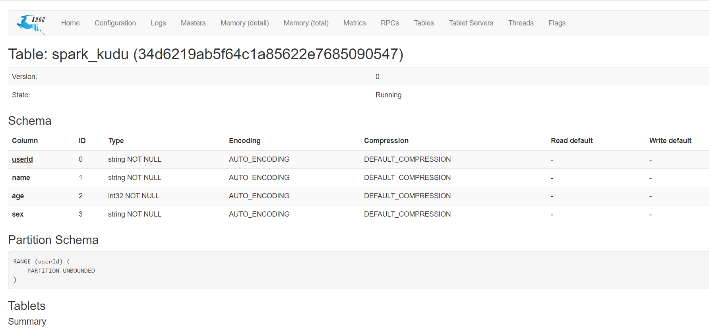

### 5.3 dataFrame操作kudu

#### 5.3.1 DML操作

Kudu支持许多DML类型的操作，其中一些操作包含在Spark on Kudu集成.
包括：

- INSERT - 将DataFrame的行插入Kudu表。请注意，虽然API完全支持INSERT，但不鼓励在Spark中使用它。
  使用INSERT是有风险的，因为Spark任务可能需要重新执行，这意味着可能要求再次插入已插入的行。这样
  做会导致失败，因为如果行已经存在，INSERT将不允许插入行（导致失败）。相反，我们鼓励使用下面描述
  的INSERT_IGNORE。
- INSERT-IGNORE - 将DataFrame的行插入Kudu表。如果表存在，则忽略插入动作。
- DELETE - 从Kudu表中删除DataFrame中的行
- UPSERT - 如果存在，则在Kudu表中更新DataFrame中的行，否则执行插入操作。
- UPDATE - 更新dataframe中的行

##### 5.3.1.1 插入数据insert操作

- 1、先创建一张表，然后把数据插入到表中

  ```scala
  case class People(id:Int,name:String,age:Int)
  object DataFrameKudu {
    def main(args: Array[String]): Unit = {
        //构建SparkConf对象
       val sparkConf: SparkConf = new SparkConf().setAppName("DataFrameKudu").setMaster("local[2]")
       //构建SparkSession对象
       val sparkSession: SparkSession = SparkSession.builder().config(sparkConf).getOrCreate()
       //获取SparkContext对象
       val sc: SparkContext = sparkSession.sparkContext
      sc.setLogLevel("warn")
        //指定kudu的master地址
       val kuduMaster="hadoop01:7051,hadoop02:7051,hadoop03:7051"
        //构建KuduContext对象
       val kuduContext = new KuduContext(kuduMaster,sc)
       
         //定义表名
         val tableName="people"
         //1、创建表
        createTable(kuduContext, tableName)
        
        //2、插入数据到表中
      insertData2table(sparkSession,sc, kuduContext, tableName)
        
        //3.查询数据
        
    }
      
   /**
      * 创建表
      * @param kuduContext
      * @param tableName
      */
    private def createTable(kuduContext: KuduContext, tableName: String): Unit = {
      //定义表的schema
      val schema = StructType(
          StructField("id", IntegerType, false) ::
          StructField("name", StringType, false) ::
          StructField("age", IntegerType, false) :: Nil
      )
  
      //定义表的主键
      val tablePrimaryKey = List("id")
  
      //定义表的选项配置
      val options = new CreateTableOptions
      options.setRangePartitionColumns(List("id").asJava)
      options.setNumReplicas(1)
  
      //创建表
        //如果表不存在,则创建
      if (!kuduContext.tableExists(tableName)) {
        kuduContext.createTable(tableName, schema, tablePrimaryKey, options)
      }
    } 
      
        /**
      * 插入数据到表中
      * @param sparkSession
      * @param sc
      * @param kuduContext
      * @param tableName
      */
    private def insertData2table(sparkSession:SparkSession,sc: SparkContext, kuduContext: KuduContext, tableName: String): Unit = {
      //准备数据
      val data = List(People(1, "zhangsan", 20), People(2, "lisi", 30), People(3, "wangwu", 40))
      val peopleRDD: RDD[People] = sc.parallelize(data)
      import sparkSession.implicits._
      val peopleDF: DataFrame = peopleRDD.toDF
      kuduContext.insertRows(peopleDF, tableName)
        //推荐使用
        df.write.option("kudu.master","")
        .option("kudu.table","")
        .kudu(import org.apache.kudu.spark.kudu._)
  
    /*    //准备数据
    
        var arr = Seq[(Int,String,Int)]()
        
        for(i<1 to 10 ){
            arr = arr.+:((i,"zhangsan-"+i,20+i))
        }
        
        //指定列名的时候必须和表的列名一直
        val data = arr.toDF("id","name","age")
        
        kuduContext.insertRows(data.TABLE_NAME)*/
    }
      //查询数据
      private def query()={
          //指定查询的列
          val colums = Seq[String]("id","name","age")
          //查询
          val rdd = kuduContext.kuduRDD(spark.Context,tableName,colums)
          //推荐使用
          spark.read.option("kudu.master","")
          .option("kudu.table","")
          .kudu(import org.apache.kudu.spark.kudu._)
          
          rdd.foreach(println(_))
      }
      
  }
       
  
  ```

##### 5.3.1.2 删除数据delete操作

```scala
  /**
    * 删除表的数据
    * @param sparkSession
    * @param sc
    * @param kuduMaster
    * @param kuduContext
    * @param tableName
    */
  private def deleteData(sparkSession: SparkSession, sc: SparkContext, kuduMaster: String, kuduContext: KuduContext, tableName: String): Unit = {
    //定义一个map集合，封装kudu的相关信息
    val options = Map(
      "kudu.master" -> kuduMaster,
      "kudu.table" -> tableName
    )

    import sparkSession.implicits._
    val data = List(People(1, "zhangsan", 20), People(2, "lisi", 30), People(3, "wangwu", 40))
      val data1 = sc.parallelize(Seq(1,3)).toDF("id")
    val dataFrame: DataFrame = sc.parallelize(data).toDF
    dataFrame.createTempView("temp")
    //获取年龄大于30的所有用户id
    val result: DataFrame = sparkSession.sql("select id from temp where age >30")
    //删除对应的数据，这里必须要是主键字段
    kuduContext.deleteRows(result, tableName)
  }
	
```

##### 5.3.1.3 更新数据upsert操作

```scala
 /**
    * 更新数据--添加数据
    *
    * @param sc
    * @param kuduMaster
    * @param kuduContext
    * @param tableName
    */
  private def UpsertData(sparkSession: SparkSession,sc: SparkContext, kuduMaster: String, kuduContext: KuduContext, tableName: String): Unit = {
    //更新表中的数据
    //定义一个map集合，封装kudu的相关信息
    val options = Map(
      "kudu.master" -> kuduMaster,
      "kudu.table" -> tableName
    )

    import sparkSession.implicits._
    val data = List(People(1, "zhangsan", 50), People(5, "tom", 30))
    val dataFrame: DataFrame = sc.parallelize(data).toDF
    //如果主键存在就是更新，如果主键不存在就是插入
    kuduContext.upsertRows(dataFrame, tableName)
  }
```

##### 5.3.1.4 更新数据update操作

```scala
  /**
    * 更新数据
    * @param sparkSession
    * @param sc
    * @param kuduMaster
    * @param kuduContext
    * @param tableName
    */
  private def updateData(sparkSession: SparkSession,sc: SparkContext, kuduMaster: String, kuduContext: KuduContext, tableName: String): Unit = {
    //定义一个map集合，封装kudu的相关信息
    val options = Map(
      "kudu.master" -> kuduMaster,
      "kudu.table" -> tableName
    )

    import sparkSession.implicits._
    val data = List(People(1, "zhangsan", 60), People(6, "tom", 30))
    val dataFrame: DataFrame = sc.parallelize(data).toDF
    //如果存在就是更新，否则就是报错
    kuduContext.updateRows(dataFrame, tableName)
  }
```


#### 5.3.2 DataFrameApi读取kudu表中的数据

​          虽然我们可以通过上面显示的KuduContext执行大量操作，但我们还可以直接从默认数据源本身调用读/写API。要设置读取，我们需要为Kudu表指定选项，命名我们要读取的表以及为表提供服务的Kudu集群的Kudu主服务器列表。

- 代码示例

```scala
  /**
    * 使用DataFrameApi读取kudu表中的数据
    * @param sparkSession
    * @param kuduMaster
    * @param tableName
    */
  private def getTableData(sparkSession: SparkSession, kuduMaster: String, tableName: String): Unit = {
     //定义map集合，封装kudu的master地址和要读取的表名
    val options = Map(
      "kudu.master" -> kuduMaster,
      "kudu.table" -> tableName
    )
    sparkSession.read.options(options).kudu.show()
  }
```

#### 5.3.3 DataFrameApi写数据到kudu表中

​	在通过DataFrame API编写时，目前只支持一种模式“append”。尚未实现的“覆盖”模式。

- 代码示例

```scala
  /**
    * DataFrame api 写数据到kudu表
    * @param sparkSession
    * @param sc
    * @param kuduMaster
    * @param tableName
    */
  private def dataFrame2kudu(sparkSession: SparkSession, sc: SparkContext, kuduMaster: String, tableName: String): Unit = {
 //定义map集合，封装kudu的master地址和要读取的表名
    val options = Map(
      "kudu.master" -> kuduMaster,
      "kudu.table" -> tableName
    )
    val data = List(People(7, "jim", 30), People(8, "xiaoming", 40))
    import sparkSession.implicits._
    val dataFrame: DataFrame = sc.parallelize(data).toDF
    //把dataFrame结果写入到kudu表中  ,目前只支持append追加
    dataFrame.write.options(options).mode("append").kudu

    //查看结果
    //导包
    import org.apache.kudu.spark.kudu._
   //加载表的数据，导包调用kudu方法，转换为dataFrame，最后在使用show方法显示结果
   sparkSession.read.options(options).kudu.show()
  }


def insertTable(){
	
    val arr = Seq[(Int,String,Int)]()
    
    for(i<- 1 to 10 ){
        arr = arr.+:((i,"zhangsan"+i,18+i))
    }
    
    //指定列名,必须与表的列民一致
    val data = arr.toDF("id","name","age")
    import org.apache.kudu.spark.kudu._
    data.write.mode(SaveMode.Append)
    .option("kudu.master",KUDU_MASTER)
    .option("kudu.table",TABLE_NAME)
    .kudu
}

```

#### 5.3.4 使用sparksql操作kudu表

​	可以选择使用Spark SQL直接使用INSERT语句写入Kudu表；与'append'类似，INSERT语句实际上将默认使用
UPSERT语义处理；

- 代码示例

```scala
/**
    * 使用sparksql操作kudu表
    * @param sparkSession
    * @param sc
    * @param kuduMaster
    * @param tableName
    */
  private def SparkSql2Kudu(sparkSession: SparkSession, sc: SparkContext, kuduMaster: String, tableName: String): Unit = {
   //定义map集合，封装kudu的master地址和表名
    val options = Map(
      "kudu.master" -> kuduMaster,
      "kudu.table" -> tableName
    )
    val data = List(People(10, "小张", 30), People(11, "小王", 40))
    import sparkSession.implicits._
    val dataFrame: DataFrame = sc.parallelize(data).toDF
      //把dataFrame注册成一张表
    dataFrame.createTempView("temp1")

    //获取kudu表中的数据，然后注册成一张表
    sparkSession.read.options(options).kudu.createTempView("temp2")
      //使用sparkSQL的insert操作插入数据
    sparkSession.sql("insert into table temp2 select * from temp1")
    sparkSession.sql("select * from temp2 where age >30").show()
  }
```


### 5.4 Kudu Native RDD

Spark与Kudu的集成同时提供了kudu RDD.

- 代码示例

```scala
    //使用kuduContext对象调用kuduRDD方法，需要sparkContext对象，表名，想要的字段名称
   val kuduRDD: RDD[Row] = kuduContext.kuduRDD(sc,tableName,Seq("name","age"))
    //操作该rdd 打印输出
    val result: RDD[(String, Int)] = kuduRDD.map {
      case Row(name: String, age: Int) => (name, age)
    }
    result.foreach(println)
```


## 6、kudu集成impala

### 6.1 impala基本介绍

```
	impala是cloudera提供的一款高效率的sql查询工具，提供实时的查询效果，官方测试性能比hive快10到100倍，其sql查询比sparkSQL还要更加快速，号称是当前大数据领域最快的查询sql工具，

	impala是参照谷歌的新三篇论文（Caffeine--网络搜索引擎、Pregel--分布式图计算、Dremel--交互式分析工具）当中的Dremel实现而来，其中旧三篇论文分别是（BigTable，GFS，MapReduce）分别对应我们即将学的HBase和已经学过的HDFS以及MapReduce。

    impala是基于hive并使用内存进行计算，兼顾数据仓库，具有实时，批处理，多并发等优点	
    

     Kudu与Apache Impala （孵化）紧密集成，impala天然就支持兼容kudu，允许开发人员使用Impala的SQL语法从Kudu的tablets 插入，查询，更新和删除数据；

```

### 6.2 **impala的架构**以及查询计划

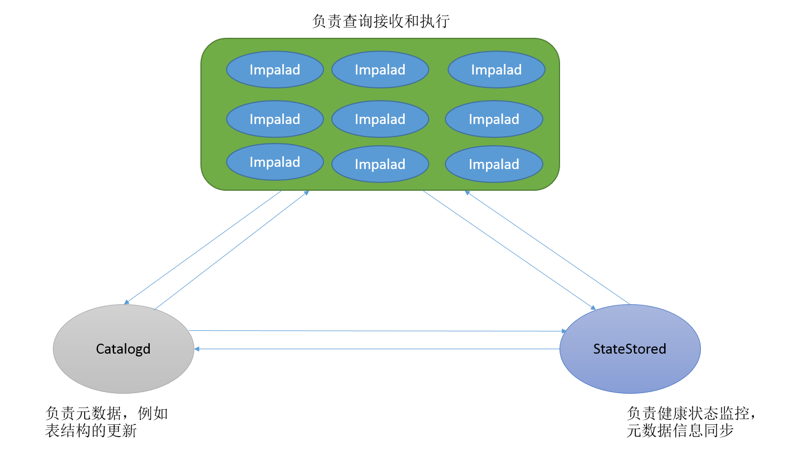

- Impalad
  - 基本是每个DataNode上都会启动一个Impalad进程，Impalad主要扮演两个角色：
    - Coordinator： 
      - 负责接收客户端发来的查询，解析查询，构建查询计划
      - 把查询子任务分发给很多Executor，收集Executor返回的结果，组合后返回给客户端
      - 对于客户端发送来的DDL，提交给Catalogd处理
    - Executor： 
      - 执行查询子任务，将子任务结果返回给Coordinator
- Catalogd
  - 整个集群只有一个Catalogd，负责所有元数据的更新和获取
- StateStored
  - 整个集群只有一个Statestored，作为集群的订阅中心，负责集群不同组件的信息同步
  - 跟踪集群中的Impalad的健康状态及位置信息，由statestored进程表示，它通过创建多个线程来处理Impalad的注册订阅和与各Impalad保持心跳连接，各Impalad都会缓存一份State Store中的信息，当State Store离线后（Impalad发现State Store处于离线时，会进入recovery模式，反复注册，当State Store重新加入集群后，自动恢复正常，更新缓存数据）因为Impalad有State Store的缓存仍然可以工作，但会因为有些Impalad失效了，而已缓存数据无法更新，导致把执行计划分配给了失效的Impalad，导致查询失败。

### 6.3 安装impala

- 按照规划

|      服务名称      | hadoop01 | hadoop02 | hadoop03 |
| :----------------: | :------: | :------: | :------: |
|   impala-catalog   |  不安装  |  不安装  |   安装   |
| impala-state-store |  不安装  |  不安装  |   安装   |
|   impala-server    |   安装   |   安装   |   安装   |
|       impala       |   安装   |   安装   |   安装   |

- 主节点hadoop03执行以下命令进行安装

```
yum install impala -y
yum install impala-server -y
yum install impala-state-store -y
yum install impala-catalog -y
yum install bigtop-utils -y 
yum install impala-shell -y

```

- 从节点hadoop01和hadoop02上安装以下服务

```
yum install impala-server -y
yum install bigtop-utils -y 

```

### 6.4 所有节点配置impala

#### 6.4.1 修改hive-site.xml文件

- impala依赖于hive，所以首先需要进行hive的配置修改；
  - hadoop01机器修改hive-site.xml内容如下:
  - vim /export/servers/hive-1.1.0-cdh5.14.0/conf/hive-site.xml

```
<configuration>
    <property>
        <name>javax.jdo.option.ConnectionURL</name>
        <value>jdbc:mysql://hadoop01:3306/hive?
        createDatabaseIfNotExist=true</value>
    </property>
    <property>
        <name>javax.jdo.option.ConnectionDriverName</name>
        <value>com.mysql.jdbc.Driver</value>
    </property>
    <property>
        <name>javax.jdo.option.ConnectionUserName</name>
        <value>root</value>
    </property>
    <property>
        <name>javax.jdo.option.ConnectionPassword</name>
        <value>123456</value>
    </property>
    <property>
        <name>hive.cli.print.current.db</name>
        <value>true</value>
    </property>
    <property>
        <name>hive.cli.print.header</name>
        <value>true</value>
    </property>
    <property>
        <name>hive.server2.thrift.bind.host</name>
        <value>hadoop01</value>
    </property>
    <property>
        <name>hive.metastore.uris</name>
        <value>thrift://hadoop01:9083</value>
    </property>
    <property>
        <name>hive.metastore.client.socket.timeout</name>
        <value>3600</value>
    </property>
</configuration>
```

#### 6.4.2 添加mysql的jar包放入hive的lib目录下


#### 6.4.3 将hive的安装包发送到hadoop02与hadoop03上

- 在hadoop01上执行命令

```
cd /export/servers/
scp -r hive-1.1.0-cdh5.14.0/ hadoop02:$PWD
scp -r hive-1.1.0-cdh5.14.0/ hadoop03:$PWD
```

#### 6.4.4 启动hive的metastore服务

- 在hadoop01上启动hive的metastore服务

  ```
  cd /export/servers/hive-1.1.0-cdh5.14.0
  nohup bin/hive --service metastore &
  ```

- 注意：一定要保证mysql的服务正常启动，否则metastore的服务不能够启动

#### 6.4.5 所有hadoop节点修改hdfs-site.xml添加以下内容

- 所有节点创建文件夹
  - **mkdir -p /var/run/hdfs-sockets**
- 修改所有节点的hdfs-site.xml添加以下配置，修改完之后重启hdfs集群生效
  vim /export/servers/hadoop-2.6.0-cdh5.14.0/etc/hadoop/hdfs-site.xml

```xml
<configuration>     
		<property>
                <name>dfs.replication</name>
                <value>2</value>
        </property>
        <property>
                <name>dfs.permissions</name>
                <value>false</value>
        </property>
        <property>
                <name>dfs.blocksize</name>
                <value>134217728</value>
        </property>

        <property>
               <!--短路读取--就是允许impala把一些信息存储在本地磁盘上，可以加快计算的速度-->
                <name>dfs.client.read.shortcircuit</name>
                <value>true</value>
        </property>
         <property>
               <!--打开”块位置的存储的元数据信息”-->
                <name>dfs.datanode.hdfs-blocks-metadata.enabled</name>
                <value>true</value>
        </property>
        <property>
                <name>dfs.domain.socket.path</name>
                <value>/var/run/hdfs-sockets/dn</value>
              <!--Datanode和DFSClient之间沟通的Socket的本地路径套接口文件-->
        </property>
        <property>
                <name>dfs.client.file-block-storage-locations.timeout.millis</name>
                <value>10000</value>
        </property>
		<property>
          <name>dfs.permissions.enabled</name>
           <value>false</value>
        </property>
</configuration>
```

#### 6.4.6 重启hdfs

- 在hadoop集群的主节点hadoop01上执行
  - stop-dfs.sh
  - start-dfs.sh

#### 6.5.7 创建hadoop与hive的配置文件的连接

- impala的配置目录为 /etc/impala/conf
  - 这个路径下面需要把core-site.xml，hdfs-site.xml以及hive-site.xml拷贝到这里来，但是我们这里使用软连接的方式会更好。
  - 所有节点执行以下命令创建链接到impala配置目录下来

```
ln -s /export/servers/hadoop-2.6.0-cdh5.14.0/etc/hadoop/core-site.xml /etc/impala/conf/core-site.xml

ln -s /export/servers/hadoop-2.6.0-cdh5.14.0/etc/hadoop/hdfs-site.xm-  /etc/impala/conf/hdfs-site.xml

ln -s /export/servers/hive-1.1.0-cdh5.14.0/conf/hive-site.xml /etc/impala/conf/hive-site.xml
```

#### 6.4.8 所有节点修改impala默认配置

- 所有节点更改impala默认配置文件以及添加mysql的连接驱动包

- vim /etc/default/impala

  ```
  #指定集群的CATALOG_SERVICE和STATE_STORE服务地址
  IMPALA_CATALOG_SERVICE_HOST=hadoop03
  IMPALA_STATE_STORE_HOST=hadoop03
  ```

#### 6.4.9 所有节点创建mysql的驱动包的软连接

```
ln -s /export/servers/hive-1.1.0-cdh5.14.0/lib/mysql-connector-java-5.1.35.jar /usr/share/java/mysql-connector-java.jar
```

#### 6.4.10 所有节点修改bigtop的java路径

- 修改bigtop的java_home路径

  - vim /etc/default/bigtop-utils

    ```
    export JAVA_HOME=/export/servers/jdk
    ```


#### 6.4.11 启动impala服务

- 在主节点hadoop03启动以下三个服务进程

  ```
  service impala-state-store start
  service impala-catalog start
  service impala-server start
  ```

- 在从节点hadoop01和hadoop02上启动impala-server

  ```
  service impala-server start
  ```

- 查看impala进程是否存在

  ```
  ps -ef | grep impala
  ```


注意：启动之后所有关于impala的日志默认都在/var/log/impala 这个路径下，hadoop03机器上面应该有三个进
程，hadoop01与hadoop02机器上面只有一个进程，如果进程个数不对，去对应目录下查看报错日志


#### 6.4.12 浏览器页面访问

- 访问impalad的管理界面http://hadoop03:25000/

  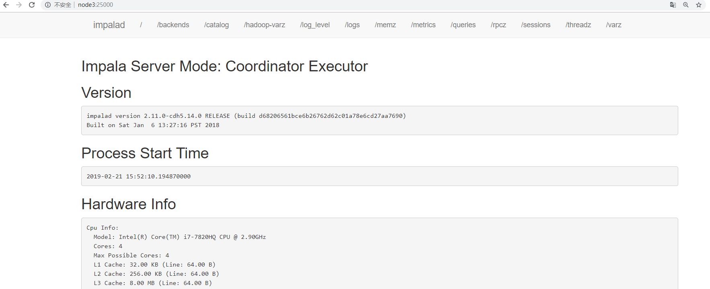

- 访问statestored的管理界面http://hadoop03:25010/

  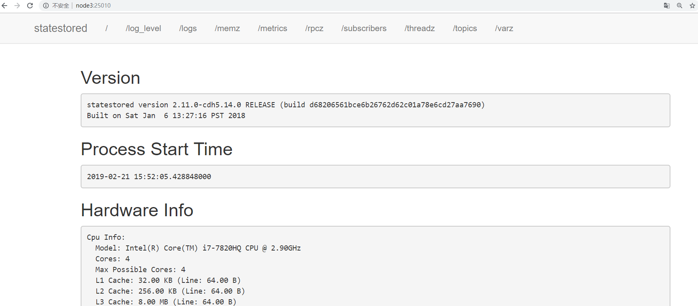

- 访问catalogd 的管理界面http://hadoop03:25020/

  


### 6.5 将impala与kudu整合

- 在每一个服务器的impala的配置文件中添加如下配置：

  - vim /etc/default/impala

  ```
  在IMPALA_SERVER_ARGS下添加：
  -kudu_master_hosts=hadoop01:7051,hadoop02:7051,hadoop03:7051
  ```

  如下图：

  

# 7、使用impala操作kudu整合

- 1、需要先启动hdfs、hive、kudu、impala

- 2、使用impala的shell控制台

  - 执行命令impala-shell

  ```
  (1):使用该impala-shell命令启动Impala Shell 。默认情况下，impala-shell 尝试连接到localhost端口21000 上的Impala守护程序。要连接到其他主机，请使用该-i <host:port>选项。要自动连接到特定的Impala数据库，请使用该-d <database>选项。例如，如果您的所有Kudu表都位于数据库中的Impala中impala_kudu，则-d impala_kudu可以使用此数据库。
  (2)：要退出Impala Shell，请使用以下命令： quit;
  ```

  


### 7.1 创建kudu表

- 使用Impala创建新的Kudu表时，可以将该表创建为内部表或外部表。


#### 7.1.1 内部表

- 内部表由Impala管理，当您从Impala中删除时，数据和表确实被删除。当您使用Impala创建新表时，它通常是内部表。

  - 使用impala创建内部表：

  ```sql
  CREATE TABLE my_first_table_tmp
  (
  id BIGINT,
  name STRING,
  PRIMARY KEY(id)
  )
  PARTITION BY HASH PARTITIONS 16 
  STORED AS KUDU
  TBLPROPERTIES (
  'kudu.master_addresses' = 'hadoop01:7051,hadoop02:7051,hadoop03:7051',
  'kudu.table_name' = 'my_first_table_tmp'
  );
      
  在 CREATE TABLE 语句中，必须首先列出构成主键的列。
  ```


- 此时创建的表是内部表，从impala删除表的时候，在底层存储的kudu也会删除表。

```sql
drop table if exists my_first_table；
```

#### 7.1.2 外部表

- 外部表（创建者CREATE EXTERNAL TABLE）不受Impala管理，并且删除此表不会将表从其源位置（此处为Kudu）丢弃。相反，它只会去除Impala和Kudu之间的映射。这是Kudu提供的用于将现有表映射到Impala的语法。
- 使用java创建一个kudu表：
  - 代码

```java
public class CreateTable {
        private static ColumnSchema newColumn(String name, Type type, boolean iskey) {
                ColumnSchema.ColumnSchemaBuilder column = new
                    ColumnSchema.ColumnSchemaBuilder(name, type);
                column.key(iskey);
                return column.build();
        }
    public static void main(String[] args) throws KuduException {
        // master地址
        final String masteraddr = "hadoop01,hadoop02,hadoop03";
        // 创建kudu的数据库链接
        KuduClient client = new
     KuduClient.KuduClientBuilder(masteraddr).defaultSocketReadTimeoutMs(6000).build();
        
        // 设置表的schema
        List<ColumnSchema> columns = new LinkedList<ColumnSchema>();
        columns.add(newColumn("CompanyId", Type.INT32, true));
        columns.add(newColumn("WorkId", Type.INT32, false));
        columns.add(newColumn("Name", Type.STRING, false));
        columns.add(newColumn("Gender", Type.STRING, false));
        columns.add(newColumn("Photo", Type.STRING, false));
        Schema schema = new Schema(columns);
    //创建表时提供的所有选项
    CreateTableOptions options = new CreateTableOptions();
        
    // 设置表的replica备份和分区规则
    List<String> parcols = new LinkedList<String>();
        
    parcols.add("CompanyId");
    //设置表的备份数
        options.setNumReplicas(1);
    //设置range分区
    options.setRangePartitionColumns(parcols);
        
    //设置hash分区和数量
    options.addHashPartitions(parcols, 3);
    try {
    client.createTable("person", schema, options);
    } catch (KuduException e) {
    e.printStackTrace();
    }
    client.close();
    }
}
```

- 在kudu的页面上可以观察到如下信息：


- 在impala的命令行查看表:

  

  - 当前在impala中并没有person这个表

- 使用impala创建外部表 ， 将kudu的表映射到impala上：

  - 在impala-shell执行

  ```sql
  CREATE EXTERNAL TABLE `person` STORED AS KUDU
  TBLPROPERTIES(
      'kudu.table_name' = 'person',
      'kudu.master_addresses' = 'hadoop01:7051,hadoop02:7051,hadoop03:7051')
  ```

  

### 7.2 使用impala对kudu进行DML操作

#### 7.2.1 将数据插入 Kudu 表

- impala 允许使用标准 SQL 语句将数据插入 Kudu 。

##### 7.2.1.1 插入单个值

- 创建表

  ```sql
  CREATE TABLE my_first_table
  (
  id BIGINT,
  name STRING,
  PRIMARY KEY(id)
  )
  PARTITION BY HASH PARTITIONS 16
  STORED AS KUDU;
  ```

- 此示例插入单个行

  ```sql
  INSERT INTO my_first_table VALUES (50, "zhangsan");
  ```

- 查看数据

  ```sql
  select * from my_first_table
  ```

  

- 使用单个语句插入三行

  ```sql
  INSERT INTO my_first_table VALUES (1, "john"), (2, "jane"), (3, "jim");
  ```

  


##### 7.2.1.2 批量插入Batch Insert

- 从 Impala 和 Kudu 的角度来看，通常表现最好的方法通常是使用 Impala 中的 SELECT FROM 语句导入数据

  - 示例

  ```sql
  INSERT INTO my_first_table
  SELECT * FROM temp1;
  ```

#### 7.2.2 更新数据

- 示例

  ```sql
  UPDATE my_first_table SET name="xiaowang" where id =1 ;
  ```

  


#### 7.2.3 删除数据

- 示例

  ```sql
  delete from my_first_table where id =2;
  ```

  

### 7.3 更改表属性

- 开发人员可以通过更改表的属性来更改 Impala 与给定 Kudu 表相关的元数据。这些属性包括表名， Kudu 主地址列表，以及表是否由 Impala （内部）或外部管理。

#### 7.3.1 Rename an Impala Mapping Table ( 重命名 Impala 映射表 )

```sql
ALTER TABLE PERSON RENAME TO person_temp;
```

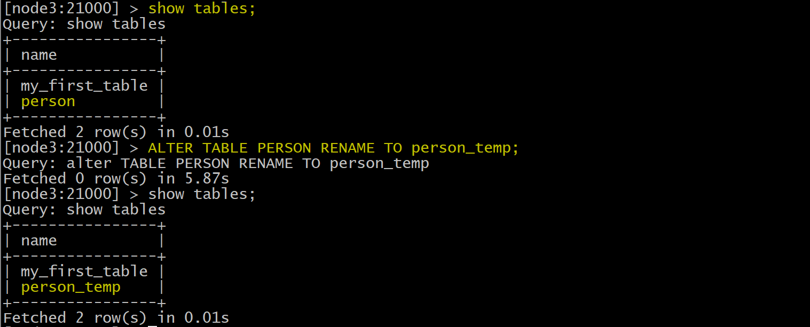

#### 7.3.2 Rename the underlying Kudu table for an internal table ( 重

新命名内部表的基础 Kudu 表 )

- 创建内部表：

  ```sql
  CREATE TABLE kudu_student
  (
  CompanyId INT,
  WorkId INT,
  Name STRING,
  Gender STRING,
  Photo STRING,
  PRIMARY KEY(CompanyId)
  )
  PARTITION BY HASH PARTITIONS 16
  STORED AS KUDU
  TBLPROPERTIES (
  'kudu.master_addresses' = 'hadoop01:7051,hadoop02:7051,hadoop03:7051',
  'kudu.table_name' = 'student'
  );
  ```

- 如果表是内部表，则可以通过更改 kudu.table_name 属性重命名底层的 Kudu 表

  ```sql
  ALTER TABLE kudu_student SET TBLPROPERTIES('kudu.table_name' = 'new_student');
  ```

  - 效果图

    

#### 7.3.3 Remapping an external table to a different Kudu table ( 将外部表重新映射到不同的 Kudu 表 )

- 如果用户在使用过程中发现其他应用程序重新命名了kudu表，那么此时的外部表需要重新映射到kudu上

  - 创建一个外部表：

  ```sql
  CREATE EXTERNAL TABLE external_table
      STORED AS KUDU
      TBLPROPERTIES (
      'kudu.master_addresses' = 'hadoop01:7051,hadoop02:7051,hadoop03:7051',
      'kudu.table_name' = 'person'
  );
  ```

  - 重新映射外部表，指向不同的kudu表：

  ```sql
  ALTER TABLE external_table
  SET TBLPROPERTIES('kudu.table_name' = 'hashTable')
  ```

  上面的操作是：将external_table映射的PERSON表重新指向hashTable表

#### 7.3.4 Change the Kudu Master Address ( 更改 Kudu Master 地址 )

```
ALTER TABLE my_table
SET TBLPROPERTIES('kudu.master_addresses' = 'kudu-new-master.example.com:7051');
```

#### 7.3.5 Change an Internally-Managed Table to External ( 将内部管理

的表更改为外部 )

```
ALTER TABLE my_table SET TBLPROPERTIES('EXTERNAL' = 'TRUE');
```


### 7.4 impala使用java语言操作kudu

- 对于impala而言，开发人员是可以通过JDBC连接impala的，有了JDBC，开发人员可以通过impala来间接操作
  kudu；

#### 7.4.1 引入依赖

```xml
       <!--impala的jdbc操作--> 
	   <dependency>
            <groupId>com.cloudera</groupId>
            <artifactId>ImpalaJDBC41</artifactId>
            <version>2.5.42</version>
        </dependency>

        <!--Caused by : ClassNotFound : thrift.protocol.TPro-->
        <dependency>
            <groupId>org.apache.thrift</groupId>
            <artifactId>libfb303</artifactId>
            <version>0.9.3</version>
            <type>pom</type>
        </dependency>

        <!--Caused by : ClassNotFound : thrift.protocol.TPro-->
        <dependency>
            <groupId>org.apache.thrift</groupId>
            <artifactId>libthrift</artifactId>
            <version>0.9.3</version>
            <type>pom</type>
        </dependency>
       
        <dependency>
            <groupId>org.apache.hive</groupId>
            <artifactId>hive-jdbc</artifactId>
            <exclusions>
                <exclusion>
                    <groupId>org.apache.hive</groupId>
                    <artifactId>hive-service-rpc</artifactId>
                </exclusion>
                <exclusion>
                    <groupId>org.apache.hive</groupId>
                    <artifactId>hive-service</artifactId>
                </exclusion>
            </exclusions>
            <version>1.1.0</version>
        </dependency>

        <!--导入hive-->
        <dependency>
            <groupId>org.apache.hive</groupId>
            <artifactId>hive-service</artifactId>
            <version>1.1.0</version>
        </dependency>
```

#### 7.4.2 通过JDBC连接impala操作kudu

- 使用JDBC连接impala操作kudu，与JDBC连接mysql做更重增删改查基本一样

##### 7.4.2.1 创建实体类

```java
package cn.itcast.impala.impala;

public class Person {
    private int companyId;
    private int workId;
    private  String name;
    private  String gender;
    private  String photo;

    public Person(int companyId, int workId, String name, String gender, String photo) {
        this.companyId = companyId;
        this.workId = workId;
        this.name = name;
        this.gender = gender;
        this.photo = photo;
    }

    public int getCompanyId() {
        return companyId;
    }

    public void setCompanyId(int companyId) {
        this.companyId = companyId;
    }

    public int getWorkId() {
        return workId;
    }

    public void setWorkId(int workId) {
        this.workId = workId;
    }

    public String getName() {
        return name;
    }

    public void setName(String name) {
        this.name = name;
    }

    public String getGender() {
        return gender;
    }

    public void setGender(String gender) {
        this.gender = gender;
    }

    public String getPhoto() {
        return photo;
    }

    public void setPhoto(String photo) {
        this.photo = photo;
    }
}

```

##### 7.4.2.2 JDBC连接impala对kudu进行增删改查

```java
package cn.itcast.impala.impala;

import java.sql.*;

public class Contants {
    private static String JDBC_DRIVER="com.cloudera.impala.jdbc41.Driver";
    private static  String CONNECTION_URL="jdbc:impala://hadoop01:21050/default;auth=noSasl";
     //定义数据库连接
    static Connection conn=null;
    //定义PreparedStatement对象
    static PreparedStatement ps=null;
    //定义查询的结果集
    static ResultSet rs= null;


    //数据库连接
    public static Connection getConn(){
        try {
            Class.forName(JDBC_DRIVER);
            conn=DriverManager.getConnection(CONNECTION_URL);
        } catch (Exception e) {
            e.printStackTrace();
        }

        return  conn;
        
    }

    //创建一个表
    public static void createTable(){
        conn=getConn();
        String sql="CREATE TABLE impala_kudu_test" +
                "(" +
                "companyId BIGINT," +
                "workId BIGINT," +
                "name STRING," +
                "gender STRING," +
                "photo STRING," +
                "PRIMARY KEY(companyId)" +
                ")" +
                "PARTITION BY HASH PARTITIONS 16 " +
                "STORED AS KUDU " +
                "TBLPROPERTIES (" +
                "'kudu.master_addresses' = 'hadoop01:7051,hadoop02:7051,hadoop03:7051'," +
                "'kudu.table_name' = 'impala_kudu_test'" +
                ");";

        try {
            ps = conn.prepareStatement(sql);
            ps.execute();
        } catch (SQLException e) {
            e.printStackTrace();
        }
    }


    //查询数据
    public static ResultSet queryRows(){
        try {
            //定义执行的sql语句
            String sql="select * from impala_kudu_test";
            ps = getConn().prepareStatement(sql);
            rs= ps.executeQuery();
        } catch (SQLException e) {
            e.printStackTrace();
        }

        return  rs;
    }

    //打印结果
    public  static void printRows(ResultSet rs){
        /**
         private int companyId;
         private int workId;
         private  String name;
         private  String gender;
         private  String photo;
         */

        try {
            while (rs.next()){
                //获取表的每一行字段信息
                int companyId = rs.getInt("companyId");
                int workId = rs.getInt("workId");
                String name = rs.getString("name");
                String gender = rs.getString("gender");
                String photo = rs.getString("photo");
                System.out.print("companyId:"+companyId+" ");
                System.out.print("workId:"+workId+" ");
                System.out.print("name:"+name+" ");
                System.out.print("gender:"+gender+" ");
                System.out.println("photo:"+photo);

            }
        } catch (SQLException e) {
            e.printStackTrace();
        }finally {
            if(ps!=null){
                try {
                    ps.close();
                } catch (SQLException e) {
                    e.printStackTrace();
                }
            }

            if(conn !=null){
                try {
                    conn.close();
                } catch (SQLException e) {
                    e.printStackTrace();
                }
            }
        }
    }


    //插入数据
    public static void insertRows(Person person){
        conn=getConn();
        String sql="insert into table impala_kudu_test(companyId,workId,name,gender,photo) values(?,?,?,?,?)";

        try {
            ps=conn.prepareStatement(sql);
            //给占位符？赋值
            ps.setInt(1,person.getCompanyId());
            ps.setInt(2,person.getWorkId());
            ps.setString(3,person.getName());
            ps.setString(4,person.getGender());
            ps.setString(5,person.getPhoto());
            ps.execute();

        } catch (SQLException e) {
            e.printStackTrace();
        }finally {
            if(ps !=null){
                try {
                    //关闭
                    ps.close();
                } catch (SQLException e) {
                    e.printStackTrace();
                }
            }

            if(conn !=null){
                try {
                      //关闭
                    conn.close();
                } catch (SQLException e) {
                    e.printStackTrace();
                }
            }
        }

    }

    //更新数据
    public static void updateRows(Person person){
       //定义执行的sql语句
        String sql="update impala_kudu_test set workId="+person.getWorkId()+
                ",name='"+person.getName()+"' ,"+"gender='"+person.getGender()+"' ,"+
                "photo='"+person.getPhoto()+"' where companyId="+person.getCompanyId();

        try {
            ps= getConn().prepareStatement(sql);
            ps.execute();
        } catch (SQLException e) {
            e.printStackTrace();
        }finally {
            if(ps !=null){
                try {
                      //关闭
                    ps.close();
                } catch (SQLException e) {
                    e.printStackTrace();
                }
            }

            if(conn !=null){
                try {
                      //关闭
                    conn.close();
                } catch (SQLException e) {
                    e.printStackTrace();
                }
            }
        }
    }

    //删除数据
    public   static void deleteRows(int companyId){
      
        //定义sql语句
        String sql="delete from impala_kudu_test where companyId="+companyId;
        try {
            ps =getConn().prepareStatement(sql);
            ps.execute();
        } catch (SQLException e) {
            e.printStackTrace();

        }

    }
    
   //删除表
    public static void dropTable() {
        String sql="drop table if exists impala_kudu_test";
        try {
            ps =getConn().prepareStatement(sql);
            ps.execute();
        } catch (SQLException e) {
            e.printStackTrace();
        }
    }
}

```

##### 7.4.2.3 代码测试运行

```java
package cn.itcast.impala.impala;

import java.sql.Connection;

public class ImpalaJdbcClient {
    public static void main(String[] args) {
        Connection conn = Contants.getConn();

        //创建一个表
       Contants.createTable();

        //插入数据
       Contants.insertRows(new Person(1,100,"lisi","male","lisi-photo"));

        //查询表的数据
        ResultSet rs = Contants.queryRows();
        Contants.printRows(rs);

        //更新数据
        Contants.updateRows(new Person(1,200,"zhangsan","male","zhangsan-photo"));

        //删除数据
        Contants.deleteRows(1);

        //删除表
        Contants.dropTable();

    }
}

```

## 8、存储机制

### 8.1 存储结构全景图

   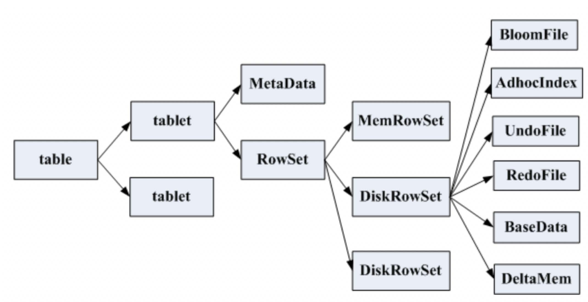

 

### 8.2、存储结构解析

- 一个Table包含多个Tablet，其中Tablet的数量是根据hash或者range进行设置
- 一个Tablet中包含MetaData信息和多个RowSet信息
- 一个Rowset中包含一个MemRowSet与0个或多个DiskRowset，其中MemRowSet存储insert的数据，一旦MemRowSet写满会flush到磁盘生成一个或多个DiskRowSet，此时MemRowSet清空。MemRowSet默认写满1G或者120s flush一次
- (注意:memRowSet是行式存储，DiskRowSet是列式存储，MemRowSet基于primary key有序)。每个tablet中会定期对一些diskrowset做compaction操作，目的是对多个diskRowSet进行重新排序，以此来使其更有序并减少diskRowSet的数量，同时在compaction的过程中会resolve掉deltaStores当中的delete记录
- 一个DiskRowSet包含BoolmFile、AdhocIndex、UndoFile、RedoFile、baseData与DeltaMem
  - BoolmFile ：根据DiskRowSet中的key生成的boolmFilter，用来快速定位某个key是否在DiskRowSet中存在
  - AdhocIndex：主键索引，用来定位primary key在DiskRowSet中的具体位置
  - UndoFile：BaseData之前时间的历史数据
  - RedoFile：BaseData之后时间的数据
  - BaseData:MemRowSet flush后的数据，主键有序
  - DeltMem:用于DiskRowSet中的mutation，先写到内存中，写满后flush到磁盘形成RedoFile

## 9、kudu的工作机制

### 9.1、概述

1、kudu主要角色分为master与tserver

2、master主要负责:管理元数据信息，监听server，当server宕机后负责tablet的重分配

3、tserver主要负责tablet的存储与和数据的增删改查

4、master与tserver只要集群中(数量-1)/2 个可用，则tablet可用，即使leader宕机，仍然可读

### 9.2、读流程

#### 9.2.1、概述

客户端将要读取的数据信息发送给master，master对其进行一定的校验，比如表是否存在，字段是否存在。Master返回元数据信息给client，然后client与tserver建立连接，通过metaData找到数据所在的RowSet，首先加载内存里面的数据(MemRowSet与DeltMemStore),然后加载磁盘里面的数据，最后返回最终数据给client.

 

#### 9.2.2、详细步骤图

   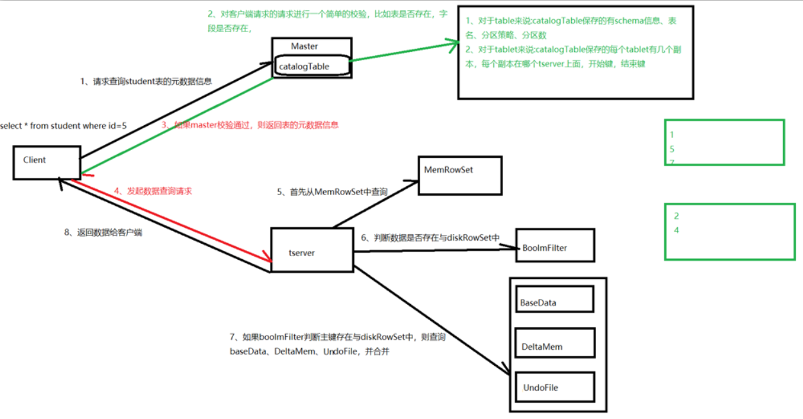

#### 9.2.3、详细步骤解析

1、客户端master请求查询表指定数据

2、master对请求进行校验，校验表是否存在，schema中是否存在指定查询的字段，如果校验不通过则报错。

3、master通过查询catalog Table返回表，将tablet对应的tserver信息、tserver状态等元数据信息返回给client

4、client与tserver建立连接,根据数据所处位置的不同，有不同的加载方式。

5、首先加载RowSet内存中MemRowSet与DeltMem中的数据

6、然后加载磁盘中的数据，首先通过BloomFilter判断主键是否在DIskRowSet中，如果在，则加载DiskRowSet中的主键索引中的数据所处的位置信息拿出了[row_offset],

7、根据row_offset取出basedata中的数据,另外需要取出DeltMem与RedoFile中的数据，并合并,得到最新的数据

8、将数据合并后返回数据给Client

### 9.3、Insert流程

#### 9.3.1、概述

Client首先连接master，获取元数据信息。然后连接tserver，查找MemRowSet与DeltMem中是否存在相同primary key，如果存在，则报错;如果不存在，则将待插入的数据写入WAL日志，然后将数据写入MemRowSet。

#### 9.3.2、详细步骤图

   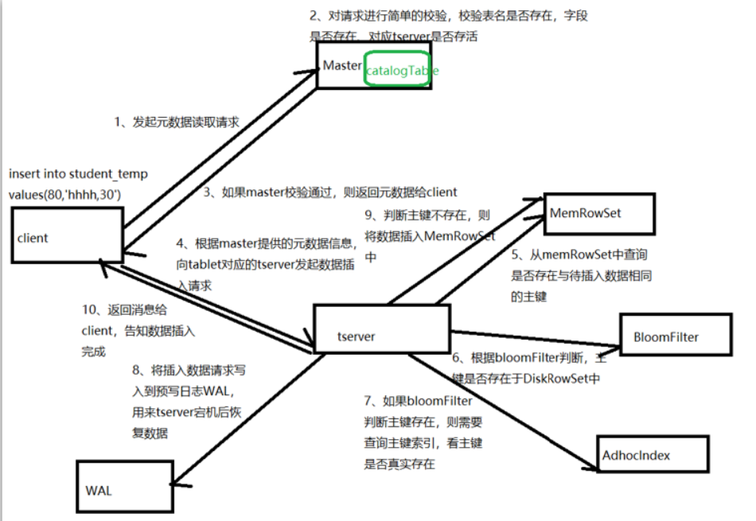

#### 9.3.3、详细步骤解析

1、client向master请求预写表的元数据信息

2、master会进行一定的校验，表是否存在，字段是否存在等

3、如果master校验通过，则返回表的分区、tablet与其对应的tserver给client；如果校验失败则报错给client。

4、client根据master返回的元数据信息，将请求发送给tablet对应的tserver.

5、tserver首先从memrowset中查询RowSet中是否存在与待插入数据主键相同的数据，如果存在则报错

6、tserver会将写请求预写到WAL日志(用来server宕机后的恢复操作)，并且通过raft一致性算法得到tablet副本server回应后继续下一步

7、将数据写入内存中的MemRowSet中，一旦MemRowSet的大小达到1G或120s后，MemRowSet会flush成一个或DiskRowSet,用来将数据持久化

8、返回client数据处理完毕

### 9.4、数据更新流程

#### 9.4.1、概述

Client首先向master请求元数据，然后根据元数据提供的tablet信息，连接tserver，根据数据所处位置的不同，有不同的操作:在内存MemRowSet中的数据，会将更新信息写入数据所在行的mutation链表中；在磁盘中的数据，会将更新信息写入DeltMem中。

#### 9.4.2、详细步骤图

   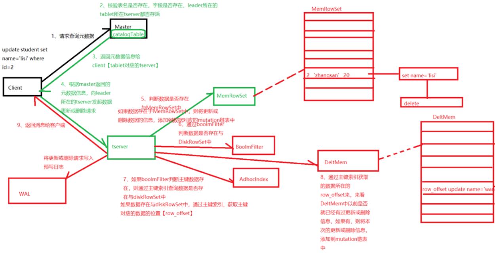

#### 9.4.3、详细步骤解析

1、client向master请求预更新表的元数据，首先master会校验表是否存在，字段是否存在，如果校验通过则会返回给client表的分区、tablet、tablet所在tserver信息

2、client向tserver发起更新请求

4、将更新操作预写如WAL日志，用来在server宕机后的数据恢复

5、根据tserver中待更新的数据所处位置的不同，有不同的处理方式:

​       如果数据在内存中，则从MemRowSet中找到数据所处的行，然后在改行的mutation链表中写入更新信息，在MemRowSet flush的时候，将更新合并到baseData中

​       如果数据在DiskRowSet中，则将更新信息写入DeltMemStore中，DeltMem达到一定大小后会flush成RedoFile。

5、更新完毕后返回消息给client。


