#  方法解析scala第一天

课程目标

- 搭建scala开发环境
- 掌握scala基本语法结构（变量、表达式、if、循环、方法、函数...）
- 掌握scala集合使用（数组、元组、List、Set、Map...）

## 01. scala简介

scala是运行在`JVM`上的多范式编程语言，同时支持面向对象和面向函数编程

早期，scala刚出现的时候，并没有怎么引起重视，随着Spark和Kafka这样基于scala的大数据框架的兴起，scala逐步进入大数据开发者的眼帘。scala的主要优势是它的**表达性**。

接下来，我们要来学习：

- 为什么要使用scala?
- 通过两个案例对比Java语言和scala语言

### 为什么使用scala

- 开发大数据应用程序（Spark程序、Flink程序）

- 表达能力强，一行代码抵得上Java多行，开发速度快
- 兼容Java，可以访问庞大的Java类库，例如：操作mysql、redis、freemarker、activemq等等

### scala对比Java

下面通过两个案例，分别使用java和scala实现的代码数量

### 案例一

定义三个实体类（用户、订单、商品）

**Java代码**

````
/**
 * 用户实体类
 */
public class User {
    private String name;
    private List<Order> orders;

    public String getName() {
    	return name;
    }

    public void setName(String name) {
    	this.name = name;
    }

    public List<Order> getOrders() {
    	return orders;
    }

    public void setOrders(List<Order> orders) {
    	this.orders = orders;
    }
}
````

```
/**
 * 订单实体类
 */
public class Order {
    private int id;
    private List<Product> products;

    public int getId() {
    	return id;
    }

    public void setId(int id) {
    	this.id = id;
    }

    public List<Product> getProducts() {
    	return products;
    }

    public void setProducts(List<Product> products) {
    	this.products = products;
    }
}
```

```
/**
 * 商品实体类
 */
public class Product {
    private int id;
    private String category;

    public int getId() {
    	return id;
    }

    public void setId(int id) {
    	this.id = id;
    }

    public String getCategory() {
    	return category;
    }

    public void setCategory(String category) {
    	this.category = category;
    }
}
```

**scala代码**


```
case class User(var name:String, var orders:List[Order])	// 用户实体类
case class Order(var id:Int, var products:List[Product])	// 订单实体类
case class Product(var id:Int, var category:String)  		// 商品实体类
```

## 02. 开发环境安装

学习如何编写scala代码之前，需要先安装scala编译器以及开发工具

Java程序编译执行流程


Scala程序编译执行流程

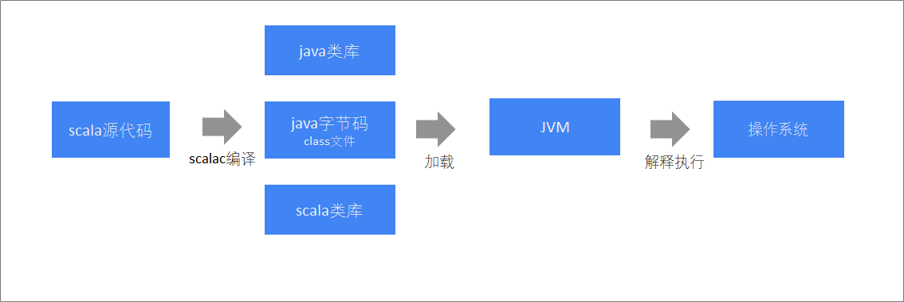

scala程序运行需要依赖于Java类库，必须要有Java运行环境，scala才能正确执行


根据上述流程图，要编译运行scala程序，需要

- jdk（jvm）
- scala编译器（scala SDK）

要依次安装以下内容：

- 安装JDK
- 安装scala SDK=scala编译器
- 安装IDEA插件

### 第一步:安装JDK

安装JDK 1.8 64位版本，并配置好环境变量

### 第二步:安装scala SDK

scala SDK是scala语言的编译器，要开发scala程序，必须要先安装SDK

本次安装的版本是: 2.11.12

步骤

1. 下载、安装SDK
2. 测试是否安装成功

具体操作

1. 双击scala-2.11.12.msi，将scala安装在指定目录，例如：c:/opt
2. 打开控制台，输入`scala -version`

### 第三步:安装IDEA scala插件

IDEA默认是不支持scala程序开发，所以需要来安装scala插件来支持scala语言。

步骤

1. 下载指定版本[IDEA scala插件](http://plugins.jetbrains.com/plugin/1347-scala)
2. IDEA配置scala插件
3. 重新启动IDEA

具体操作

操作1：查看IDEA的版本号


操作2：到IDEA官网下载对应版本的[IDEA scala插件](http://plugins.jetbrains.com/plugin/1347-scala)

> [!DANGER]
>
> 请务必下载IDEA版本一致的scala插件

操作3：选择配置 > 选择插件


操作4：点击小齿轮 > 选择从本地安装插件


操作5：找到下载的插件位置，点击OK

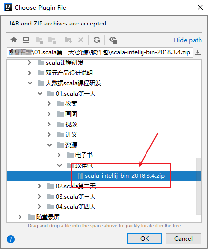

操作6：重新启动IDEA

操作7：查看scala插件

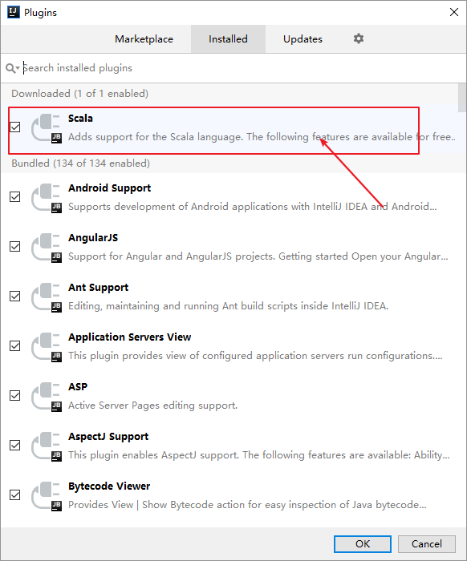


#### 注意:如果以上操作完成之后,无法启动scala,说明环境变量未自动添加,需要手动添加scala的环境变量

1. ##### 右击我的电脑，单击“属性”，进入如图所示页面。下面开始配置环境变量，右击【我的电脑】---【属性】-----【高级系统设置】---【环境变量】，如图：

   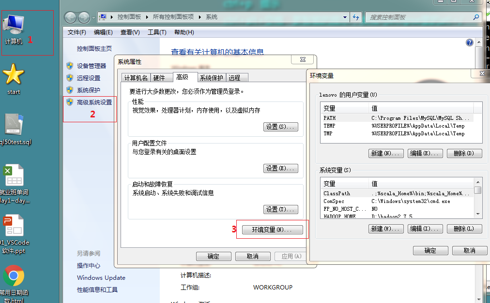

2. ##### 设置SCALA-HOME变量：如图，单击新建，在变量名一栏输入：  **SCALA-HOME**           变量值一栏输入：  D:\sorfware\scala        也就是scala的安装目录，根据个人情况有所不同，如果安装在E盘，将“D”改成“E”即可。

   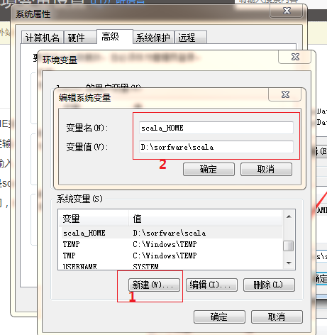

3. ##### 设置path变量：找到系统变量下的“path”如图，单击编辑。在“变量值”一栏的**最前面**添加如下的 code：  **%scala_Home%\bin;%scala_Home%\jre\bin;**     注意：后面的分号  ；  不要漏掉。

   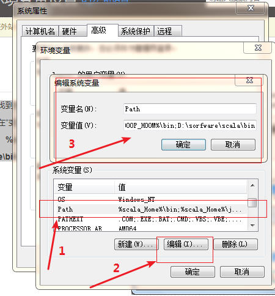

4. ##### 设置classpath变量：找到找到系统变量下的“classpath”如图，单击编辑，如没有，则单击“新建”， “变量名”：**ClassPath** “变量值”：**.;%scala_Home%\bin;%scala_Home%\lib\dt.jar;%scala_Home%\lib\tools.jar.;**           注意：“变量值”最前面的  .;  不要漏掉。最后单击确定即可。

   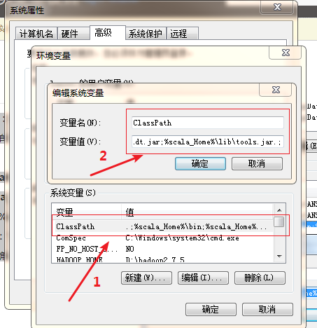

5. ##### 检查环境变量是否设置好了：win+R键调出“cmd”检查。单击 【开始】，在输入框中输入cmd，然后“回车”，输入 scala，然后回车，如环境变量设置ok，你应该能看到这些信息。

   

## 03. scala解释器

后续我们会使用scala解释器来学习scala基本语法，scala解释器像Linux命令一样，执行一条代码，马上就可以让我们看到执行结果，用来测试比较方便。


我们接下来学习：

- 启动scala解释器
- 在scala解释器中执行scala代码
- 退出scala解释器

### 启动scala解释器

要启动scala解释器，只需要以下几步：

- 按住`windows键 + r`
- 输入`scala`即可


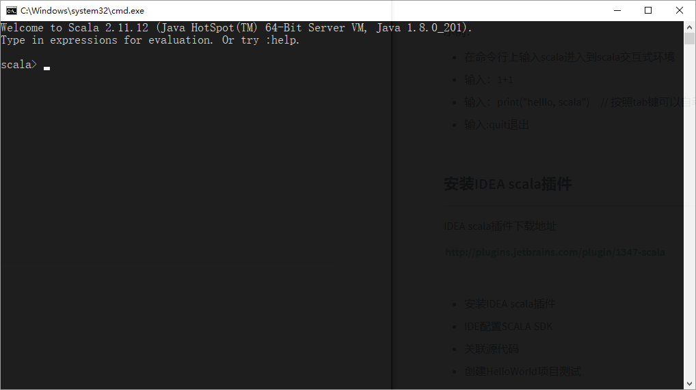

### 执行scala代码

在scala的命令提示窗口中输入`println("hello, world")`，回车执行

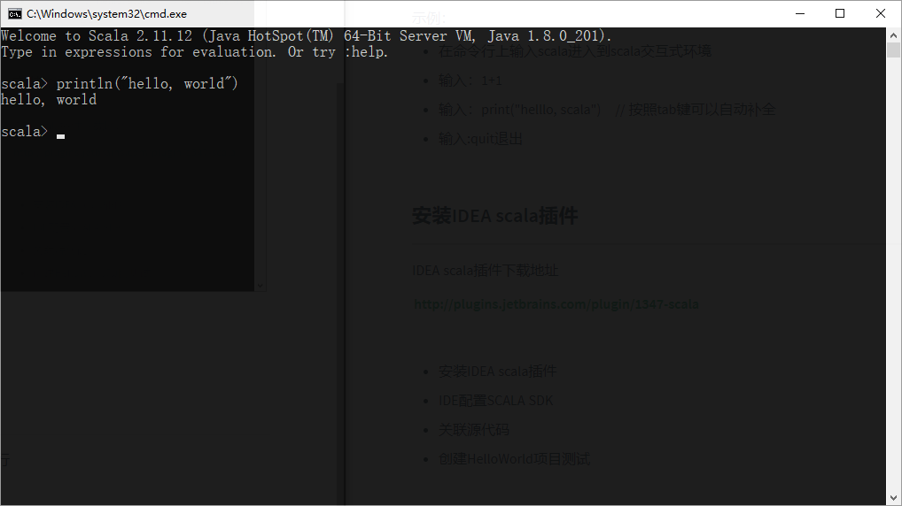

### 退出解释器

在scala命令提示窗口中执行`:quit`，即可退出解释器

## 04. 声明变量

我们将来每一天编写scala程序都会定义变量。那scala语言如何定义变量呢？

语法格式

Java变量定义

```java
int a = 0;
```

在scala中，可以使用`val`或者`var`来定义变量，语法格式如下:

```scala
val/var 变量标识:变量类型 = 初始值
```

其中

- `val`定义的是不可重新赋值的变量
- `var`定义的是可重新赋值的变量

> [!NOTE]
>
> - scala中定义变量类型写在变量名后面
> - scala的语句最后不需要添加分号

### 在解释器中定义一个变量

示例：定义一个变量保存一个人的名字"tom"

**步骤**

1. 打开scala解释器win+R,输入scala,回车进入
2. 定义一个字符串类型的变量用来保存名字

**参考代码**

```scala
scala> val name:String = "tom"
name: String = tom
```

### val和var变量

**示例**

给名字变量进行重新赋值为Jim，观察其运行结果

**参考代码**

```scala
scala> name = "Jim"
<console>:12: error: reassignment to val
       name = "Jim"
```

**示例**

使用`var`重新定义变量来保存名字"tom"，并尝试重新赋值为Jim，观察其运行结果

**参考代码**

```scala
scala> var name:String = "tom"
name: String = tom

scala> name = "Jim"
name: String = Jim
```


> [!TIP]
>
> 优先使用`val`定义变量，如果变量需要被重新赋值，才使用`var`


### 使用类型推断来定义变量

scala的语法要比Java简洁，我们可以使用一种更简洁的方式来定义变量。

**示例**

使用更简洁的语法定义一个变量保存一个人的名字"tom"

**参考代码**

```scala
scala> val name = "tom"
name: String = tom
```

**scala可以自动根据变量的值来自动推断变量的类型**，这样编写代码更加简洁。

### 惰性赋值

在企业的大数据开发中，有时候会编写非常复杂的SQL语句，这些SQL语句可能有几百行甚至上千行。这些SQL语句，如果直接加载到JVM中，会有很大的内存开销。如何解决？

当有一些变量保存的数据较大时，但是不需要马上加载到JVM内存。可以使用**惰性赋值**来提高效率。

语法格式：

```scala
lazy val/var 变量名 = 表达式
```

**示例**

在程序中需要执行一条以下复杂的SQL语句，我们希望只有用到这个SQL语句才加载它。

```scala
"""insert overwrite table adm.itcast_adm_personas
    select
    a.user_id,
    a.user_name,
    a.user_sex,
    a.user_birthday,
    a.user_age,
    a.constellation,
    a.province,
    a.city,
    a.city_level,
    a.hex_mail,
    a.op_mail,
    a.hex_phone,
    a.fore_phone,
    a.figure_model,
    a.stature_model,
    b.first_order_time,
    b.last_order_time,
      ...
    d.month1_hour025_cnt,
    d.month1_hour627_cnt,
    d.month1_hour829_cnt,
    d.month1_hour10212_cnt,
    d.month1_hour13214_cnt,
    d.month1_hour15217_cnt,
    d.month1_hour18219_cnt,
    d.month1_hour20221_cnt,
    d.month1_hour22223_cnt
    from gdm.itcast_gdm_user_basic a
      left join gdm.itcast_gdm_user_consume_order b on a.user_id=b.user_id
    left join gdm.itcast_gdm_user_buy_category c on a.user_id=c.user_id
    left join gdm.itcast_gdm_user_visit d on a.user_id=d.user_id;"""
```

**参考代码**

```scala
scala> lazy val sql = """insert overwrite table adm.itcast_adm_personas
     |     select
     |     a.user_id,
	....
     |     left join gdm.itcast_gdm_user_buy_category c on a.user_id=c.user_id
     |     left join gdm.itcast_gdm_user_visit d on a.user_id=d.user_id;"""
sql: String = <lazy>
```

## 05. 字符串

scala提供多种定义字符串的方式，将来我们可以根据需要来选择最方便的定义方式。

- 使用双引号
- 使用插值表达式
- 使用三引号

### 使用双引号

语法

```scala
val/var 变量名 = “字符串”
```

**示例**

有一个人的名字叫"hadoop"，请打印他的名字以及名字的长度。

**参考代码**

```scala
scala> println(name + name.length)
hadoop6
```

### 使用插值表达式

scala中，可以使用插值表达式来定义字符串，有效避免大量字符串的拼接。

语法

```scala
val/var 变量名 = s"${变量/表达式}字符串"
```


> [!TIP]
>
> - 在定义字符串之前添加`s`
> - 在字符串中，可以使用`${}`来引用变量或者编写表达式

**示例**

请定义若干个变量，分别保存："zhangsan"、30、"male"，定义一个字符串，保存这些信息。

打印输出：name=zhangsan, age=30, sex=male

**参考代码**

```scala
scala> val name = "zhangsan"
name: String = zhangsan

scala> val age = 30
age: Int = 30

scala> val sex = "male"
sex: String = male

scala> val info = s"name=${name}, age=${age}, sex=${sex}"
info: String = name=zhangsan, age=30, sex=male

scala> println(info)
name=zhangsan, age=30, sex=male
```

### 使用三引号

如果有大段的文本需要保存，就可以使用三引号来定义字符串。例如：保存一大段的SQL语句。三个引号中间的所有字符串都将作为字符串的值。

语法

```scala
val/var 变量名 = """字符串1
字符串2"""
```

**示例**

定义一个字符串，保存以下SQL语句

```sql
select
	*
from
    t_user
where
    name = "zhangsan"
```

打印该SQL语句

**参考代码**

```scala
val sql = """select
     | *
     | from
     |     t_user
     | where
     |     name = "zhangsan""""

println(sql)
```

## 06. 数据类型与操作符

scala中的类型以及操作符绝大多数和Java一样，我们主要来学习

- 与Java不一样的一些用法
- scala类型的继承体系

### 数据类型

| 基础类型 | 类型说明                 |
| -------- | ------------------------ |
| Byte     | 8位带符号整数            |
| Short    | 16位带符号整数           |
| **Int**  | 32位带符号整数           |
| Long     | 64位带符号整数           |
| Char     | 16位无符号Unicode字符    |
| String   | Char类型的序列（字符串） |
| Float    | 32位单精度浮点数         |
| Double   | 64位双精度浮点数         |
| Boolean  | true或false              |

注意下 scala类型与Java的区别

> [!NOTE]
>
> 1. scala中所有的类型都使用**大写字母**开头
> 2. 整形使用`Int`而不是Integer
> 3. scala中定义变量可以不写类型，让scala编译器自动推断

### 运算符

| 类别       | 操作符                     |
| ---------- | -------------------------- |
| 算术运算符 | +、-、*、/                 |
| 关系运算符 | >、<、==、!=、>=、<=       |
| 逻辑运算符 | &&、&#124;&#124;、!        |
| 位运算符   | &、&#124;&#124;、^、<<、>> |


- scala中没有，++、--运算符
- 与Java不一样，在scala中，可以直接使用`==`、`!=`进行比较，它们与`equals`方法表示一致。而比较两个对象的引用值，使用`eq`

**示例**

有一个字符串"abc"，再创建第二个字符串，值为：在第一个字符串后拼接一个空字符串。

然后使用比较这两个字符串是否相等、再查看它们的引用值是否相等。

**参考代码**

```scala
val str1 = "abc"
val str2 = str1 + ""
str1 == str2
str1.eq(str2)
```

### scala类型层次结构


| 类型    | 说明                                                         |
| ------- | ------------------------------------------------------------ |
| Any     | **所有类型**的父类，,它有两个子类AnyRef与AnyVal              |
| AnyVal  | **所有数值类型**的父类                                       |
| AnyRef  | 所有对象类型（引用类型）的父类                               |
| Unit    | 表示空，Unit是AnyVal的子类，它只有一个的实例它类似于Java中的void，但scala要比Java更加面向对象 |
| Null    | Null是AnyRef的子类，也就是说它是所有引用类型的子类。它的实例是null可以将null赋值给任何对象类型 |
| Nothing | 所有类型的**子类**不能直接创建该类型实例，某个方法抛出异常时，返回的就是Nothing类型，因为Nothing是所有类的子类，那么它可以赋值为任何类型 |

**nothing**

```scala
def main(args: Array[String]): Unit = {
    val c = m3(1,0)
}

def m3(x:Int, y:Int):Int = {
    if(y == 0) throw new Exception("这是一个异常")
    x / y
}
```

**问题**

以下代码是否有问题？

```scala
val b:Int = null
```

scala会解释报错：

Null类型并不能转换为Int类型，说明**Null类型并不是Int类型的子类**

## 07. 条件表达式

条件表达式就是if表达式，if表达式可以根据给定的条件是否满足，根据条件的结果（真或假）决定执行对应的操作。scala条件表达式的语法和Java一样。

### 有返回值的if

与Java不一样的是，

> [!NOTE]
>
> - 在scala中，条件表达式也是有返回值的
> - 在scala中，没有三元表达式，可以使用if表达式替代三元表达式

**示例**

定义一个变量sex，再定义一个result变量，如果sex等于"male"，result等于1，否则result等于0

**参考代码**

```scala
scala> val sex = "male"
sex: String = male

scala> val result = if(sex == "male") 1 else 0
result: Int = 1
```

### 块表达式

- scala中，使用{}表示一个块表达式
- 和if表达式一样，块表达式也是有值的
- **结果值**就是最后一个表达式的值

**问题**

请问以下代码，变量a的值是什么？

```scala
scala> val a = {
     | println("1 + 1")
     | 1 + 1
     | }
```

## 08.  循环

在scala中，可以使用for和while，但一般推荐使用for表达式，因为for表达式语法更简洁

### for表达式

语法

```scala
for(i <- 表达式/数组/集合) {
    // 表达式
}
```

### 简单循环

使用for表达式打印1-10的数字

**步骤**

1. 生成1-10的数字（提示：使用to方法）
2. 使用for表达式遍历，打印每个数字
3. to:生成一个列表,前后闭合
4. until:生成一个列表,前后闭合

**参考代码1**

```scala
scala> val nums = 1.to(10)                                                              
nums: scala.collection.immutable.Range.Inclusive = Range(1, 2, 3, 4, 5, 6, 7, 8, 9, 10) 
                                                                                        
scala> for(i <- nums) println(i)                                              
```

**简写方式**

**参考代码2**

```scala
// 中缀调用法
scala> for(i <- 1 to 10) println(i)
```

### 嵌套循环

使用for表达式，打印以下字符

```scala
*****
*****
*****
```

**步骤**

1. 使用for表达式打印3行，5列星星
2. 每打印5个星星，换行

**参考代码**

```scala
//简写方式
for(i <- 1 to 3; j <- 1 to 5) {print("*");if(j == 5) println("")}
//复杂方式
for(i <- 3){
    for(j <- 5){
        print("*")
        if(j == 5)
        println()
    }
}
```

### 守卫

for表达式中，可以添加if判断语句，这个if判断就称之为守卫。我们可以使用守卫让for表达式更简洁。

**语法**

```scala
for(i <- 表达式/数组/集合 if 表达式) {
    // 表达式
}
```

**示例**

使用for表达式打印1-10之间能够整除3的数字

**参考代码**

```scala
// 添加守卫，打印能够整除3的数字
for(i <- 1 to 10 if i % 3 == 0) println(i)
```

### for推导式

- 将来可以使用for推导式生成一个新的集合（一组数据）
- 在for循环体中，可以使用yield表达式构建出一个集合，我们把使用yield的for表达式称之为推导式

**示例**

生成一个10、20、30...100的集合

**参考代码**

```scala
// for推导式：for表达式中以yield开始，该for表达式会构建出一个集合
val v = for(i <- 1 to 10) yield i * 10
```

### while循环

scala中while循环和Java中是一致的

**示例**

打印1-10的数字

**参考代码**

```scala
scala> var i = 1
i: Int = 1

scala> while(i <= 10) {
     | println(i)
     | i = i+1
     | }
```

## 08-1. break和continue

- 在scala中，类似Java和C++的break/continue关键字被移除了
- 如果一定要使用break/continue，就需要使用scala.util.control包的Break类的**breable**和**break**方法。

### 实现break

**用法**

- 导入Breaks包`import scala.util.control.Breaks._`
- 使用breakable将for表达式包起来
- for表达式中需要退出循环的地方，添加`break()`方法调用

  **示例**	

使用for表达式打印1-100的数字，如果数字到达50，退出for表达式

**参考代码**

```scala
// 导入scala.util.control包下的Break
import scala.util.control.Breaks._

breakable{
    for(i <- 1 to 100) {
        if(i >= 50) break()
        else println(i)
    }
}
```

### 实现continue

**用法**

continue的实现与break类似，但有一点不同：

> [!NOTE]
>
> 实现break是用breakable{}将整个for表达式包起来，而实现continue是用breakable{}将for表达式的循环体包含起来就可以了

**示例**

打印1-100的数字，使用for表达式来遍历，如果数字能整除10，不打印

```scala
// 导入scala.util.control包下的Break    
import scala.util.control.Breaks._

for(i <- 1 to 100 ) {
    breakable{
        if(i % 10 == 0) break()
        else println(i)
    }
}
```

## 09.方法参数

```
标准形式:
def 方法名(参数名:参数类型,...):返回类型={方法体}
不写返回值类型:
def 方法名((参数名:参数类型,...)={方法体}
参数给默认值:
def 方法名(参数名:参数类型=默认值,...)={方法体}
变长参数:
def 方法名(参数名:参数类型*)={方法体}
```

scala中的方法参数，使用比较灵活。它支持以下几种类型的参数：

- 默认参数
- 带名参数
- 变长参数

### 默认参数

在定义方法时可以给参数定义一个默认值。

**示例**

1. 定义一个计算两个值相加的方法，这两个值默认为0
2. 调用该方法，不传任何参数

**参考代码**

```scala
// x，y带有默认值为0 
def add(x:Int = 0, y:Int = 0) = x + y
add()
```


### 带名参数

在调用方法时，可以指定参数的名称来进行调用。

**示例**

1. 定义一个计算两个值相加的方法，这两个值默认为0
2. 调用该方法，只设置第一个参数的值

**参考代码**

```scala
def add(x:Int = 0, y:Int = 0) = x + y
add(x=1)
add()
```


### 变长参数

如果方法的参数是不固定的，可以定义一个方法的参数是变长参数。

语法格式：

```scala
def 方法名(参数名:参数类型*):返回值类型 = {
    方法体
}
```

> [!NOTE]
>
> 在参数类型后面加一个`*`号，表示参数可以是0个或者多个

**示例**

1. 定义一个计算若干个值相加的方法
2. 调用方法，传入以下数据：1,2,3,4,5

**参考代码**

```scala
scala> def add(num:Int*) = num.sum
add: (num: Int*)Int

scala> add(1,2,3,4,5)
res1: Int = 15
```


## 09-1.方法调用方式

在scala中，有以下几种方法调用方式，

- 后缀调用法
- 中缀调用法
- 花括号调用法
- 无括号调用法

在后续编写spark、flink程序时，我们会使用到这些方法调用方式。

### 后缀调用法

这种方法与Java没有区别。

**语法**

```scala
对象名.方法名(参数)
```

**示例**

使用后缀法`Math.abs`求绝对值

**参考代码**

```scala
scala> Math.abs(-1)
res3: Int = 1
```


### 中缀调用法

**语法**

```scala
对象名 方法名 参数
```

例如：`1 to 10`

> [!TIP]
>
> 如果有多个参数，使用括号括起来

**示例**

使用中缀法`Math.abs`求绝对值

```scala
scala> Math abs -1
res4: Int = 1
```

### 操作符即方法

来看一个表达式

```scala
1 + 1
```

大家觉得上面的表达式像不像方法调用？

在scala中，+ - * / %等这些操作符和Java一样，但在scala中，

- 所有的**操作符都是方法**
- 操作符是**一个方法名字是符号的方法**

### 花括号调用法

语法

```scala
Math.abs{ 
    // 表达式1
    // 表达式2
}
```


> [!DANGER]
>
> 方法只**有一个参数，才能使用花括号调用法**

**示例**

使用花括号调用法`Math.abs`求绝对值

**参考代码**

```scala
scala> Math.abs{
    println("求绝对值")
    -10}
res13: Int = 10
```


### 无括号调用法

如果方法没有参数，可以省略方法名后面的括号

**示例**

- 定义一个无参数的方法，打印"hello"
- 使用无括号调用法调用该方法

**参考代码**

```scala
def m3()=println("hello")
m3()
```

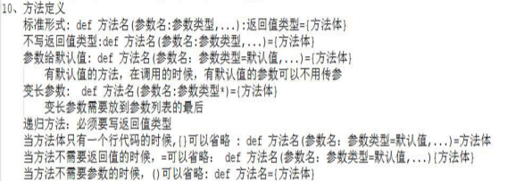

## 10. 函数

scala支持函数式编程，将来编写Spark/Flink程序中，会大量使用到函数

### 定义函数

**语法**

```scala
val 函数变量名 = (参数名:参数类型, 参数名:参数类型....) => 函数体
```

> [!TIP]
>
> - 函数是一个**对象**（变量）
> - 类似于方法，函数也有输入参数和返回值
> - 函数定义不需要使用`def`定义
> - 无需指定返回值类型

**示例**

1. 定义一个两个数值相加的函数
2. 调用该函数

**参考代码**

```scala
scala> val add = (x:Int, y:Int) => x + y
add: (Int, Int) => Int = <function2>

scala> add(1,2)
res3: Int = 3
```


### 方法和函数的区别

- **方法是隶属于类或者对象的，在运行时，它是加载到JVM的方法区中**
- **可以将函数对象赋值给一个变量，在运行时，它是加载到JVM的堆内存中**
- 函数是一个对象，继承自FunctionN，函数对象有apply，curried，toString，tupled这些方法。方法则没有

**示例**

方法无法赋值给变量

```scala
scala> def add(x:Int,y:Int)=x+y
add: (x: Int, y: Int)Int

scala> val a = add
<console>:12: error: missing argument list for method add
Unapplied methods are only converted to functions when a function type is expected.
You can make this conversion explicit by writing `add _` or `add(_,_)` instead of `add`.
       val a = add
```


### 方法转换为函数

- 有时候需要将方法转换为函数，作为变量传递，就需要将方法转换为函数
- 使用`_`即可将方法转换为函数

**示例**

1. 定义一个方法用来进行两个数相加
2. 将该方法转换为一个函数，赋值给变量

**参考代码**

```scala
scala> def add(x:Int,y:Int)=x+y
add: (x: Int, y: Int)Int

scala> val a = add _
a: (Int, Int) => Int = <function2>
```


## 11. 数组

scala中数组的概念是和Java类似，可以用数组来存放一组数据。scala中，有两种数组，一种是**定长数组**，另一种是**变长数组**

### 定长数组

- 定长数组指的是数组的**长度**是**不允许改变**的
- 数组的**元素**是**可以改变**的

**语法**

```scala
// 通过指定长度定义数组
val/var 变量名 = new Array[元素类型](数组长度)

// 用元素直接初始化数组
val/var 变量名 = Array(元素1, 元素2, 元素3...)
```


> [!NOTE]
>
> - 在scala中，数组的泛型使用`[]`来指定
> - 使用`()`来获取元素

**示例一**

1. 定义一个长度为100的整型数组
2. 设置第1个元素为110
3. 打印第1个元素

**参考代码**

```scala
scala> val a = new Array[Int](100)
a: Array[Int] = Array(0, 0, 0, 0, 0, 0, 0, 0, 0, 0, 0, 0, 0, 0, 0, 0, 0, 0, 0, 0, 0, 0, 0, 0, 0, 0, 0, 0, 0, 0, 0, 0, 0, 0, 0, 0, 0, 0, 0, 0, 0, 0, 0, 0, 0, 0, 0, 0, 0, 0, 0, 0, 0, 0, 0, 0, 0, 0, 0, 0, 0, 0, 0, 0, 0, 0, 0, 0, 0, 0, 0, 0, 0, 0, 0, 0, 0, 0, 0, 0, 0, 0, 0, 0, 0, 0, 0, 0, 0, 0, 0, 0, 0, 0, 0, 0, 0, 0, 0, 0)

scala> a(0) = 110

scala> println(a(0))
110
```

**示例二**

1. 定义一个包含以下元素的数组

   ```scala
   "java", "scala", "python"
   ```

2. 获取数组长度

**参考代码**

```scala
// 定义包含jave、scala、python三个元素的数组
scala> val a = Array("java", "scala", "python")
a: Array[String] = Array(java, scala, python)

scala> a.length
res17: Int = 3
```

## 11-1. 变长数组

变长数组指的是数组的长度是可变的，可以往数组中添加、删除元素

### 定义变长数组

创建变长数组，需要提前导入ArrayBuffer类`import scala.collection.mutable.ArrayBuffer`

mutable:表示可变的,mutable包下的都是可变的

**语法**

- 创建空的ArrayBuffer变长数组，语法结构：

  ```scala
  val/var a = ArrayBuffer[元素类型]()
  ```

- 创建带有初始元素的ArrayBuffer

  ```scala
  val/var a = ArrayBuffer(元素1，元素2，元素3....)
  ```

**示例一**

定义一个长度为0的整型变长数组

**参考代码**

```scala
val a = ArrayBuffer[Int]()
```

**示例二**

定义一个包含以下元素的变长数组

```scala
"hadoop", "storm", "spark"
```

**参考代码**

```scala
scala> val a = ArrayBuffer("hadoop", "storm", "spark")
a: scala.collection.mutable.ArrayBuffer[String] = ArrayBuffer(hadoop, storm, spark)
```

### 添加/修改/删除元素

- 使用`+=`添加元素
- 使用`-=`删除元素
- 使用`++=`追加一个数组到变长数组

**示例**

1. 定义一个变长数组，包含以下元素: "hadoop", "spark", "flink"
2. 往该变长数组添加一个"flume"元素
3. 从该变长数组删除"hadoop"元素
4. 再将一个数组，该数组包含"hive", "sqoop"追加到变长数组中

**参考代码**

```scala
// 定义变长数组
scala> val a = ArrayBuffer("hadoop", "spark", "flink")
a: scala.collection.mutable.ArrayBuffer[String] = ArrayBuffer(hadoop, spark, flink)

// 追加一个元素
scala> a += "flume"
res10: a.type = ArrayBuffer(hadoop, spark, flink, flume)

// 删除一个元素
scala> a -= "hadoop"
res11: a.type = ArrayBuffer(spark, flink, flume)

// 追加一个数组
scala> a ++= Array("hive", "sqoop")
res12: a.type = ArrayBuffer(spark, flink, flume, hive, sqoop)
```

## 11-2. 遍历数组

可以使用以下两种方式来遍历数组：

- 使用`for表达式`直接遍历数组中的元素
- 使用`索引`遍历数组中的元素

**示例一**

1. 定义一个数组，包含以下元素1,2,3,4,5
2. 使用for表达式直接遍历，并打印数组的元素

**参考代码**

```scala
scala> val a = Array(1,2,3,4,5)
a: Array[Int] = Array(1, 2, 3, 4, 5)

scala> for(i<-a) println(i)
1
2
3
4
5
```


**示例二**

1. 定义一个数组，包含以下元素1,2,3,4,5
2. 使用for表达式基于索引下标遍历，并打印数组的元素

**参考代码**

```scala
scala> val a = Array(1,2,3,4,5)
a: Array[Int] = Array(1, 2, 3, 4, 5)

scala> for(i <- 0 to a.length - 1) println(a(i))
1
2
3
4
5

scala> for(i <- 0 until a.length) println(a(i))
1
2
3
4
5
```

> [!NOTE]
>
> 0 until n——生成一系列的数字，包含0，不包含n
>
> 0 to n ——包含0，也包含n

## 11-3. 数组常用算法

scala中的数组封装了一些常用的计算操作，将来在对数据处理的时候，不需要我们自己再重新实现。以下为常用的几个算法：

- 求和——sum方法

- 求最大值——max方法
- 求最小值——min方法
- 排序——sorted方法

### 求和

数组中的`sum`方法可以将所有的元素进行累加，然后得到结果

**示例**

1. 定义一个数组，包含以下几个元素（1,2,3,4)
2. 请计算该数组的和

**参考代码**

```scala
scala> val a = Array(1,2,3,4)
a: Array[Int] = Array(1, 2, 3, 4)

scala> a.sum
res49: Int = 10
```


### 最大值

数组中的`max`方法，可以获取到数组中的最大的那个元素值

**示例**

1. 定义一个数组，包含以下几个元素（4,1,2,4,10）
2. 获取数组的最大值

**参考代码**

```scala
scala> val a = Array(4,1,2,4,10)
a: Array[Int] = Array(4, 1, 2, 4, 10)

scala> a.max
res50: Int = 10
```


### 最小值

数组的`min`方法，可以获取到数组中最小的那个元素值

**示例**

1. 定义一个数组，包含以下几个元素（4,1,2,4,10）
2. 获取数组的最小值

**参考代码**

```scala
scala> val a = Array(4,1,2,4,10)
a: Array[Int] = Array(4, 1, 2, 4, 10)

scala> a.min
res51: Int = 1
```


### 排序

数组的`sorted`方法，可以对数组进行升序排序。而`reverse`方法，可以将数组进行反转，从而实现降序排序

**示例**

1. 定义一个数组，包含以下几个元素（4,1,2,4,10）
2. 对数组进行升序排序、降序排序

**参考代码**

```scala
// 升序排序
scala> a.sorted
res53: Array[Int] = Array(1, 2, 4, 4, 10)

// 降序
scala> a.sorted.reverse
res56: Array[Int] = Array(10, 4, 4, 2, 1)
```

## 11-4. 元组

元组可以用来包含一组不同类型的值。例如：姓名，年龄，性别，出生年月。**元组的元素是不可变的。**

**定义元组**

**语法**

使用括号来定义元组

```scala
val/var 元组 = (元素1, 元素2, 元素3....)
```

使用箭头来定义元组（元组只有两个元素）

```scala
val/var 元组 = 元素1->元素2
```

**示例**

定义一个元组，包含一个学生的以下数据

| id   | 姓名     | 年龄 | 地址    |
| ---- | -------- | ---- | ------- |
| 1    | zhangsan | 20   | beijing |

**参考代码**

```scala
scala> val a = (1, "zhangsan", 20, "beijing")
a: (Int, String, Int, String) = (1,zhangsan,20,beijing)
```

**示例**

- 定义一个元组，包含学生的姓名和年龄（zhangsan、20）
- 分别使用括号、和箭头来定义元组

**参考代码**

```scala
scala> val a = ("zhangsan", 20)
a: (String, Int) = (zhangsan,20)

scala> val a = "zhangsan" -> 20
a: (String, Int) = (zhangsan,20)
```


### **访问元组**

使用\_1、\_2、\_3....来访问元组中的元素，**_1表示访问第一个元素**，依次类推

**示例**

- 定义一个元组，包含一个学生的姓名和性别，"zhangsan",  "male"
- 分别获取该学生的姓名和性别

**参考代码**

```scala
scala> val a = "zhangsan" -> "male"
a: (String, String) = (zhangsan,male)

// 获取第一个元素
scala> a._1
res41: String = zhangsan

// 获取第二个元素
scala> a._2
res42: String = male

//元组内元素与前面的参数一一对应的关系
scala> val (id,name,addr) = (1,"张三","北京")
```


## 12. 列表

列表是scala中最重要的、也是最常用的数据结构。List具备以下性质：

- 可以保存重复的值
- 有先后顺序

**在scala中，也有两种列表，一种是不可变列表、另一种是可变列表**

**定义**

不可变列表就是列表的元素、长度都是不可变的。

**语法**

使用`List(元素1, 元素2, 元素3, ...)`来创建一个不可变列表，语法格式：

```scala
val/var 变量名 = List(元素1, 元素2, 元素3...)
```

使用`Nil`创建一个不可变的空列表

```scala
val/var 变量名 = Nil
```

使用`::`方法创建一个不可变列表

```scala
val/var 变量名 = 元素1 :: 元素2 :: Nil
```

> [!TIP]
>
> 使用**::**拼接方式来创建列表，必须在最后添加一个**Nil**

**示例一**

创建一个不可变列表，存放以下几个元素（1,2,3,4）

**参考代码**

```scala
scala> val a = List(1,2,3,4)
a: List[Int] = List(1, 2, 3, 4)
```

**示例二**

使用Nil创建一个不可变的空列表

**参考代码**

```scala
scala> val a = Nil
a: scala.collection.immutable.Nil.type = List()
```

**示例三**

使用`::`方法创建列表，包含-2、-1两个元素

**参考代码**

```scala
scala> val a = -2 :: -1 :: Nil
a: List[Int] = List(-2, -1)
```


## 12-1. 可变列表

可变列表就是列表的元素、长度都是可变的。

要使用可变列表，先要导入`import scala.collection.mutable.ListBuffer`

> [!NOTE]
>
> - 可变集合都在`mutable`包中
> - 不可变集合都在`immutable`包中（默认导入）

**定义**

使用ListBuffer\[元素类型\]()创建空的可变列表，语法结构：

```scala
val/var 变量名 = ListBuffer[Int]()
```

使用ListBuffer(元素1, 元素2, 元素3...)创建可变列表，语法结构：

```scala
val/var 变量名 = ListBuffer(元素1，元素2，元素3...)
```

**示例一**

创建空的整形可变列表

**参考代码**

```scala
  scala> val a = ListBuffer[Int]()
  a: scala.collection.mutable.ListBuffer[Int] = ListBuffer()
```

**示例二**

创建一个可变列表，包含以下元素：1,2,3,4

**参考代码**

```scala
scala> val a = ListBuffer(1,2,3,4)
a: scala.collection.mutable.ListBuffer[Int] = ListBuffer(1, 2, 3, 4)
```


## 12-2. 可变列表操作

- 获取元素（使用括号访问`(索引值)`）
- 添加元素（`+=`）
- 追加一个列表（`++=`）
- 更改元素（`使用括号获取元素，然后进行赋值`）
- 删除元素（`-=`）
- 转换为List（`toList`）
- 转换为Array（`toArray`）

**示例**

1. 定义一个可变列表包含以下元素：1,2,3
2. 获取第一个元素
3. 添加一个新的元素：4
4. 追加一个列表，该列表包含以下元素：5,6,7
5. 删除元素7
6. 将可变列表转换为不可变列表
7. 将可变列表转换为数组

**参考代码**

```scala
// 导入不可变列表
scala> import scala.collection.mutable.ListBuffer
import scala.collection.mutable.ListBuffer

// 创建不可变列表
scala> val a = ListBuffer(1,2,3)
a: scala.collection.mutable.ListBuffer[Int] = ListBuffer(1, 2, 3)

// 获取第一个元素
scala> a(0)
res19: Int = 1

// 追加一个元素
scala> a += 4
res20: a.type = ListBuffer(1, 2, 3, 4)

// 追加一个列表
scala> a ++= List(5,6,7)
res21: a.type = ListBuffer(1, 2, 3, 4, 5, 6, 7)

// 删除元素
scala> a -= 7
res22: a.type = ListBuffer(1, 2, 3, 4, 5, 6)

// 转换为不可变列表
scala> a.toList
res23: List[Int] = List(1, 2, 3, 4, 5, 6)

// 转换为数组
scala> a.toArray
res24: Array[Int] = Array(1, 2, 3, 4, 5, 6)
```

## 12-3. 列表常用操作

以下是列表常用的操作

- 判断列表是否为空（`isEmpty`）
- 拼接两个列表（`++`）
- 获取列表的首个元素（`head`）和剩余部分(`tail`)
- 反转列表（`reverse`）
- 获取前缀（`take`）、获取后缀（`drop`）
- 扁平化（`flaten`）
- 拉链（`zip`）和拉开（`unzip`）
- 转换字符串（`toString`）
- 生成字符串（`mkString`）
- 并集（`union`）
- 交集（`intersect`）
- 差集（`diff`）

### 判断列表是否为空

**示例**

- 定义一个列表，包含以下元素：1,2,3,4
- 使用isEmpty判断列表是否为空

**参考代码**

```scala
scala> val a = List(1,2,3,4)
a: List[Int] = List(1, 2, 3, 4)

scala> a.isEmpty
res51: Boolean = false
```


### 拼接两个列表

**示例**

- 有两个列表，分别包含以下元素1,2,3和4,5,6
- 使用`++`将两个列表拼接起来

**参考代码**

```scala
scala> val a = List(1,2,3)
a: List[Int] = List(1, 2, 3)

scala> val b = List(4,5,6)
b: List[Int] = List(4, 5, 6)

scala> a ++ b
res52: List[Int] = List(1, 2, 3, 4, 5, 6)
```


### 获取列表的首个元素和剩余部分

**示例**

- 定义一个列表，包含以下几个元素：1,2,3
- 使用head方法，获取列表的首个元素
- 使用tail方法，获取除第一个元素以外的元素，它也是一个列表

**参考代码**

```scala
scala> val a = List(1,2,3)
a: List[Int] = List(1, 2, 3)

scala> a.head
res4: Int = 1

scala> a.tail
res5: List[Int] = List(2, 3)
```


### 反转列表

**示例**

- 定一个列表，包含以下元素：1,2,3
- 使用reverse方法将列表的元素反转

```scala
scala> val a = List(1,2,3)
a: List[Int] = List(1, 2, 3)

scala> a.reverse
res6: List[Int] = List(3, 2, 1)
```


### 获取列表前缀和后缀

**示例**

- 定义一个列表，包含以下元素：1,2,3,4,5
- 使用take方法获取前缀（前三个元素）：1,2, 3
- 使用drop方法获取后缀（除前三个以外的元素）：4,5

**参考代码**

```scala
scala> val a = List(1,2,3,4,5)
a: List[Int] = List(1, 2, 3, 4, 5)

scala> a.take(3)
res56: List[Int] = List(1, 2, 3)

scala> a.drop(3)
res60: List[Int] = List(4, 5)
```


### 扁平化(压平)

扁平化表示将列表中的列表中的所有元素放到一个列表中。


**示例**

- 有一个列表，列表中又包含三个列表，分别为：List(1,2)、List(3)、List(4,5)
- 使用flatten将这个列表转换为List(1,2,3,4,5)

**参考代码**

```scala
scala> val a = List(List(1,2), List(3), List(4,5))
a: List[List[Int]] = List(List(1, 2), List(3), List(4, 5))

scala> a.flatten
res0: List[Int] = List(1, 2, 3, 4, 5)
```


### 拉链与拉开

- 拉链：使用zip将两个列表，组合成一个元素为元组的列表
- 拉开：将一个包含元组的列表，解开成包含两个列表的元组

**示例**

- 有两个列表
  - 第一个列表保存三个学生的姓名，分别为：zhangsan、lisi、wangwu
  - 第二个列表保存三个学生的年龄，分别为：19, 20, 21
- 使用zip操作将两个列表的数据"拉"在一起，形成 zhangsan->19, lisi ->20, wangwu->21

**参考代码**

```scala
scala> val a = List("zhangsan", "lisi", "wangwu")
a: List[String] = List(zhangsan, lisi, wangwu)

scala> val b = List(19, 20, 21)
b: List[Int] = List(19, 20, 21)

scala> a.zip(b)
res1: List[(String, Int)] = List((zhangsan,19), (lisi,20), (wangwu,21))
```

**示例**

- 将上述包含学生姓名、年龄的元组列表，解开成两个列表

**参考代码**

```scala
scala> res1.unzip
res2: (List[String], List[Int]) = (List(zhangsan, lisi, wangwu),List(19, 20, 21))
```


### 转换字符串

toString方法可以返回List中的所有元素

**示例**

- 定义一个列表，包含以下元素：1,2,3,4
- 使用toString输出该列表的元素

**参考代码**

```scala
scala> val a = List(1,2,3,4)
a: List[Int] = List(1, 2, 3, 4)

scala> println(a.toString)
List(1, 2, 3, 4)
```


### 生成字符串

mkString方法，可以将元素以分隔符拼接起来。默认没有分隔符

**示例**

- 定义一个列表，包含以下元素1,2,3,4
- 使用mkString，用冒号将元素都拼接起来

**参考代码**

```scala
scala> val a = List(1,2,3,4)
a: List[Int] = List(1, 2, 3, 4)

scala> a.mkString
res7: String = 1234

scala> a.mkString(":")
res8: String = 1:2:3:4
```


### 并集

union表示对两个列表取并集，不去重

**示例**

- 定义第一个列表，包含以下元素：1,2,3,4
- 定义第二个列表，包含以下元素：3,4,5,6
- 使用union操作，获取这两个列表的并集
- 使用distinct操作，去除重复的元素

**参考代码**

```scala
scala> val a1 = List(1,2,3,4)
a1: List[Int] = List(1, 2, 3, 4)

scala> val a2 = List(3,4,5,6)
a2: List[Int] = List(3, 4, 5, 6)

// 并集操作
scala> a1.union(a2)
res17: List[Int] = List(1, 2, 3, 4, 3, 4, 5, 6)

// 可以调用distinct去重
scala> a1.union(a2).distinct
res18: List[Int] = List(1, 2, 3, 4, 5, 6)
```


### 交集

intersect表示对两个列表取交集

**示例**

- 定义第一个列表，包含以下元素：1,2,3,4
- 定义第二个列表，包含以下元素：3,4,5,6
- 使用intersect操作，获取这两个列表的交集

```scala
scala> val a1 = List(1,2,3,4)
a1: List[Int] = List(1, 2, 3, 4)

scala> val a2 = List(3,4,5,6)
a2: List[Int] = List(3, 4, 5, 6)

scala> a1.intersect(a2)
res19: List[Int] = List(3, 4)
```


### 差集

diff表示对两个列表取差集，例如： a1.diff(a2)，表示获取a1在a2中不存在的元素

**示例**

- 定义第一个列表，包含以下元素：1,2,3,4
- 定义第二个列表，包含以下元素：3,4,5,6
- 使用diff获取这两个列表的差集

```scala
scala> val a1 = List(1,2,3,4)
a1: List[Int] = List(1, 2, 3, 4)

scala> val a2 = List(3,4,5,6)
a2: List[Int] = List(3, 4, 5, 6)

scala> a1.diff(a2)
res24: List[Int] = List(1, 2)
```


## 13. Set

**Set(集)是代表没有重复元素的集合**。Set具备以下性质：

1. 元素不重复
2. 不保证插入顺序

scala中的集也分为两种，一种是不可变集，另一种是可变集。

### 不可变集

**定义**

**语法**

创建一个空的不可变集，语法格式：

```scala
val/var 变量名 = Set[类型]()
```

给定元素来创建一个不可变集，语法格式：

```scala
val/var 变量名 = Set(元素1, 元素2, 元素3...)
```

**示例一**

定义一个空的不可变集

**参考代码**

```scala
scala> val a = Set[Int]()
a: scala.collection.immutable.Set[Int] = Set()
```

**示例二**

定义一个不可变集，保存以下元素：1,1,3,2,4,8

**参考代码**

```scala
scala> val a = Set(1,1,3,2,4,8)
a: scala.collection.immutable.Set[Int] = Set(1, 2, 3, 8, 4)
```


**基本操作**

- 获取集的大小（`size`）
- 遍历集（`和遍历数组一致`）
- 添加一个元素，生成一个Set（`+`）
- 拼接两个集，生成一个Set（`++`）
- 拼接集和列表，生成一个Set（`++`）

**示例**

1. 创建一个集，包含以下元素：1,1,2,3,4,5
2. 获取集的大小`size`
3. 遍历集，打印每个元素`for(i<- set集名)println(i)`
4. 删除元素1，生成新的集`-、+`
5. 拼接另一个集（6, 7, 8)`++`
6. 拼接一个列表(6,7,8, 9)`++`

**参考代码**

```scala
// 创建集
scala> val a = Set(1,1,2,3,4,5)
a: scala.collection.immutable.Set[Int] = Set(5, 1, 2, 3, 4)

// 获取集的大小
scala> a.size
res0: Int = 5

// 遍历集
scala> for(i <- a) println(i)

// 删除一个元素
scala> a - 1
res5: scala.collection.immutable.Set[Int] = Set(5, 2, 3, 4)

// 拼接两个集
scala> a ++ Set(6,7,8)
res2: scala.collection.immutable.Set[Int] = Set(5, 1, 6, 2, 7, 3, 8, 4)

// 拼接集和列表
scala> a ++ List(6,7,8,9)
res6: scala.collection.immutable.Set[Int] = Set(5, 1, 6, 9, 2, 7, 3, 8, 4)
```

## 14. 可变集

**定义**

可变集合不可变集的创建方式一致，只不过需要提前导入一个可变集类。

手动导入：`import scala.collection.mutable.Set`

**示例**

1. 定义一个可变集，包含以下元素: 1,2,3, 4
2. 添加元素5到可变集中
3. 从可变集中移除元素1

**参考代码**

```scala
scala> val a = Set(1,2,3,4)
a: scala.collection.mutable.Set[Int] = Set(1, 2, 3, 4)                          

// 添加元素
scala> a += 5
res25: a.type = Set(1, 5, 2, 3, 4)

// 删除元素
scala> a -= 1
res26: a.type = Set(5, 2, 3, 4)
```


## 15. 映射

Map可以称之为映射。它是由键值对组成的集合。在scala中，Map也分为不可变Map和可变Map。

### 不可变Map

**定义**

**语法**

```scala
val/var map = Map(键->值, 键->值, 键->值...)	// 推荐，可读性更好
val/var map = Map((键, 值), (键, 值), (键, 值), (键, 值)...)
```

**示例**

1. 定义一个映射，包含以下学生姓名和年龄数据

   ```scala
   "zhangsan", 30
   "lisi", 40
   ```

2. 获取zhangsan的年龄

**参考代码**

```scala
scala> val map = Map("zhangsan"->30, "lisi"->40)
map: scala.collection.immutable.Map[String,Int] = Map(zhangsan -> 30, lisi -> 40)

scala> val map = Map(("zhangsan", 30), ("lisi", 30))
map: scala.collection.immutable.Map[String,Int] = Map(zhangsan -> 30, lisi -> 30)

// 根据key获取value
scala> map("zhangsan")
res10: Int = 30
```


### 可变Map

**定义**

定义语法与不可变Map一致。但定义可变Map需要手动导入`import scala.collection.mutable.Map`

**示例**

1. 定义一个映射，包含以下学生姓名和年龄数据

   ```scala
   "zhangsan", 30
   "lisi", 40
   ```

2. 修改zhangsan的年龄为20

```scala
scala> val map = Map("zhangsan"->30, "lisi"->40)
map: scala.collection.mutable.Map[String,Int] = Map(lisi -> 40, zhangsan -> 30)

// 修改value
scala> map("zhangsan") = 20
```

Option内有两个子类

- some
- None

## 15-1. Map基本操作

**基本操作**

- 获取值(`map(key)`)
- 获取所有key（`map.keys`）
- 获取所有value（`map.values`）
- 遍历map集合
- getOrElse
- 增加key,value对
- 删除key

**示例**

1. 定义一个映射，包含以下学生姓名和年龄数据

   ```scala
   "zhangsan", 30
   "lisi", 40
   ```

2. 获取zhangsan的年龄

3. 获取所有的学生姓名

4. 获取所有的学生年龄

5. 打印所有的学生姓名和年龄

6. 获取wangwu的年龄，如果wangwu不存在，则返回-1

7. 新增一个学生：wangwu, 35

8. 将lisi从可变映射中移除

**参考代码**

```scala
scala> val map = Map("zhangsan"->30, "lisi"->40)
map: scala.collection.mutable.Map[String,Int] = Map(lisi -> 40, zhangsan -> 30)

// 获取zhagnsan的年龄
scala> map("zhangsan")
res10: Int = 30

// 获取所有的学生姓名
scala> map.keys
res13: Iterable[String] = Set(lisi, zhangsan)

// 获取所有的学生年龄
scala> map.values
res14: Iterable[Int] = HashMap(40, 30)

// 打印所有的学生姓名和年龄
scala> for((x,y) <- map) println(s"$x $y")
lisi 40
zhangsan 30

// 获取wangwu的年龄，如果wangwu不存在，则返回-1
scala> map.getOrElse("wangwu", -1)
res17: Int = -1

// 新增一个学生：wangwu, 35
scala> map + "wangwu"->35
res22: scala.collection.mutable.Map[String,Int] = Map(lisi -> 40, zhangsan -> 30, wangwu -> 35)

// 将lisi从可变映射中移除
scala> map - "lisi"
res23: scala.collection.mutable.Map[String,Int] = Map(zhangsan -> 30)
```


## 15-2. iterator迭代器

scala针对每一类集合都提供了一个迭代器（iterator）用来迭代访问集合

**使用迭代器遍历集合**

- 使用`iterator`方法可以从集合获取一个迭代器
- 迭代器的两个基本操作
  - hasNext——查询容器中是否有下一个元素
  - next——返回迭代器的下一个元素，如果没有，抛出NoSuchElementException
- 每一个迭代器都是有状态的
  - 迭代完后保留在最后一个元素的位置
  - 再次使用则抛出NoSuchElementException
- 可以使用while或者for来逐个返回元素

**示例**

1. 定义一个列表，包含以下元素：1,2,3,4,5
2. 使用while循环和迭代器，遍历打印该列表

**参考代码**

```scala
scala> val ite = a.iterator
ite: Iterator[Int] = non-empty iterator

scala> while(ite.hasNext) {
     | println(ite.next)
     | }
```

**示例**

1. 定义一个列表，包含以下元素：1,2,3,4,5
2. 使用for 表达式和迭代器，遍历打印该列表

**参考代码**

```scala
scala> val a = List(1,2,3,4,5)
a: List[Int] = List(1, 2, 3, 4, 5)

scala> for(i <- a) println(i)
```


## 16. 函数式编程

我们将来使用Spark/Flink的大量业务代码都会使用到函数式编程。下面的这些操作是学习的重点。

- 遍历（`foreach`）
- 映射（`map`）
- 映射扁平化（`flatmap`）
- 过滤（`filter`）
- 是否存在（`exists`）
- 排序（`sorted`、`sortBy`、`sortWith`）
- 分组（`groupBy`）
- 聚合计算（`reduce`）
- 折叠（`fold`）

### 遍历 | foreach

之前，学习过了使用for表达式来遍历集合。我们接下来将学习scala的函数式编程，使用`foreach`方法来进行遍历、迭代。它可以让代码更加简洁。

- **方法签名**

```scala
foreach(f: (A) ⇒ Unit): Unit
```

**说明**

| foreach | API           | 说明                                                       |
| ------- | ------------- | ---------------------------------------------------------- |
| 参数    | f: (A) ⇒ Unit | 接收一个函数对象,函数的输入参数为集合的元素，返回值为空:() |
| 返回值  | Unit          | 空                                                         |

- **foreach执行过程**

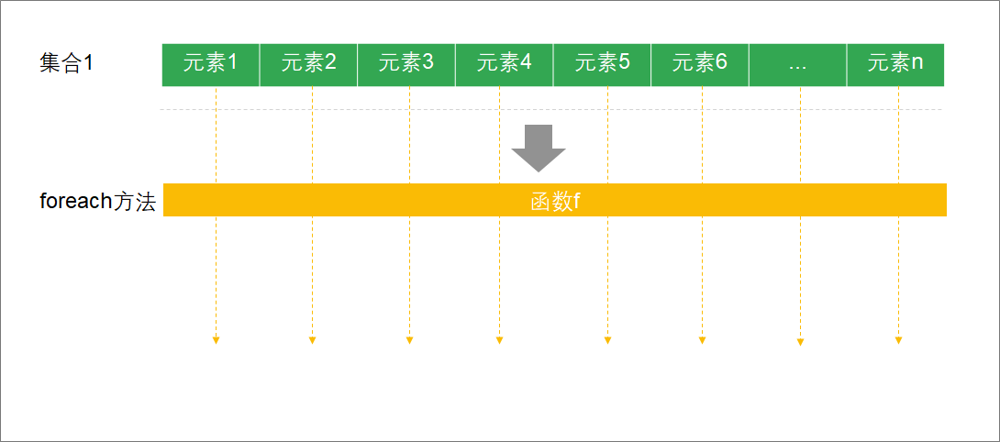

**示例**

有一个列表，包含以下元素1,2,3,4，请使用foreach方法遍历打印每个元素

**参考代码**

```scala
// 定义一个列表
scala> val a = List(1,2,3,4)
a: List[Int] = List(1, 2, 3, 4)

// 迭代打印
scala> a.foreach((x:Int)=>println(x))
```


### 使用类型推断简化函数定义

上述案例函数定义有点啰嗦，我们有更简洁的写法。因为使用foreach去迭代列表，而列表中的每个元素类型是确定的

- scala可以自动来推断出来集合中每个元素参数的类型
- 创建函数时，可以省略其参数列表的类型

**示例**

1. 有一个列表，包含以下元素1,2,3,4，请使用foreach方法遍历打印每个元素
2. 使用类型推断简化函数定义

**参考代码**

```scala
scala> val a = List(1,2,3,4)
a: List[Int] = List(1, 2, 3, 4)
scala> a.foreach((x)=>println(x))

// 省略参数类型,如果只有一个参数,可以省略()
scala> a.foreach(x=>println(x))
```


### 使用下划线来简化函数定义

当函数参数，**只在函数体中出现一次，而且函数体没有嵌套调用时**，可以使用下划线来简化函数定义

**示例**

1. 有一个列表，包含以下元素1,2,3,4，请使用foreach方法遍历打印每个元素
2. 使用**下划线简化函数定义**

**参考代码**

```scala
scala> val a = List(1,2,3,4)
a: List[Int] = List(1, 2, 3, 4)

a.foreach(println(_))
```

- 如果方法参数是函数，如果出现了下划线，scala编译器会自动将代码封装到一个函数中
- 参数列表也是由scala编译器自动处理


## 17. 映射 | map

集合的映射操作是将来在编写Spark/Flink用得最多的操作，是我们必须要掌握的。因为进行数据计算的时候，就是一个将一种数据类型转换为另外一种数据类型的过程。

**map方法接收一个函数，将这个函数应用到每一个元素，返回一个新的列表**

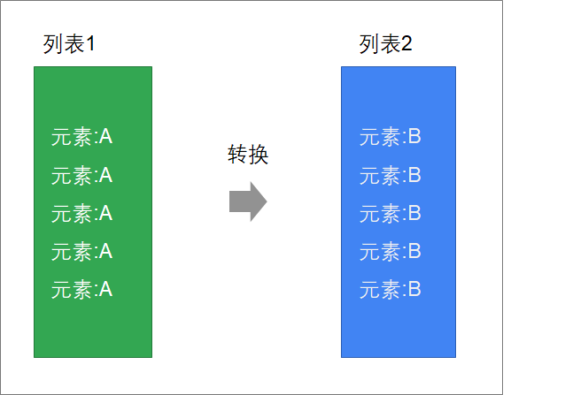

**用法**

- **方法签名**

  ```scala
  def map[B](f: (A) ⇒ B): TraversableOnce[B]
  ```

  | map方法 | API                | 说明                                                         |
  | ------- | ------------------ | ------------------------------------------------------------ |
  | 泛型    | [B]                | 指定map方法最终返回的集合泛型                                |
  | 参数    | f: (A) ⇒ B         | 传入一个函数对象 该函数接收一个类型A（要转换的列表元素），返回值为类型B |
  | 返回值  | TraversableOnce[B] | B类型的集合                                                  |

- **方法解析**

**map方法解析**


**案例一**

1. 创建一个列表，包含元素1,2,3,4
2. 对List中的每一个元素加1

**参考代码**

```scala
scala> a.map(x=>x+1)
res4: List[Int] = List(2, 3, 4, 5)
```

**案例二**

1. 创建一个列表，包含元素1,2,3,4
2. 使用下划线来定义函数，对List中的每一个元素加1

**参考代码**

```scala
scala> val a = List(1,2,3,4)
a: List[Int] = List(1, 2, 3, 4)

scala> a.map(_ + 1)
```


## 18. 扁平化映射 | flatMap

扁平化映射也是将来用得非常多的操作，也是必须要掌握的。

**定义**

**可以把flatMap，理解为先map，然后再flatten**


- map是将列表中的**元素转换为一个List**
- flatten再将整个列表进行扁平化

**方法签名**

```scala
def flatMap[B](f: (A) ⇒ GenTraversableOnce[B]): TraversableOnce[B]
```

**方法解析**

| flatmap方法 | API                            | 说明                                                         |
| ----------- | ------------------------------ | ------------------------------------------------------------ |
| 泛型        | [B]                            | 最终要转换的集合元素类型                                     |
| 参数        | f: (A) ⇒ GenTraversableOnce[B] | 传入一个函数对象<br />函数的参数是集合的元素<br />函数的返回值是一个集合 |
| 返回值      | TraversableOnce[B]             | B类型的集合                                                  |

**案例**

**案例说明**

1. 有一个包含了若干个文本行的列表："hadoop hive spark flink flume", "kudu hbase sqoop storm"
2. 获取到文本行中的每一个单词，并将每一个单词都放到列表中

**思路分析**

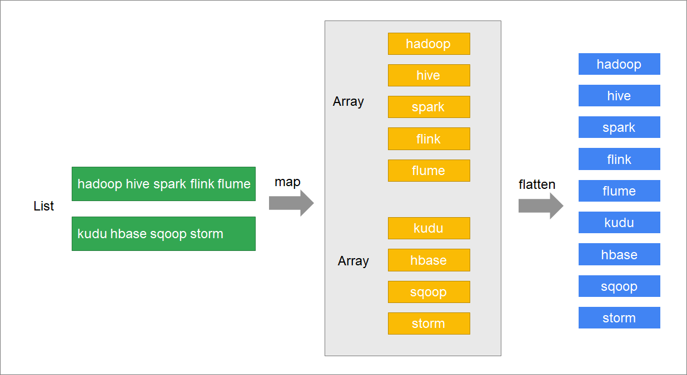

**步骤**

1. 使用map将文本行拆分成数组
2. 再对数组进行扁平化

**参考代码**

```scala
// 定义文本行列表
scala> val a = List("hadoop hive spark flink flume", "kudu hbase sqoop storm")
a: List[String] = List(hadoop hive spark flink flume, kudu hbase sqoop storm)

// 使用map将文本行转换为单词数组
scala> a.map(x=>x.split(" "))
res5: List[Array[String]] = List(Array(hadoop, hive, spark, flink, flume), Array(kudu, hbase, sqoop, storm))

// 扁平化，将数组中的
scala> a.map(x=>x.split(" ")).flatten
res6: List[String] = List(hadoop, hive, spark, flink, flume, kudu, hbase, sqoop, storm)
```

**使用flatMap简化操作**

**参考代码**

```scala
scala>  val a = List("hadoop hive spark flink flume", "kudu hbase sqoop storm")
a: List[String] = List(hadoop hive spark flink flume, kudu hbase sqoop storm)
//flatMap想进行map操作,在进行flat操作
scala> a.flatMap(_.split(" "))
res7: List[String] = List(hadoop, hive, spark, flink, flume, kudu, hbase, sqoop, storm)
```


## 19. 过滤 | filter

过滤符合一定条件的元素


**定义**

**方法签名**

```scala
def filter(p: (A) ⇒ Boolean): TraversableOnce[A]
```

**方法解析**

| filter方法 | API                | 说明                                                         |
| ---------- | ------------------ | ------------------------------------------------------------ |
| 参数       | p: (A) ⇒ Boolean   | 传入一个函数对象<br />接收一个集合类型的参数<br />返回布尔类型，满足条件返回true, 不满足返回false |
| 返回值     | TraversableOnce[A] | 列表                                                         |


**案例**

1. 有一个数字列表，元素为：1,2,3,4,5,6,7,8,9
2. 请过滤出所有的偶数

**参考代码**

```scala
scala> List(1,2,3,4,5,6,7,8,9).filter(_ % 2 == 0)
res8: List[Int] = List(2, 4, 6, 8)
```


## 20. 排序

在scala集合中，可以使用以下几种方式来进行排序

- sorted默认排序
- sortBy指定字段排序
- sortWith自定义排序


### 默认排序 | sorted

**示例**

1. 定义一个列表，包含以下元素: 3, 1, 2, 9, 7
2. 对列表进行升序排序

**参考代码**

```scala
scala> List(3,1,2,9,7).sorted
res16: List[Int] = List(1, 2, 3, 7, 9)
```


### 指定字段排序 | sortBy

根据传入的函数转换后，再进行排序
**方法签名**

```scala
def sortBy[B](f: (A) ⇒ B): List[A]
```

**方法解析**

| sortBy方法 | API        | 说明                                                         |
| ---------- | ---------- | ------------------------------------------------------------ |
| 泛型       | [B]        | 按照什么类型来进行排序                                       |
| 参数       | f: (A) ⇒ B | 传入函数对象<br />接收一个集合类型的元素参数<br />返回B类型的元素进行排序 |
| 返回值     | List[A]    | 返回排序后的列表                                             |

**示例**

1. 有一个列表，分别包含几下文本行："01 hadoop", "02 flume", "03 hive", "04 spark"
2. 请按照单词字母进行排序

**参考代码**

```scala
scala> val a = List("01 hadoop", "02 flume", "03 hive", "04 spark")
a: List[String] = List(01 hadoop, 02 flume, 03 hive, 04 spark)

// 获取单词字段
scala> a.sortBy(_.split(" ")(1))
res8: List[String] = List(02 flume, 01 hadoop, 03 hive, 04 spark)
```


### 自定义排序 | sortWith

自定义排序，根据一个函数来进行自定义排序

**方法签名**

```scala
def sortWith(lt: (A, A) ⇒ Boolean): List[A]
```

**方法解析**

| sortWith方法 | API                  | 说明                                                         |
| ------------ | -------------------- | ------------------------------------------------------------ |
| 参数         | lt: (A, A) ⇒ Boolean | 传入一个比较大小的函数对象<br />接收两个集合类型的元素参数<br />返回两个元素大小，小于返回true，大于返回false |
| 返回值       | List[A]              | 返回排序后的列表                                             |

**示例**

1. 有一个列表，包含以下元素：2,3,1,6,4,5
2. 使用sortWith对列表进行降序排序

**参考代码**

```scala
scala> val a = List(2,3,1,6,4,5)
a: List[Int] = List(2, 3, 1, 6, 4, 5)

scala> a.sortWith((x,y) => if(x<y)true else false)
res15: List[Int] = List(1, 2, 3, 4, 5, 6)

scala> res15.reverse
res18: List[Int] = List(6, 5, 4, 3, 2, 1)
```

**使用下划线简写上述案例** 

**参考代码**

```scala
scala> val a = List(2,3,1,6,4,5)
a: List[Int] = List(2, 3, 1, 6, 4, 5)

// 函数参数只在函数中出现一次，可以使用下划线代替
scala> a.sortWith(_ < _).reverse
res19: List[Int] = List(6, 5, 4, 3, 2, 1)
```


## 21. 分组 | groupBy

我们如果要将数据按照分组来进行统计分析，就需要使用到分组方法

**定义**

groupBy表示按照函数将列表分成不同的组

**方法签名**

```scala
def groupBy[K](f: (A) ⇒ K): Map[K, List[A]]
```

**方法解析**

| groupBy方法 | API             | 说明                                                         |
| ----------- | --------------- | ------------------------------------------------------------ |
| 泛型        | [K]             | 分组字段的类型                                               |
| 参数        | f: (A) ⇒ K      | 传入一个函数对象<br />接收集合元素类型的参数<br />返回一个K类型的key，这个key会用来进行分组，相同的key放在一组中 |
| 返回值      | Map[K, List[A]] | 返回一个映射，K为分组字段，List为这个分组字段对应的一组数据  |


**groupBy执行过程分析**

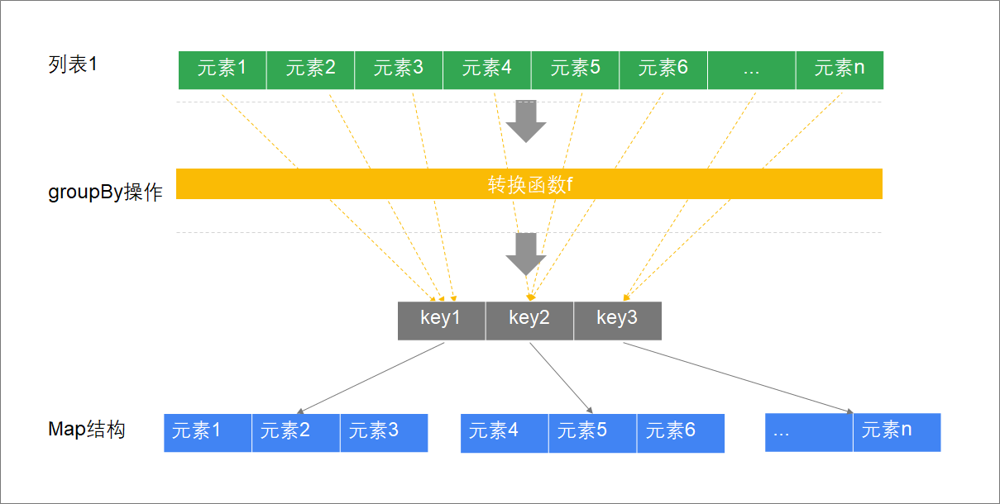


**示例**

1. 有一个列表，包含了学生的姓名和性别: 

   ```scala
   "张三", "男"
   "李四", "女"
   "王五", "男"
   ```

2. 请按照性别进行分组，统计不同性别的学生人数

**步骤**

1. 定义一个元组列表来保存学生姓名和性别
2. 按照性别进行分组
3. 将分组后的Map转换为列表：List(("男" -> 2), ("女" -> 1))

**参考代码**

```scala
scala> val a = List("张三"->"男", "李四"->"女", "王五"->"男")
a: List[(String, String)] = List((张三,男), (李四,女), (王五,男))

// 按照性别分组
scala> a.groupBy(_._2)
res0: scala.collection.immutable.Map[String,List[(String, String)]] = Map(男 -> List((张三,男), (王五,男)),
女 -> List((李四,女)))

// 将分组后的映射转换为性别/人数元组列表
scala> res0.map(x => x._1 -> x._2.size)
res3: scala.collection.immutable.Map[String,Int] = Map(男 -> 2, 女 -> 1)
```


## 22. 聚合操作

聚合操作，可以将一个列表中的数据合并为一个。这种操作经常用来统计分析中

### 聚合 | reduce

**reduce表示将列表，传入一个函数进行聚合计算**

**定义**

------

**方法签名**

```scala
def reduce[A1 >: A](op: (A1, A1) ⇒ A1): A1
```

**方法解析**

| reduce方法 | API               | 说明                                                         |
| ---------- | ----------------- | ------------------------------------------------------------ |
| 泛型       | [A1 >: A]         | （下界）A1必须是集合元素类型的子类                           |
| 参数       | op: (A1, A1) ⇒ A1 | 传入函数对象，用来不断进行聚合操作<br />第一个A1类型参数为：当前聚合后的变量<br />第二个A1类型参数为：当前要进行聚合的元素 |
| 返回值     | A1                | 列表最终聚合为一个元素                                       |

**reduce执行流程分析**

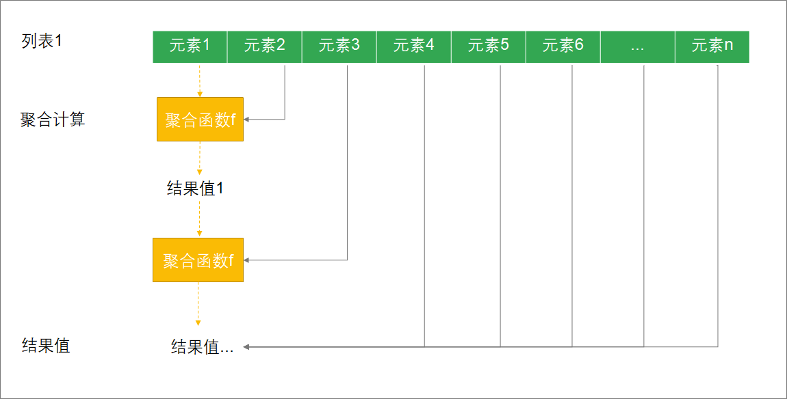


> [!NOTE]
>
> - reduce和reduceLeft效果一致，表示从左到右计算
> - reduceRight表示从右到左计算

**案例**

------

1. 定义一个列表，包含以下元素：1,2,3,4,5,6,7,8,9,10
2. 使用reduce计算所有元素的和

**参考代码**

```scala
scala> val a = List(1,2,3,4,5,6,7,8,9,10)
a: List[Int] = List(1, 2, 3, 4, 5, 6, 7, 8, 9, 10)

scala> a.reduce((x,y) => x + y)
res5: Int = 55

// 第一个下划线表示第一个参数，就是历史的聚合数据结果
// 第二个下划线表示第二个参数，就是当前要聚合的数据元素
scala> a.reduce(_ + _)
res53: Int = 55

// 与reduce一样，从左往右计算
scala> a.reduceLeft(_ + _)
res0: Int = 55

// 从右往左聚合计算
scala> a.reduceRight(_ + _)
res1: Int = 55
```


### 折叠 |  fold

fold与reduce很像，但是多了一个指定初始值参数

**定义**

------

**方法签名**

```scala
def fold[A1 >: A](z: A1)(op: (A1, A1) ⇒ A1): A1
```

**方法解析**

| reduce方法 | API               | 说明                                                         |
| ---------- | ----------------- | ------------------------------------------------------------ |
| 泛型       | [A1 >: A]         | （下界）A1必须是集合元素类型的子类                           |
| 参数1      | z: A1             | 初始值                                                       |
| 参数2      | op: (A1, A1) ⇒ A1 | 传入函数对象，用来不断进行折叠操作<br />第一个A1类型参数为：当前折叠后的变量<br />第二个A1类型参数为：当前要进行折叠的元素 |
| 返回值     | A1                | 列表最终折叠为一个元素                                       |


> [!NOTE]
>
> - fold和foldLet效果一致，表示从左往右计算
> - foldRight表示从右往左计算

**案例**

------

1. 定义一个列表，包含以下元素：1,2,3,4,5,6,7,8,9,10
2. 使用fold方法计算所有元素的和

**参考代码**

```scala
scala> val a = List(1,2,3,4,5,6,7,8,9,10)
a: List[Int] = List(1, 2, 3, 4, 5, 6, 7, 8, 9, 10)

scala> a.fold(0)(_ + _)
res4: Int = 155
```

## 作业

1. 需求:定义方法[数组[Int]/列表[Int],x:Int],找到x在数据中的位置[二分查找]		[index,list]

   //List(1,8,2,4,6,9)   4

   //4,List(1,2,4,6,8,9)

   ```scala
   /** **
     * 需求:定义方法[数组[Int]/列表[Int],x:Int],找到x在数组的位置[二分法查找]
     * 返回值 (index,List)
     *
     * */
   object _02ClassDemo {
     def findIndex(a:Int,list:List[Int]):(Int,List[Int])={
       val list1 =list.sorted
       var startIndex =0
       var stopIndex =list.length-1
       var tmpIndex = -1
       while(startIndex <= stopIndex){
       tmpIndex = (stopIndex + startIndex)/2
       if(list1(tmpIndex) > a){
       stopIndex = tmpIndex - 1
     }else if(list1(tmpIndex) < a){
       startIndex =tmpIndex + 1
     }else{
       return (tmpIndex,list1)
     }
     }
       return (-1,list1)
     }
   
     def main(args: Array[String]): Unit = {
       var a =3;
       var list =List(1,2,3,4,5,6)
      print(findIndex(a,list))
       
     }
   }
   ```

2. 使用类似mapreduce的方法做单词统计

   ```scala
   //定义List集合
   var list = List("hello hello word","java scala python","scala word java")
   
   list.flatMap(_.split(" "))
   
   list.flatMap(_.split(" ")).map(x=>(x,1)).groupBy
   
   list.flatMap(_.split(" ")).map(x=>(x,1)).groupBy(_._1)
   
   list.flatMap(_.split(" ")).map(x=>(x,1)).groupBy(_._1).map(x=>(x._1,x._2.size)
   ```