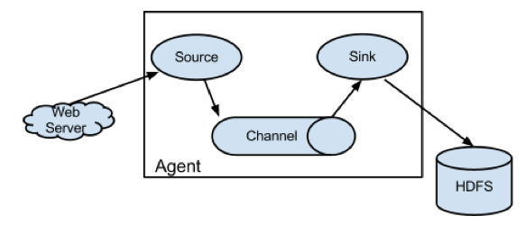
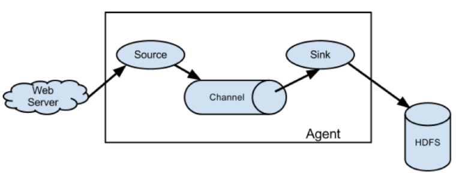
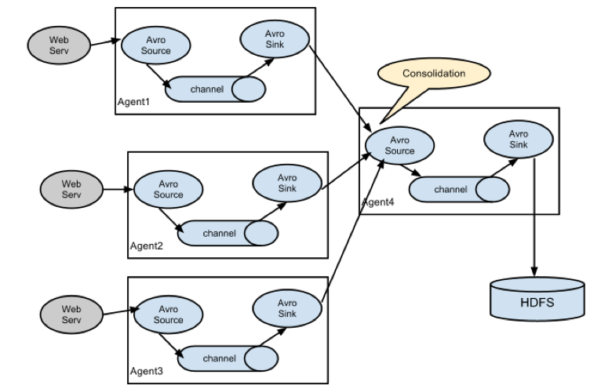
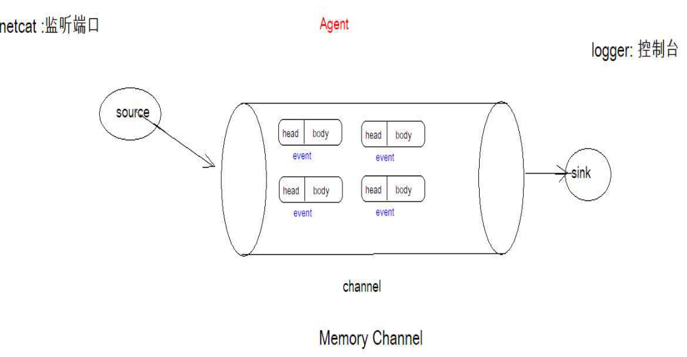
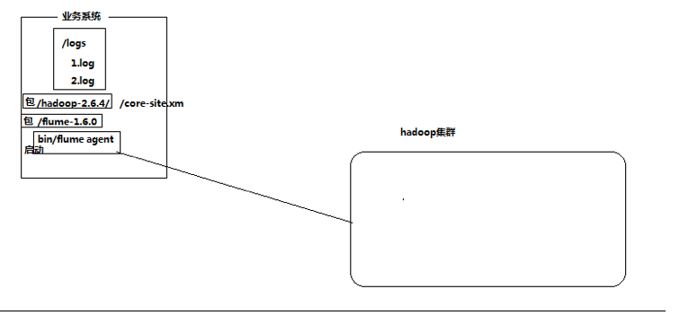
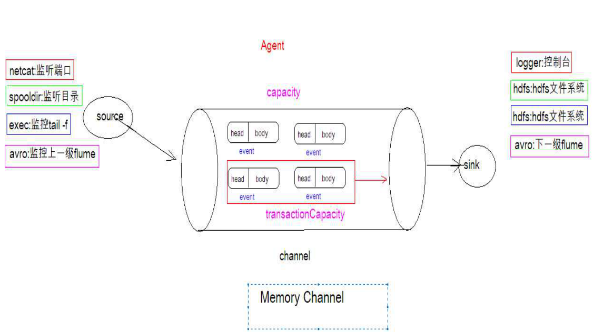
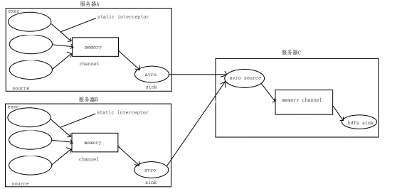
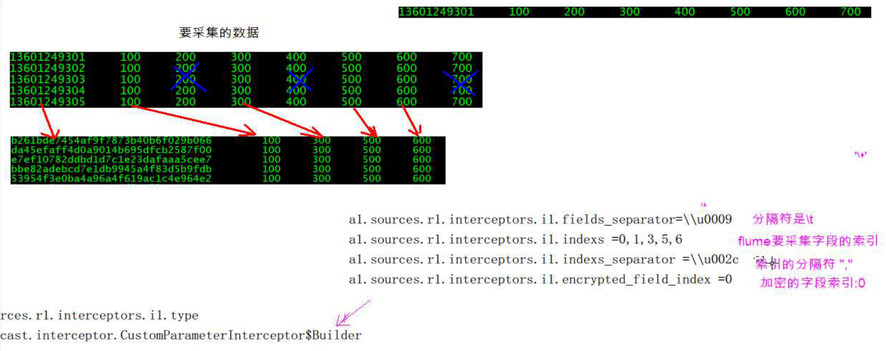
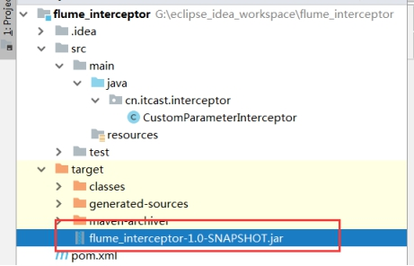

# Day 11 Flume

## 1. Flume 介绍

### 1.1. 概述

* Flume是一个分布式、可靠、和高可用的海量日志采集、聚合和传输的系统。
* Flume可以采集文件，socket数据包、文件、文件夹、kafka等各种形式源数据，又可以将采集到的数据(下沉sink)输出到HDFS、hbase、hive、kafka等众多外部存储系统中
* 一般的采集需求，通过对flume的简单配置即可实现
* Flume针对特殊场景也具备良好的自定义扩展能力，
因此，flume可以适用于大部分的日常数据采集场景
* 官网https://flume.apache.org

**总结**

- flume是一款大数据中海量数据采集传输汇总的软件,特别指定的是数据流转的过程,或者说是数据搬运的过程,把数据一个存储介质通过flume传递到另一个存储介质中.

### 1.2. 运行机制

1. Flume分布式系统中最核心的角色是agent，flume采集系统就是由一个个agent所连接起来形成
2. 每一个agent相当于一个数据传递员，内部有三个组件：
    1. Source：采集组件，用于跟数据源对接，以获取数据
    
    2. Sink：下沉组件，用于往下一级agent传递数据或者往最终存储系统传递数据

    3. Channel：传输通道组件，用于从source将数据传递到sink
    
       

**总结**	

- flume本身是一个java程序,在需要采集数据机器上启动-->agent进程
- agent进程里面包含了:source sink channel
- 在flume中,数据包装成event真实的数据是放在event body中,event 是flume中最小的数据单元;

### 1.3. Flume 结构图

##### 简单结构

单个 Agent 采集数据

	

##### 复杂结构

多级 Agent 之间串联

	

**总结**

- 简单架构
  - 只需要部署一个agent进程即可
- 复杂结构
  - 多个agent之间的串联,相当于大家手拉手共同完成数据的采集传输工作,在串联的架构中没有主从之分,大家的地位都一样

## 2. Flume 实战案例

> 案例：使用网络telent命令向一台机器发送一些网络数据，然后通过flume采集网络端口数据

> 

### 2.1. Flume 的安装部署

##### Step 1: 下载解压修改配置文件

下载地址：

http://archive.apache.org/dist/flume/1.8.0/apache-flume-1.8.0-bin.tar.gz

Flume的安装非常简单，只需要解压即可，当然，前提是已有hadoop环境

上传安装包到数据源所在节点上

这里我们采用在第三台机器(192.168.72.120)来进行安装 

```shell
cd /export/softwares/
tar -zxvf apache-flume-1.8.0-bin.tar.gz -C ../servers/
cd /export/servers/apache-flume-1.8.0-bin/conf
cp  flume-env.sh.template flume-env.sh
vim flume-env.sh

export JAVA_HOME=/export/servers/jdk1.8.0_141
chmod a+x flume-env.sh
```

##### Step 2: 开发配置文件

根据数据采集的需求配置采集方案，描述在配置文件中(文件名可任意自定义)

配置我们的网络收集的配置文件
在flume的conf目录下新建一个配置文件（采集方案）

```shell
vim   /export/servers/apache-flume-1.8.0-bin/conf/netcat-logger.conf
```

```properties
# 定义这个agent中各组件的名字
a1.sources = r1
a1.sinks = k1
a1.channels = c1

# 描述和配置source组件：r1
a1.sources.r1.type = netcat
a1.sources.r1.bind = 192.168.72.120
a1.sources.r1.port = 44444

# 描述和配置sink组件：k1
a1.sinks.k1.type = logger

# 描述和配置channel组件，此处使用是内存缓存的方式
a1.channels.c1.type = memory
a1.channels.c1.capacity = 1000
a1.channels.c1.transactionCapacity = 100

# 描述和配置source  channel   sink之间的连接关系
a1.sources.r1.channels = c1
a1.sinks.k1.channel = c1
```

Channel参数解释：

capacity：默认该通道中最大的可以存储的event数量

trasactionCapacity：每次最大可以从source中拿到或者送到sink中的event数量

##### Step 3: 启动配置文件

指定采集方案配置文件，在相应的节点上启动flume agent

先用一个最简单的例子来测试一下程序环境是否正常
启动agent去采集数据

```shell
#回到flume根目录
bin/flume-ng agent -c conf -f conf/netcat-logger.conf -n a1  -Dflume.root.logger=INFO,console
```

* `-c conf`   指定flume自身的配置文件所在目录
* `-f conf/netcat-logger.con`  指定我们所描述的采集方案
* `-n a1`  指定我们这个agent的名字

##### Step 4: 安装 Telnet 准备测试

在node02机器上面安装telnet客户端，用于模拟数据的发送

```shell
yum -y install telnet
telnet  node03  44444   # 使用telnet模拟数据发送
```



### 2.2. 采集案例

#### 2.2.3. 采集目录到 HDFS



##### 需求

某服务器的某特定目录下，会不断产生新的文件，每当有新文件出现，就需要把文件采集到HDFS中去

##### 思路

根据需求，首先定义以下3大要素
1. 数据源组件，即source ——监控文件目录 :  spooldir
    1. 监视一个目录，只要目录中出现新文件，就会采集文件中的内容
    2. 采集完成的文件，会被agent自动添加一个后缀：COMPLETED
    3. 所监视的目录中不允许重复出现相同文件名的文件
2. 下沉组件，即sink——HDFS文件系统  :  hdfs sink
3. 通道组件，即channel——可用file channel 也可以用内存channel

##### Step 1: Flume 配置文件

```shell
cd  /export/servers/apache-flume-1.8.0-bin/conf
mkdir -p /export/servers/dirfile
vim spooldir.conf
```

```properties
# Name the components on this agent
a1.sources = r1
a1.sinks = k1
a1.channels = c1
# Describe/configure the source
##注意：不能往监控目中重复丢同名文件
a1.sources.r1.type = spooldir
a1.sources.r1.spoolDir = /export/servers/dirfile
a1.sources.r1.fileHeader = true
# Describe the sink
a1.sinks.k1.type = hdfs
a1.sinks.k1.channel = c1
a1.sinks.k1.hdfs.path = hdfs://node01:8020/spooldir/files/%y-%m-%d/%H%M/
a1.sinks.k1.hdfs.filePrefix = events-
#是否开启时间上的舍弃,控制文件夹
a1.sinks.k1.hdfs.round = true
a1.sinks.k1.hdfs.roundValue = 10
a1.sinks.k1.hdfs.roundUnit = minute

#roll控制写入hdfs文件,以何种方式进行滚动
#以时间间隔
a1.sinks.k1.hdfs.rollInterval = 3	
#以文件大小
a1.sinks.k1.hdfs.rollSize = 20
#以event个数
a1.sinks.k1.hdfs.rollCount = 5		
#以上三个文件都配置,谁先满足触发滚动,如果不想以某种属性滚动,设置为0即可
a1.sinks.k1.hdfs.batchSize = 1
a1.sinks.k1.hdfs.useLocalTimeStamp = true

#生成的文件类型，默认是Sequencefile，可用DataStream，则为普通文本

a1.sinks.k1.hdfs.fileType = DataStream

# Use a channel which buffers events in memory
a1.channels.c1.type = memory
#capacity为1000个event
a1.channels.c1.capacity = 1000
#transactionCapacity一次向sink运输100个event
a1.channels.c1.transactionCapacity = 100
# Bind the source and sink to the channel
a1.sources.r1.channels = c1
a1.sinks.k1.channel = c1
```

Channel参数解释

capacity：默认该通道中最大的可以存储的event数量
trasactionCapacity：每次最大可以从source中拿到或者送到sink中的event数量
keep-alive：event添加到通道中或者移出的允许时间

##### Step 2: 启动 Flume

```shell
bin/flume-ng agent -c ./conf -f ./conf/spooldir.conf -n a1 -Dflume.root.logger=INFO,console
#命令的精简版,
#--conf 对应 -c 	配置文件的目录
#--conf-file对应-f	指定采集方案路径
#--name对应-n		进程名字,摇跟采集方案中保持一致
```

##### Step 3: 上传文件到指定目录

将不同的文件放到下面目录里面去，注意[文件不能重名]()

```shell
cd /export/servers/dirfile
```

#### 2.2.4. 采集文件到 HDFS

##### 需求

比如业务系统使用log4j生成的日志，日志内容不断增加，需要把追加到日志文件中的数据实时采集到hdfs

##### 分析

根据需求，首先定义以下3大要素
* 采集源，即source——监控文件内容更新 :  exec  ‘tail -F 	file’
* 下沉目标，即sink——HDFS文件系统  :  hdfs sink
* Source和sink之间的传递通道——channel，可用file channel 也可以用 内存channel

##### Step 1: 定义 Flume 配置文件

```shell
cd /export/servers/apache-flume-1.8.0-bin/conf
vim tail-exec-file.conf
```

```properties
agent1.sources = source1
agent1.sinks = sink1
agent1.channels = channel1

# Describe/configure tail -F source1
agent1.sources.source1.type = exec
agent1.sources.source1.command = tail -F /export/servers/taillogs/access_log
agent1.sources.source1.channels = channel1

# Describe sink1
agent1.sinks.sink1.type = hdfs
#a1.sinks.k1.channel = c1
agent1.sinks.sink1.hdfs.path = hdfs://node01:8020/weblog/flume-collection/%y-%m-%d/%H-%M
agent1.sinks.sink1.hdfs.filePrefix = access_log
agent1.sinks.sink1.hdfs.maxOpenFiles = 5000
agent1.sinks.sink1.hdfs.batchSize= 100
agent1.sinks.sink1.hdfs.fileType = DataStream
agent1.sinks.sink1.hdfs.writeFormat =Text
 
agent1.sinks.sink1.hdfs.round = true
agent1.sinks.sink1.hdfs.roundValue = 10
agent1.sinks.sink1.hdfs.roundUnit = minute
agent1.sinks.sink1.hdfs.useLocalTimeStamp = true

# Use a channel which buffers events in memory
agent1.channels.channel1.type = memory
agent1.channels.channel1.keep-alive = 120
agent1.channels.channel1.capacity = 500000
agent1.channels.channel1.transactionCapacity = 600

# Bind the source and sink to the channel
agent1.sources.source1.channels = channel1
agent1.sinks.sink1.channel = channel1
```

##### Step 2: 启动 Flume

```shell
cd  /export/servers/apache-flume-1.8.0-bin
bin/flume-ng agent -c conf -f conf/tail-exec-file.conf -n agent1  -Dflume.root.logger=INFO,console
```

##### Step 3: 开发 Shell 脚本定时追加文件内容

```shell
mkdir -p /export/servers/shells/
cd  /export/servers/shells/
vim tail-file.sh
```

```shell
#!/bin/bash
while true
do
 date >> /export/servers/taillogs/access_log;
  sleep 0.5;
done
```

##### Step 4: 启动脚本

```shell
# 创建文件夹
mkdir -p /export/servers/taillogs
# 启动脚本
sh /export/servers/shells/tail-file.sh
```

**参数解析：**

**·** **rollInterval**

默认值：30

hdfs sink间隔多长将临时文件滚动成最终目标文件，单位：秒；

如果设置成0，则表示不根据时间来滚动文件；

注：滚动（roll）指的是，hdfs sink将临时文件重命名成最终目标文件，并新打开一个临时文件来写入数据；

**·** **rollSize**

默认值：1024

当临时文件达到该大小（单位：bytes）时，滚动成目标文件；

如果设置成0，则表示不根据临时文件大小来滚动文件；

**·** **rollCount**

默认值：10

当events数据达到该数量时候，将临时文件滚动成目标文件；

如果设置成0，则表示不根据events数据来滚动文件；

**·** **round**

默认值：false

是否启用时间上的“舍弃”，这里的“舍弃”，类似于“四舍五入”。

**·** **roundValue**

默认值：1

时间上进行“舍弃”的值；

**·** **roundUnit**

默认值：seconds

时间上进行“舍弃”的单位，包含：second,minute,hour

示例：

a1.sinks.k1.hdfs.path = /flume/events/%y-%m-%d/%H%M/%S

a1.sinks.k1.hdfs.round = true

a1.sinks.k1.hdfs.roundValue = 10

a1.sinks.k1.hdfs.roundUnit = minute

当时间为2015-10-16 17:38:59时候，hdfs.path依然会被解析为：

/flume/events/20151016/17:30/00

因为设置的是舍弃10分钟内的时间，因此，该目录每10分钟新生成一个。

#### 2.2.5. Agent 级联


##### 分析

第一个agent负责收集文件当中的数据，通过网络发送到第二个agent当中去
第二个agent负责接收第一个agent发送的数据，并将数据保存到hdfs上面去

##### Step 1: Node02 安装 Flume

将node03机器上面解压后的flume文件夹拷贝到node02机器上面去
```shell
cd  /export/servers
scp -r apache-flume-1.8.0-bin/ node02:$PWD
```

##### Step 2: Node02 配置 Flume

在node02机器配置我们的flume
```shell
cd /export/servers/ apache-flume-1.8.0-bin/conf
vim tail-avro-avro-logger.conf
```

```properties
# Name the components on this agent
a1.sources = r1
a1.sinks = k1
a1.channels = c1
# Describe/configure the source
a1.sources.r1.type = exec
a1.sources.r1.command = tail -F /export/servers/taillogs/access_log
a1.sources.r1.channels = c1
# Describe the sink
##sink端的avro是一个数据发送者
a1.sinks = k1
a1.sinks.k1.type = avro
a1.sinks.k1.channel = c1
a1.sinks.k1.hostname = node03
a1.sinks.k1.port = 4141
a1.sinks.k1.batch-size = 10
# Use a channel which buffers events in memory
a1.channels.c1.type = memory
a1.channels.c1.capacity = 1000
a1.channels.c1.transactionCapacity = 100
# Bind the source and sink to the channel
a1.sources.r1.channels = c1
a1.sinks.k1.channel = c1
```

##### Step 3: 开发脚本向文件中写入数据

直接将node03下面的脚本和数据拷贝到node02即可，node03机器上执行以下命令

```shell
cd  /export/servers
scp -r shells/ taillogs/ node02:$PWD
```

##### Step 4: Node03 Flume 配置文件

在node03机器上开发flume的配置文件

```shell
cd /export/servers/apache-flume-1.8.0-bin/conf
vim avro-hdfs.conf
```

```properties
# Name the components on this agent
a1.sources = r1
a1.sinks = k1
a1.channels = c1
# Describe/configure the source
##source中的avro组件是一个接收者服务
a1.sources.r1.type = avro
a1.sources.r1.channels = c1
a1.sources.r1.bind = node03
a1.sources.r1.port = 4141
# Describe the sink
a1.sinks.k1.type = hdfs
a1.sinks.k1.hdfs.path = hdfs://node01:8020/av/%y-%m-%d/%H%M/
a1.sinks.k1.hdfs.filePrefix = events-
a1.sinks.k1.hdfs.round = true
a1.sinks.k1.hdfs.roundValue = 10
a1.sinks.k1.hdfs.roundUnit = minute
a1.sinks.k1.hdfs.rollInterval = 3
a1.sinks.k1.hdfs.rollSize = 20
a1.sinks.k1.hdfs.rollCount = 5
a1.sinks.k1.hdfs.batchSize = 1
a1.sinks.k1.hdfs.useLocalTimeStamp = true
#生成的文件类型，默认是Sequencefile，可用DataStream，则为普通文本
a1.sinks.k1.hdfs.fileType = DataStream
# Use a channel which buffers events in memory
a1.channels.c1.type = memory
a1.channels.c1.capacity = 1000
a1.channels.c1.transactionCapacity = 100

# Bind the source and sink to the channel
a1.sources.r1.channels = c1
a1.sinks.k1.channel = c1
```

##### Step 5: 顺序启动

node03机器启动flume进程

```shell
cd /export/servers/apache-flume-1.8.0-bin
bin/flume-ng agent -c conf -f conf/avro-hdfs.conf -n a1  -Dflume.root.logger=INFO,console
```

node02机器启动flume进程
```shell
cd /export/servers/apache-flume-1.8.0-bin/
bin/flume-ng agent -c conf -f conf/tail-avro-avro-logger.conf -n a1  -Dflume.root.logger=INFO,console
```

node02机器启shell脚本生成文件
```shell
cd  /export/servers/shells
sh tail-file.sh
```

## 3. flume的高可用方案-failover

在完成单点的Flume NG搭建后，下面我们搭建一个高可用的Flume NG集群，架构图如下所示：


### 3.1. 角色分配

Flume的Agent和Collector分布如下表所示：
| 名称　| 	HOST	| 角色 |
| --- | --- | --- |
| Agent1	| node01	| Web Server|
| Collector1	| node02	| AgentMstr1|
| Collector2	| node03	| AgentMstr2|

图中所示，Agent1数据分别流入到Collector1和Collector2，Flume NG本身提供了Failover机制，可以自动切换和恢复。在上图中，有3个产生日志服务器分布在不同的机房，要把所有的日志都收集到一个集群中存储。下 面我们开发配置Flume NG集群


### 3.2. Node01 安装和配置

将node03机器上面的flume安装包以及文件生产的两个目录拷贝到node01机器上面去

node03机器执行以下命令

```shell
cd /export/servers
scp -r apache-flume-1.8.0-bin/ node01:$PWD
scp -r shells/ taillogs/ node01:$PWD
```

node01机器配置agent的配置文件

```shell
cd /export/servers/apache-flume-1.8.0-bin/conf
vim agent.conf
```

```properties
#agent1 name
agent1.channels = c1
agent1.sources = r1
agent1.sinks = k1 k2
#set gruop
agent1.sinkgroups = g1

agent1.sources.r1.channels = c1
agent1.sources.r1.type = exec
agent1.sources.r1.command = tail -F /export/servers/taillogs/access_log

#set channel
agent1.channels.c1.type = memory
agent1.channels.c1.capacity = 1000
agent1.channels.c1.transactionCapacity = 100

#set sink1
agent1.sinks.k1.channel = c1
agent1.sinks.k1.type = avro
agent1.sinks.k1.hostname = node02
agent1.sinks.k1.port = 52020

#set sink2
agent1.sinks.k2.channel = c1
agent1.sinks.k2.type = avro
agent1.sinks.k2.hostname = node03
agent1.sinks.k2.port = 52020

#set sink group
agent1.sinkgroups.g1.sinks = k1 k2

#set failover
agent1.sinkgroups.g1.processor.type = failover
agent1.sinkgroups.g1.processor.priority.k1 = 10
agent1.sinkgroups.g1.processor.priority.k2 = 1
agent1.sinkgroups.g1.processor.maxpenalty = 10000
```

### 3.3. Node02 与 Node03 配置 FlumeCollection

node02机器修改配置文件

```shell
cd /export/servers/apache-flume-1.8.0-bin/conf
vim collector.conf
```

```properties
#set Agent name
a1.sources = r1
a1.channels = c1
a1.sinks = k1

#set channel
a1.channels.c1.type = memory
a1.channels.c1.capacity = 1000
a1.channels.c1.transactionCapacity = 100

#other node,nna to nns
a1.sources.r1.type = avro
a1.sources.r1.bind = node02
a1.sources.r1.port = 52020
a1.sources.r1.channels = c1

#set sink to hdfs
a1.sinks.k1.type=hdfs
a1.sinks.k1.hdfs.path= hdfs://node01:8020/flume/failover/
a1.sinks.k1.hdfs.fileType=DataStream
a1.sinks.k1.hdfs.writeFormat=TEXT
a1.sinks.k1.hdfs.rollInterval=10
a1.sinks.k1.channel=c1
a1.sinks.k1.hdfs.filePrefix=%y-%m-%d/%H%M
```

node03机器修改配置文件

```shell
cd  /export/servers/apache-flume-1.8.0-bin/conf
vim collector.conf
```

```properties
#set Agent name
a1.sources = r1
a1.channels = c1
a1.sinks = k1
#
##set channel
a1.channels.c1.type = memory
a1.channels.c1.capacity = 1000
a1.channels.c1.transactionCapacity = 100
#
## other node,nna to nns
a1.sources.r1.type = avro
a1.sources.r1.bind = node03
a1.sources.r1.port = 52020
a1.sources.r1.channels = c1
#
##set sink to hdfs
a1.sinks.k1.type=hdfs
a1.sinks.k1.hdfs.path= hdfs://node01:8020/flume/failover/
a1.sinks.k1.hdfs.fileType=DataStream
a1.sinks.k1.hdfs.writeFormat=TEXT
a1.sinks.k1.hdfs.rollInterval=10
a1.sinks.k1.channel=c1
a1.sinks.k1.hdfs.filePrefix=%y-%m-%d/%H%M
```

### 3.4. 顺序启动

node03机器上面启动flume

```shell
cd /export/servers/apache-flume-1.8.0-bin
bin/flume-ng agent -n a1 -c conf -f conf/collector.conf -Dflume.root.logger=DEBUG,console
```

node02机器上面启动flume

```shell
cd /export/servers/apache-flume-1.8.0-bin
bin/flume-ng agent -n a1 -c conf -f conf/collector.conf -Dflume.root.logger=DEBUG,console
```

node01机器上面启动flume

```shell
cd /export/servers/apache-flume-1.8.0-bin
bin/flume-ng agent -n agent1 -c conf -f conf/agent.conf -Dflume.root.logger=DEBUG,console
```

node01机器启动文件产生脚本

```shell
cd  /export/servers/shells
sh tail-file.sh
```

### 3.5. Failover 测试

下面我们来测试下Flume NG集群的高可用（故障转移）。场景如下：我们在Agent1节点上传文件，由于我们配置Collector1的权重比Collector2大，所以 Collector1优先采集并上传到存储系统。然后我们kill掉Collector1，此时有Collector2负责日志的采集上传工作，之后，我 们手动恢复Collector1节点的Flume服务，再次在Agent1上次文件，发现Collector1恢复优先级别的采集工作。具体截图如下所 示：

Collector1优先上传

	

HDFS集群中上传的log内容预览

	

Collector1宕机，Collector2获取优先上传权限

	

重启Collector1服务，Collector1重新获得优先上传的权限

## 4. flume 的负载均衡

负载均衡是用于解决一台机器(一个进程)无法解决所有请求而产生的一种算法。Load balancing Sink Processor 能够实现 load balance 功能，如下图Agent1 是一个路由节点，负责将 Channel 暂存的 Event 均衡到对应的多个 Sink组件上，而每个 Sink 组件分别连接到一个独立的 Agent 上，示例配置，如下所示：

 

 

在此处我们通过三台机器来进行模拟flume的负载均衡

三台机器规划如下：

node01：采集数据，发送到node02和node03机器上去

node02：接收node01的部分数据

node03：接收node01的部分数据

 

### 第一步：开发node01服务器的flume配置

node01服务器配置：

~~~shell
cd /export/servers/apache-flume-1.8.0-bin/conf
vim load_banlancer_client.conf
~~~

~~~shell
#agent name

a1.channels = c1
a1.sources = r1
a1.sinks = k1 k2

#set gruop

a1.sinkgroups = g1

#set channel

a1.channels.c1.type = memory
a1.channels.c1.capacity = 1000
a1.channels.c1.transactionCapacity = 100
a1.sources.r1.channels = c1
a1.sources.r1.type = exec
a1.sources.r1.command = tail -F /export/servers/taillogs/access_log

# set sink1
#hostname、port是下游的主机名和端口,
a1.sinks.k1.channel = c1
a1.sinks.k1.type = avro
a1.sinks.k1.hostname = node02
a1.sinks.k1.port = 52020

# set sink2
a1.sinks.k2.channel = c1
a1.sinks.k2.type = avro
a1.sinks.k2.hostname = node03
a1.sinks.k2.port = 52020
#set sink group

a1.sinkgroups.g1.sinks = k1 k2

#set failover
#load_balance负载均衡
a1.sinkgroups.g1.processor.type = load_balance
a1.sinkgroups.g1.processor.backoff = true
#round_robin轮询
a1.sinkgroups.g1.processor.selector = round_robin
a1.sinkgroups.g1.processor.selector.maxTimeOut=10000
~~~

### 第二步：开发node02服务器的flume配置

~~~shell
cd /export/servers/apache-flume-1.8.0-bin/conf

vim load_banlancer_server.conf
~~~

~~~shell
# Name the components on this agent
a1.sources = r1
a1.sinks = k1
a1.channels = c1

# Describe/configure the source

a1.sources.r1.type = avro
a1.sources.r1.channels = c1
#bind、port是 绑定自己和端口
a1.sources.r1.bind = node02
a1.sources.r1.port = 52020

# Describe the sink
a1.sinks.k1.type = logger

# Use a channel which buffers events in memory
a1.channels.c1.type = memory
a1.channels.c1.capacity = 1000
a1.channels.c1.transactionCapacity = 100

# Bind the source and sink to the channel
a1.sources.r1.channels = c1
a1.sinks.k1.channel = c1

~~~

### 第三步：开发node03服务器flume配置

node03服务器配置

~~~shell
cd /export/servers/apache-flume-1.8.0-bin/conf
vim load_banlancer_server.conf
~~~

~~~shell
# Name the components on this agent
a1.sources = r1
a1.sinks = k1
a1.channels = c1

# Describe/configure the source
a1.sources.r1.type = avro
a1.sources.r1.channels = c1
a1.sources.r1.bind = node03
a1.sources.r1.port = 52020

# Describe the sink
a1.sinks.k1.type = logger
 
# Use a channel which buffers events in memory
a1.channels.c1.type = memory
a1.channels.c1.capacity = 1000
a1.channels.c1.transactionCapacity = 100

# Bind the source and sink to the channel
a1.sources.r1.channels = c1
a1.sinks.k1.channel = c1
~~~

### 第四步：准备启动flume服务

启动node03的flume服务

~~~shell
cd /export/servers/apache-flume-1.8.0-bin
bin/flume-ng agent -n a1 -c conf -f conf/load_banlancer_server.conf -Dflume.root.logger=DEBUG,console
~~~

启动node02的flume服务

~~~shell
cd /export/servers/apache-flume-1.8.0-bin
bin/flume-ng agent -n a1 -c conf -f conf/load_banlancer_server.conf -Dflume.root.logger=DEBUG,console
~~~

启动node01的flume服务

~~~shell
cd /export/servers/apache-flume-1.8.0-bin

bin/flume-ng agent -n a1 -c conf -f conf/load_banlancer_client.conf -Dflume.root.logger=DEBUG,console
~~~

### 第五步：node01服务器运行脚本产生数据

cd /export/servers/shells

sh tail-file.sh

```
#!/bin/bash
while true
do
 date >> /export/servers/taillogs/access_log;
  sleep 1;
done
```

**总结**:

- 所谓的负载均衡,用于解决一个进程或者程序处理不了所有请求多个进程一起处理的场景

- 同一个请求只能交给一个进行处理,避免数据重复

- 如何分配请求那就涉及到了负载均衡的算法:轮询(roune_robin) 随机(random) 权重

- flume串联跨网络传输数据

  - avro sink

  - avro source

    使用上述两个组件指定绑定的端口ip,就可以满足数据跨网络的传递,通常用于flume串联架构中

- flume串联启动

  通常从远离数据源的那一级开启启动



## 5.flume的容错机制

**Failover Sink Processor**能够实现failover功能，具体流程类似load balance，但是内部处理机制与load balance完全不同。

Failover Sink Processor维护一个优先级Sink组件列表，只要有一个Sink组件可用，Event就被传递到下一个组件。故障转移机制的作用是将失败的Sink降级到一个池，在这些池中它们被分配一个冷却时间，随着故障的连续，在重试之前冷却时间增加。一旦Sink成功发送一个事件，它将恢复到活动池。 Sink具有与之相关的优先级，数量越大，优先级越高。

例如，具有优先级为100的sink在优先级为80的Sink之前被激活。如果在发送事件时汇聚失败，则接下来将尝试下一个具有最高优先级的Sink发送事件。如果没有指定优先级，则根据在配置中指定Sink的顺序来确定优先级。

示例配置如下所示：

```shell
a1.sinkgroups = g1
a1.sinkgroups.g1.sinks = k1 k2 k3
a1.sinkgroups.g1.processor.type = failover
a1.sinkgroups.g1.processor.priority.k1 = 5  #优先级值, 绝对值越大表示优先级越高
a1.sinkgroups.g1.processor.priority.k2 = 7
a1.sinkgroups.g1.processor.priority.k3 = 6
a1.sinkgroups.g1.processor.maxpenalty = 20000  #失败的Sink的最大回退期（millis）
```

**总结:**

- 容错又称为故障转移,容忍错误的发生
- 通常用于解决单点故障,给容易出故障的地方设备备份
- 备份越多容错能力越强,但是资源的浪费也越严重

## 6. Flume 案例-静态拦截器

### **1.** **案例场景**

A、B两台日志服务机器实时生产日志主要类型为access.log、nginx.log、web.log 

现在要求： 

把A、B 机器中的access.log、nginx.log、web.log 采集汇总到C机器上然后统一收集到hdfs中。

但是在hdfs中要求的目录为：

~~~shell
/source/logs/access/20180101/**
/source/logs/nginx/20180101/**
/source/logs/web/20180101/**
~~~

### **2.** **场景分析**

 

 

​                          图一

### **3.** **数据流程处理分析**

 

### 4、实现

服务器A对应的IP为 192.168.72.100

服务器B对应的IP为 192.168.72.110

服务器C对应的IP为 node03

#### **采集**端配置文件开发

node01与node02服务器开发flume的配置文件

~~~shell
cd /export/servers/apache-flume-1.8.0-bin/conf
vim exec_source_avro_sink.conf
~~~

~~~shell
# Name the components on this agent
a1.sources = r1 r2 r3
a1.sinks = k1
a1.channels = c1
# Describe/configure the source
a1.sources.r1.type = exec
a1.sources.r1.command = tail -F /export/servers/taillogs/access.log
a1.sources.r1.interceptors = i1
a1.sources.r1.interceptors.i1.type = static
#static拦截器的功能就是往采集到的数据的header中插入自己定义的key-value对
a1.sources.r1.interceptors.i1.key = type
a1.sources.r1.interceptors.i1.value = access

a1.sources.r2.type = exec
a1.sources.r2.command = tail -F /export/servers/taillogs/nginx.log
a1.sources.r2.interceptors = i2
a1.sources.r2.interceptors.i2.type = static
a1.sources.r2.interceptors.i2.key = type
a1.sources.r2.interceptors.i2.value = nginx

a1.sources.r3.type = exec
a1.sources.r3.command = tail -F /export/servers/taillogs/web.log
a1.sources.r3.interceptors = i3
a1.sources.r3.interceptors.i3.type = static
a1.sources.r3.interceptors.i3.key = type
a1.sources.r3.interceptors.i3.value = web

# Describe the sink
a1.sinks.k1.type = avro
a1.sinks.k1.hostname = node03
a1.sinks.k1.port = 41414
# Use a channel which buffers events in memory
a1.channels.c1.type = memory
a1.channels.c1.capacity = 2000
a1.channels.c1.transactionCapacity = 100
 
# Bind the source and sink to the channel
a1.sources.r1.channels = c1
a1.sources.r2.channels = c1
a1.sources.r3.channels = c1
a1.sinks.k1.channel = c1
~~~

#### 服务端配置文件开发

在node03上面开发flume配置文件

~~~shell
cd /export/servers/apache-flume-1.8.0-bin/conf
vim avro_source_hdfs_sink.conf
~~~

~~~shell
a1.sources = r1
a1.sinks = k1
a1.channels = c1
#定义source
a1.sources.r1.type = avro
a1.sources.r1.bind = node03
a1.sources.r1.port =41414

#添加时间拦截器
a1.sources.r1.interceptors = i1
a1.sources.r1.interceptors.i1.type = org.apache.flume.interceptor.TimestampInterceptor$Builder
#定义channels
a1.channels.c1.type = memory
a1.channels.c1.capacity = 20000
a1.channels.c1.transactionCapacity = 10000
#定义sink
a1.sinks.k1.type = hdfs
a1.sinks.k1.hdfs.path=hdfs://node01:8020/source/logs/%{type}/%Y%m%d
a1.sinks.k1.hdfs.filePrefix =events
a1.sinks.k1.hdfs.fileType = DataStream
a1.sinks.k1.hdfs.writeFormat = Text
#时间类型
a1.sinks.k1.hdfs.useLocalTimeStamp = true
#生成的文件不按条数生成
a1.sinks.k1.hdfs.rollCount = 0
#生成的文件按时间生成
a1.sinks.k1.hdfs.rollInterval = 30
#生成的文件按大小生成64m
a1.sinks.k1.hdfs.rollSize  = 10485760
#批量写入hdfs的个数
a1.sinks.k1.hdfs.batchSize = 10000
#flume操作hdfs的线程数（包括新建，写入等）
a1.sinks.k1.hdfs.threadsPoolSize=10
#操作hdfs超时时间
a1.sinks.k1.hdfs.callTimeout=30000
#组装source、channel、sink
a1.sources.r1.channels = c1
a1.sinks.k1.channel = c1
~~~

 

#### **采集端文件**生成脚本

在node01与node02上面开发shell脚本，模拟数据生成

~~~shell
cd /export/servers/shells
vim server.sh 
~~~

~~~shell
#!/bin/bash

while true

do  

 date >> /export/servers/taillogs/access.log; 

 date >> /export/servers/taillogs/web.log;

 date >> /export/servers/taillogs/nginx.log;

  sleep 0.5;

done

~~~

```
#!/bin/bash

while true

do  

 echo "accesss access..."" >> /export/servers/taillogs/access.log; 

 echo "web web..." >> /export/servers/taillogs/web.log;

 echo "nginx nginx..." >> /export/servers/taillogs/nginx.log;

  sleep 0.5;

done
```

#### 顺序启动服务

node03启动flume实现数据收集

~~~shell
cd /export/servers/apache-flume-1.8.0-bin

bin/flume-ng agent -c conf -f conf/avro_source_hdfs_sink.conf -name a1 -Dflume.root.logger=DEBUG,console
~~~

node01与node02启动flume实现数据监控


~~~shell
cd /export/servers/apache-flume-1.8.0-bin

bin/flume-ng agent -c conf -f conf/exec_source_avro_sink.conf -name a1 -Dflume.root.logger=DEBUG,console
~~~

node01与node02启动生成文件脚本

~~~shell
cd /export/servers/shells
sh server.sh
~~~

 

### **5**、项目实现截图

 

 

 

## 6. Flume 案例二自定义拦截器

### **案例**需求：

在数据采集之后，通过flume的拦截器，实现不需要的数据过滤掉，并将指定的第一个字段进行加密，加密之后再往hdfs上面保存



### **原始**数据与处理之后的数据对比

 

图一  原始文件内容

 

图二  HDFS上产生收集到的处理数

### **实现**步骤

#### **第一步**：创建maven java工程，导入jar包

~~~xml
<?xml version="1.0" encoding="UTF-8"?>
<project xmlns="http://maven.apache.org/POM/4.0.0"
         xmlns:xsi="http://www.w3.org/2001/XMLSchema-instance"
         xsi:schemaLocation="http://maven.apache.org/POM/4.0.0 http://maven.apache.org/xsd/maven-4.0.0.xsd">
    <modelVersion>4.0.0</modelVersion>

    <groupId>cn.itcast.cloud</groupId>
    <artifactId>example-flume-intercepter</artifactId>
    <version>1.0-SNAPSHOT</version>

    <dependencies>
        <dependency>
            <groupId>org.apache.flume</groupId>
            <artifactId>flume-ng-sdk</artifactId>
            <version>1.8.0</version>
        </dependency>
        <dependency>
            <groupId>org.apache.flume</groupId>
            <artifactId>flume-ng-core</artifactId>
            <version>1.8.0</version>
        </dependency>
    </dependencies>

    <build>
        <plugins>
            <plugin>
                <groupId>org.apache.maven.plugins</groupId>
                <artifactId>maven-compiler-plugin</artifactId>
                <version>3.0</version>
                <configuration>
                    <source>1.8</source>
                    <target>1.8</target>
                    <encoding>UTF-8</encoding>
                    <!--    <verbal>true</verbal>-->
                </configuration>
            </plugin>
            <plugin>
                <groupId>org.apache.maven.plugins</groupId>
                <artifactId>maven-shade-plugin</artifactId>
                <version>3.1.1</version>
                <executions>
                    <execution>
                        <phase>package</phase>
                        <goals>
                            <goal>shade</goal>
                        </goals>
                        <configuration>
                            <filters>
                                <filter>
                                    <artifact>*:*</artifact>
                                    <excludes>
                                        <exclude>META-INF/*.SF</exclude>
                                        <exclude>META-INF/*.DSA</exclude>
                                        <exclude>META-INF/*.RSA</exclude>
                                    </excludes>
                                </filter>
                            </filters>
                            <transformers>
                                <transformer implementation="org.apache.maven.plugins.shade.resource.ManifestResourceTransformer">
                                    <mainClass></mainClass>
                                </transformer>
                            </transformers>
                        </configuration>
                    </execution>
                </executions>
            </plugin>
        </plugins>
    </build>
</project>
~~~


#### **第二步**：自定义flume的拦截器

~~~java
package cn.itcast.interceptor;

import com.google.common.base.Charsets;
import org.apache.flume.Context;
import org.apache.flume.Event;
import org.apache.flume.interceptor.Interceptor;

import java.security.MessageDigest;
import java.security.NoSuchAlgorithmException;
import java.util.ArrayList;
import java.util.List;
import java.util.regex.Matcher;
import java.util.regex.Pattern;

import static cn.itcast.interceptor.CustomParameterInterceptor.Constants.*;
/**
 * Created by itcast
 */
public class CustomParameterInterceptor implements Interceptor{
    /** The field_separator.指明每一行字段的分隔符 */
    private final String fields_separator;
    /** The indexs.通过分隔符分割后，指明需要那列的字段 下标*/
    private final String indexs;
    /** The indexs_separator. 多个下标的分隔符*/
    private final String indexs_separator;
    /** The encrypted_field_index. 需要加密的字段下标*/
    private final String encrypted_field_index;

    /**
     * The fields_separator.指明每一行字段的分隔符
    private  String fields_separator;  // \t  ---> \u0009

    The indexs.通过分隔符分割后，指明需要那列的字段 下标
    private  String indexs;    // 0,1,3,5,6

    The indexs_separator. 多个下标下标的分隔符
    private  String indexs_separator;  // ,   --->\u0002c

     The encrypted_field. 需要加密的字段下标
    private  String encrypted_field_index;   // 0
     */
    public CustomParameterInterceptor( String fields_separator,
                                       String indexs, String indexs_separator,String encrypted_field_index) {
        String f = fields_separator.trim();
        String i = indexs_separator.trim();
        this.indexs = indexs;
        this.encrypted_field_index=encrypted_field_index.trim();
        if (!f.equals("")) {
            f = UnicodeToString(f);
        }
        this.fields_separator =f;
        if (!i.equals("")) {
            i = UnicodeToString(i);
        }
        this.indexs_separator = i;
    }

	/*
	 * \t 制表符 ('\u0009')
	 */
    public static String UnicodeToString(String str) {
        Pattern pattern = Pattern.compile("(\\\\u(\\p{XDigit}{4}))");
        Matcher matcher = pattern.matcher(str);
        char ch;
        while (matcher.find()) {
            ch = (char) Integer.parseInt(matcher.group(2), 16);
            str = str.replace(matcher.group(1), ch + "");
        }
        return str;
    }

    /*
     * @see org.apache.flume.interceptor.Interceptor#intercept(org.apache.flume.Event)
     */
    public Event intercept(Event event) {
        if (event == null) {
            return null;
        }
        try {

            String line = new String(event.getBody(), Charsets.UTF_8);

            String[] fields_spilts = line.split(fields_separator); //  13888888888   100  200 300  400  500 600 700
            String[] indexs_split = indexs.split(indexs_separator); // 0 1 3 5 6
            String newLine="";
            for (int i = 0; i < indexs_split.length; i++) {
                int parseInt = Integer.parseInt(indexs_split[i]);
                //对加密字段进行加密
                //private  String encrypted_field_index;   // 0
                if(!"".equals(encrypted_field_index)&&encrypted_field_index.equals(indexs_split[i])){
                    newLine+=StringUtils.GetMD5Code(fields_spilts[parseInt]); //13888888888  -->gojeoigjeoe3i
                }else{
                    
                    // gojeoigjeoe3i  \t +   100  \t + 300  \t  + 500  \t + 600
                    newLine+=fields_spilts[parseInt];
                }

                if(i!=indexs_split.length-1){
                    //private  String fields_separator;  // \t  ---> \u0009
                    newLine+=fields_separator;
                }
            }
            event.setBody(newLine.getBytes(Charsets.UTF_8));
            return event;
        } catch (Exception e) {
            return event;
        }
    }

    /*
     * @see org.apache.flume.interceptor.Interceptor#intercept(java.util.List)
     */
    public List<Event> intercept(List<Event> events) {
        List<Event> out = new ArrayList<Event>();
        for (Event event : events) {
            Event outEvent = intercept(event);
            if (outEvent != null) {
                out.add(outEvent);
            }
        }
        return out;
    }

    /*
     * @see org.apache.flume.interceptor.Interceptor#initialize()
     */
    public void initialize() {
        // TODO Auto-generated method stub

    }

    /*
     * @see org.apache.flume.interceptor.Interceptor#close()
     */
    public void close() {
        // TODO Auto-generated method stub
    }

    public static class Builder implements Interceptor.Builder {

        /** The fields_separator.指明每一行字段的分隔符 */
        private  String fields_separator;  // \t

        /** The indexs.通过分隔符分割后，指明需要那列的字段 下标*/
        private  String indexs;    // 0,1,3,5,6

        /** The indexs_separator. 多个下标下标的分隔符*/
        private  String indexs_separator;  // ,

        /** The encrypted_field. 需要加密的字段下标*/
        private  String encrypted_field_index;   // 0

        /*
         * @see org.apache.flume.conf.Configurable#configure(org.apache.flume.Context)
         */
        public void configure(Context context) {
            fields_separator = context.getString(FIELD_SEPARATOR, DEFAULT_FIELD_SEPARATOR);
            indexs = context.getString(INDEXS, DEFAULT_INDEXS);
            indexs_separator = context.getString(INDEXS_SEPARATOR, DEFAULT_INDEXS_SEPARATOR);
            encrypted_field_index= context.getString(ENCRYPTED_FIELD_INDEX, DEFAULT_ENCRYPTED_FIELD_INDEX);

        }

        /*
         * @see org.apache.flume.interceptor.Interceptor.Builder#build()
         */
        public Interceptor build() {

            return new CustomParameterInterceptor(fields_separator, indexs, indexs_separator,encrypted_field_index);
        }
    }

    /**
     * The Class Constants.
     *
     */
    public static class Constants {
        /** The Constant FIELD_SEPARATOR. */
        public static final String FIELD_SEPARATOR = "fields_separator";

        /** The Constant DEFAULT_FIELD_SEPARATOR. */
        public static final String DEFAULT_FIELD_SEPARATOR =" ";

        /** The Constant INDEXS. */
        public static final String INDEXS = "indexs";

        /** The Constant DEFAULT_INDEXS. */
        public static final String DEFAULT_INDEXS = "0";

        /** The Constant INDEXS_SEPARATOR. */
        public static final String INDEXS_SEPARATOR = "indexs_separator";

        /** The Constant DEFAULT_INDEXS_SEPARATOR. */
        public static final String DEFAULT_INDEXS_SEPARATOR = ",";

        /** The Constant ENCRYPTED_FIELD_INDEX. */
        public static final String ENCRYPTED_FIELD_INDEX = "encrypted_field_index";

        /** The Constant DEFAUL_TENCRYPTED_FIELD_INDEX. */
        public static final String DEFAULT_ENCRYPTED_FIELD_INDEX = "";

        /** The Constant PROCESSTIME. */
        public static final String PROCESSTIME = "processTime";
        /** The Constant PROCESSTIME. */
        public static final String DEFAULT_PROCESSTIME = "a";

    }
    /**
     * 字符串md5加密
     */
    public static class StringUtils {
        // 全局数组
        private final static String[] strDigits = { "0", "1", "2", "3", "4", "5",
                "6", "7", "8", "9", "a", "b", "c", "d", "e", "f" };

        // 返回形式为数字跟字符串
        private static String byteToArrayString(byte bByte) {
            int iRet = bByte;
            // System.out.println("iRet="+iRet);
            if (iRet < 0) {
                iRet += 256;
            }
            int iD1 = iRet / 16;
            int iD2 = iRet % 16;
            return strDigits[iD1] + strDigits[iD2];
        }

        // 返回形式只为数字
        private static String byteToNum(byte bByte) {
            int iRet = bByte;
            System.out.println("iRet1=" + iRet);
            if (iRet < 0) {
                iRet += 256;
            }
            return String.valueOf(iRet);
        }

        // 转换字节数组为16进制字串
        private static String byteToString(byte[] bByte) {
            StringBuffer sBuffer = new StringBuffer();
            for (int i = 0; i < bByte.length; i++) {
                sBuffer.append(byteToArrayString(bByte[i]));
            }
            return sBuffer.toString();
        }

        public static String GetMD5Code(String strObj) {
            String resultString = null;
            try {
                resultString = new String(strObj);
                MessageDigest md = MessageDigest.getInstance("MD5");
                // md.digest() 该函数返回值为存放哈希值结果的byte数组
                resultString = byteToString(md.digest(strObj.getBytes()));
            } catch (NoSuchAlgorithmException ex) {
                ex.printStackTrace();
            }
            return resultString;
        }
    }
}
~~~


#### **第三步**：打包上传服务器

将我们的拦截器打成jar包放到flume的lib目录下

 

 

#### **第四步**：开发flume的配置文件

第三台机器开发flume的配置文件

~~~shell
cd  /export/servers/apache-flume-1.8.0-bin/conf
vim spool-interceptor-hdfs.conf
~~~

~~~~shell
a1.channels = c1
a1.sources = r1
a1.sinks = s1
#channel

a1.channels.c1.type = memory
a1.channels.c1.capacity=100000
a1.channels.c1.transactionCapacity=50000

#source
a1.sources.r1.channels = c1
a1.sources.r1.type = spooldir
a1.sources.r1.spoolDir = /export/servers/intercept
a1.sources.r1.batchSize= 50
a1.sources.r1.inputCharset = UTF-8

a1.sources.r1.interceptors =i1 i2
a1.sources.r1.interceptors.i1.type =com.itheima.flume.interceptor.CustomParameterInterceptor$Builder
#fields_separator字段分隔符是'\t'uncode编码
a1.sources.r1.interceptors.i1.fields_separator=\\u0009
#flume要采集的字段的索引
a1.sources.r1.interceptors.i1.indexs =0,1,3,5,6
#indexs_separator索引的分隔符','
a1.sources.r1.interceptors.i1.indexs_separator =\\u002c
#encrypted_field_index加密的字段索引
a1.sources.r1.interceptors.i1.encrypted_field_index =0
a1.sources.r1.interceptors.i2.type = org.apache.flume.interceptor.TimestampInterceptor$Builder

#sink
a1.sinks.s1.channel = c1

a1.sinks.s1.type = hdfs

a1.sinks.s1.hdfs.path =hdfs://192.168.72.100:8020/flume/intercept/%Y%m%d

a1.sinks.s1.hdfs.filePrefix = event
a1.sinks.s1.hdfs.fileSuffix = .log
a1.sinks.s1.hdfs.rollSize = 10485760
a1.sinks.s1.hdfs.rollInterval =20
a1.sinks.s1.hdfs.rollCount = 0
a1.sinks.s1.hdfs.batchSize = 2

a1.sinks.s1.hdfs.round = true
a1.sinks.s1.hdfs.roundUnit = minute
a1.sinks.s1.hdfs.threadsPoolSize = 25
a1.sinks.s1.hdfs.useLocalTimeStamp = true
a1.sinks.s1.hdfs.minBlockReplicas = 1
a1.sinks.s1.hdfs.fileType =DataStream
a1.sinks.s1.hdfs.writeFormat = Text
a1.sinks.s1.hdfs.callTimeout = 60000
a1.sinks.s1.hdfs.idleTimeout =60
~~~~

#### **第五步：**上传测试数据(120)

上传我们的测试数据到/export/servers/intercept 这个目录下面去，如果目录不存在则创建

~~~shell
mkdir  -p /export/servers/intercept
~~~

测试数据如下

 ~~~shell
13601249301	100	200	300	400	500	600	700
13601249302	100	200	300	400	500	600	700
13601249303	100	200	300	400	500	600	700
13601249304	100	200	300	400	500	600	700
13601249305	100	200	300	400	500	600	700
13601249306	100	200	300	400	500	600	700
13601249307	100	200	300	400	500	600	700
13601249308	100	200	300	400	500	600	700
13601249309	100	200	300	400	500	600	700
13601249310	100	200	300	400	500	600	700
13601249311	100	200	300	400	500	600	700
13601249312	100	200	300	400	500	600	700
 ~~~

#### **第六步**：启动flume

~~~shell
cd /export/servers/apache-flume-1.8.0-bin
bin/flume-ng agent -c conf -f conf/spool-interceptor-hdfs.conf -name a1 -Dflume.root.logger=DEBUG,console
~~~

## 7、flume高阶自定义组件

### 7.1flume自定义source(扩展)

#### 7.1.1自定义说明

​		Source是负责接收数据到Flume Agent的组件。Source组件可以处理各种类型、各种格式的日志数据，包括avro、thrift、exec、jms、spooling directory、netcat、sequence generator、syslog、http、legacy。官方提供的source类型已经很多，但是有时候并不能满足实际开发当中的需求，此时我们就需要根据实际需求自定义某些source。

如：实时监控MySQL，从MySQL中获取数据传输到HDFS或者其他存储框架，所以此时需要我们自己实现**MySQLSource**。

官方也提供了自定义source的接口：

官网说明：[https://flume.apache.org/FlumeDeveloperGuide.html#source](#source)

###  7.2**自定义Source原理**

​		根据官方说明自定义mysqlsource需要继承AbstractSource类并实现Configurable和PollableSource接口。

实现相应方法：

getBackOffSleepIncrement()    //暂不用

getMaxBackOffSleepInterval()  //暂不用

configure(Context context)    //初始化context

process()   //获取数据（从mysql获取数据，业务处理比较复杂，所以我们定义一个专门的类——QueryMysql来处理跟mysql的交互），封装成event并写入channel，这个方法被循环调用

stop()   //关闭相关的资源

### 7.3自定义source具体实现

1. ##### **创建mysql数据库以及mysql数据库表**

   ```sql
   CREATE DATABASE `mysqlsource`;
   USE `mysqlsource`;
   /*Table structure for table `flume_meta` */
   DROP TABLE
   IF EXISTS `flume_meta`;
   
   CREATE TABLE `flume_meta` (
   	`source_tab` VARCHAR (255) NOT NULL,
   	`currentIndex` VARCHAR (255) NOT NULL,
   	PRIMARY KEY (`source_tab`)
   ) ENGINE = INNODB DEFAULT CHARSET = utf8;
   
   /*Data for the table `flume_meta` */
   INSERT INTO `flume_meta` (
   	`source_tab`,
   	`currentIndex`
   )
   VALUES
   	('student', '4');
   
   /*Table structure for table `student` */
   DROP TABLE
   IF EXISTS `student`;
   
   CREATE TABLE `student` (
   	`id` INT (11) NOT NULL AUTO_INCREMENT,
   	`name` VARCHAR (255) NOT NULL,
   	PRIMARY KEY (`id`)
   ) ENGINE = INNODB AUTO_INCREMENT = 5 DEFAULT CHARSET = utf8;
   
   /*Data for the table `student` */
   INSERT INTO `student` (`id`, `name`)
   VALUES
   	(1, 'zhangsan'), (2, 'lisi'), (3, 'wangwu'), (4, 'zhaoliu');
   ```

2. 创建maven工程导入pom依赖

   ```xml
   <dependencies>
       <dependency>
           <groupId>org.apache.flume</groupId>
           <artifactId>flume-ng-core</artifactId>
           <version>1.8.0</version>
           <scope>provided</scope>
       </dependency>
   
       <dependency>
           <groupId>mysql</groupId>
           <artifactId>mysql-connector-java</artifactId>
           <version>5.1.38</version>
       </dependency>
       <dependency>
           <groupId>org.apache.commons</groupId>
           <artifactId>commons-lang3</artifactId>
           <version>3.6</version>
       </dependency>
   </dependencies>
   ```

3. 定义QueryMysql工具类

   ```java
   package cn.itcast.flumesource;
   
   import org.apache.flume.Context;
   import org.apache.flume.conf.ConfigurationException;
   import org.apache.http.ParseException;
   import org.slf4j.Logger;
   import org.slf4j.LoggerFactory;
   
   import java.sql.*;
   import java.util.ArrayList;
   import java.util.List;
   import java.util.Properties;
   
   public class QueryMySql {
       private static final Logger LOG = LoggerFactory.getLogger(QueryMySql.class);
   
       private int runQueryDelay, //两次查询的时间间隔
               startFrom,            //开始id
               currentIndex,	     //当前id
               recordSixe = 0,      //每次查询返回结果的条数
               maxRow;                //每次查询的最大条数
   
   
       private String table,       //要操作的表
               columnsToSelect,     //用户传入的查询的列
               customQuery,          //用户传入的查询语句
               query,                 //构建的查询语句
               defaultCharsetResultSet;//编码集
   
       //上下文，用来获取配置文件
       private Context context;
   
       //为定义的变量赋值（默认值），可在flume任务的配置文件中修改
       private static final int DEFAULT_QUERY_DELAY = 10000;
       private static final int DEFAULT_START_VALUE = 0;
       private static final int DEFAULT_MAX_ROWS = 2000;
       private static final String DEFAULT_COLUMNS_SELECT = "*";
       private static final String DEFAULT_CHARSET_RESULTSET = "UTF-8";
   
       private static Connection conn = null;
       private static PreparedStatement ps = null;
       private static String connectionURL, connectionUserName, connectionPassword;
   
       //加载静态资源
       static {
           Properties p = new Properties();
           try {
               p.load(QueryMySql.class.getClassLoader().getResourceAsStream("jdbc.properties"));
               connectionURL = p.getProperty("dbUrl");
               connectionUserName = p.getProperty("dbUser");
               connectionPassword = p.getProperty("dbPassword");
               Class.forName(p.getProperty("dbDriver"));
           } catch (Exception e) {
               LOG.error(e.toString());
           }
       }
   
       //获取JDBC连接
       private static Connection InitConnection(String url, String user, String pw) {
           try {
               Connection conn = DriverManager.getConnection(url, user, pw);
               if (conn == null)
                   throw new SQLException();
               return conn;
           } catch (SQLException e) {
               e.printStackTrace();
           }
           return null;
       }
   
       //构造方法
       QueryMySql(Context context) throws ParseException {
           //初始化上下文
           this.context = context;
   
           //有默认值参数：获取flume任务配置文件中的参数，读不到的采用默认值
           this.columnsToSelect = context.getString("columns.to.select", DEFAULT_COLUMNS_SELECT);
           this.runQueryDelay = context.getInteger("run.query.delay", DEFAULT_QUERY_DELAY);
           this.startFrom = context.getInteger("start.from", DEFAULT_START_VALUE);
           this.defaultCharsetResultSet = context.getString("default.charset.resultset", DEFAULT_CHARSET_RESULTSET);
   
           //无默认值参数：获取flume任务配置文件中的参数
           this.table = context.getString("table");
           this.customQuery = context.getString("custom.query");
           connectionURL = context.getString("connection.url");
           connectionUserName = context.getString("connection.user");
           connectionPassword = context.getString("connection.password");
           conn = InitConnection(connectionURL, connectionUserName, connectionPassword);
   
           //校验相应的配置信息，如果没有默认值的参数也没赋值，抛出异常
           checkMandatoryProperties();
           //获取当前的id
           currentIndex = getStatusDBIndex(startFrom);
           //构建查询语句
           query = buildQuery();
       }
   
       //校验相应的配置信息（表，查询语句以及数据库连接的参数）
       private void checkMandatoryProperties() {
           if (table == null) {
               throw new ConfigurationException("property table not set");
           }
           if (connectionURL == null) {
               throw new ConfigurationException("connection.url property not set");
           }
           if (connectionUserName == null) {
               throw new ConfigurationException("connection.user property not set");
           }
           if (connectionPassword == null) {
               throw new ConfigurationException("connection.password property not set");
           }
       }
   
       //构建sql语句
       private String buildQuery() {
           String sql = "";
           //获取当前id
           currentIndex = getStatusDBIndex(startFrom);
           LOG.info(currentIndex + "");
           if (customQuery == null) {
               sql = "SELECT " + columnsToSelect + " FROM " + table;
           } else {
               sql = customQuery;
           }
           StringBuilder execSql = new StringBuilder(sql);
           //以id作为offset
           if (!sql.contains("where")) {
               execSql.append(" where ");
               execSql.append("id").append(">").append(currentIndex);
               return execSql.toString();
           } else {
               int length = execSql.toString().length();
               return execSql.toString().substring(0, length - String.valueOf(currentIndex).length()) + currentIndex;
           }
       }
   
       //执行查询
       List<List<Object>> executeQuery() {
           try {
               //每次执行查询时都要重新生成sql，因为id不同
               customQuery = buildQuery();
               //存放结果的集合
               List<List<Object>> results = new ArrayList<>();
               if (ps == null) {
                   //
                   ps = conn.prepareStatement(customQuery);
               }
               ResultSet result = ps.executeQuery(customQuery);
               while (result.next()) {
                   //存放一条数据的集合（多个列）
                   List<Object> row = new ArrayList<>();
                   //将返回结果放入集合
                   for (int i = 1; i <= result.getMetaData().getColumnCount(); i++) {
                       row.add(result.getObject(i));
                   }
                   results.add(row);
               }
               LOG.info("execSql:" + customQuery + "\nresultSize:" + results.size());
               return results;
           } catch (SQLException e) {
               LOG.error(e.toString());
               // 重新连接
               conn = InitConnection(connectionURL, connectionUserName, connectionPassword);
           }
           return null;
       }
   
       //将结果集转化为字符串，每一条数据是一个list集合，将每一个小的list集合转化为字符串
       List<String> getAllRows(List<List<Object>> queryResult) {
           List<String> allRows = new ArrayList<>();
           if (queryResult == null || queryResult.isEmpty())
               return allRows;
           StringBuilder row = new StringBuilder();
           for (List<Object> rawRow : queryResult) {
               Object value = null;
               for (Object aRawRow : rawRow) {
                   value = aRawRow;
                   if (value == null) {
                       row.append(",");
                   } else {
                       row.append(aRawRow.toString()).append(",");
                   }
               }
               allRows.add(row.toString());
               row = new StringBuilder();
           }
           return allRows;
       }
   
       //更新offset元数据状态，每次返回结果集后调用。必须记录每次查询的offset值，为程序中断续跑数据时使用，以id为offset
       void updateOffset2DB(int size) {
           //以source_tab做为KEY，如果不存在则插入，存在则更新（每个源表对应一条记录）
           String sql = "insert into flume_meta(source_tab,currentIndex) VALUES('"
                   + this.table
                   + "','" + (recordSixe += size)
                   + "') on DUPLICATE key update source_tab=values(source_tab),currentIndex=values(currentIndex)";
           LOG.info("updateStatus Sql:" + sql);
           execSql(sql);
       }
   
       //执行sql语句
       private void execSql(String sql) {
           try {
               ps = conn.prepareStatement(sql);
               LOG.info("exec::" + sql);
               ps.execute();
           } catch (SQLException e) {
               e.printStackTrace();
           }
       }
   
       //获取当前id的offset
       private Integer getStatusDBIndex(int startFrom) {
           //从flume_meta表中查询出当前的id是多少
           String dbIndex = queryOne("select currentIndex from flume_meta where source_tab='" + table + "'");
           if (dbIndex != null) {
               return Integer.parseInt(dbIndex);
           }
           //如果没有数据，则说明是第一次查询或者数据表中还没有存入数据，返回最初传入的值
           return startFrom;
       }
   
       //查询一条数据的执行语句(当前id)
       private String queryOne(String sql) {
           ResultSet result = null;
           try {
               ps = conn.prepareStatement(sql);
               result = ps.executeQuery();
               while (result.next()) {
                   return result.getString(1);
               }
           } catch (SQLException e) {
               e.printStackTrace();
           }
           return null;
       }
   
       //关闭相关资源
       void close() {
           try {
               ps.close();
               conn.close();
           } catch (SQLException e) {
               e.printStackTrace();
           }
       }
   
       int getCurrentIndex() {
           return currentIndex;
       }
   
       void setCurrentIndex(int newValue) {
           currentIndex = newValue;
       }
   
       int getRunQueryDelay() {
           return runQueryDelay;
       }
   
       String getQuery() {
           return query;
       }
   
       String getConnectionURL() {
           return connectionURL;
       }
   
       private boolean isCustomQuerySet() {
           return (customQuery != null);
       }
   
       Context getContext() {
           return context;
       }
   
       public String getConnectionUserName() {
           return connectionUserName;
       }
   
       public String getConnectionPassword() {
           return connectionPassword;
       }
   
       String getDefaultCharsetResultSet() {
           return defaultCharsetResultSet;
       }
   }
   
   ```

4. 定义MysqlSource主类

   ```java
   package cn.itcast.flumesource;
   
   import org.apache.flume.Context;
   import org.apache.flume.Event;
   import org.apache.flume.EventDeliveryException;
   import org.apache.flume.PollableSource;
   import org.apache.flume.conf.Configurable;
   import org.apache.flume.event.SimpleEvent;
   import org.apache.flume.source.AbstractSource;
   import org.slf4j.Logger;
   
   import java.util.ArrayList;
   import java.util.HashMap;
   import java.util.List;
   
   import static org.slf4j.LoggerFactory.*;
   
   public class MySqlSource extends AbstractSource implements Configurable, PollableSource {
   
       //打印日志
       private static final Logger LOG = getLogger(MySqlSource.class);
       //定义sqlHelper
       private QueryMySql sqlSourceHelper;
   
   
       @Override
       public long getBackOffSleepIncrement() {
           return 0;
       }
   
       @Override
       public long getMaxBackOffSleepInterval() {
           return 0;
       }
   
       @Override
       public void configure(Context context) {
           //初始化
           sqlSourceHelper = new QueryMySql(context);
       }
   
       @Override
       public PollableSource.Status process() throws EventDeliveryException {
           try {
               //查询数据表
               List<List<Object>> result = sqlSourceHelper.executeQuery();
               //存放event的集合
               List<Event> events = new ArrayList<>();
               //存放event头集合
               HashMap<String, String> header = new HashMap<>();
               //如果有返回数据，则将数据封装为event
               if (!result.isEmpty()) {
                   List<String> allRows = sqlSourceHelper.getAllRows(result);
                   Event event = null;
                   for (String row : allRows) {
                       event = new SimpleEvent();
                       event.setBody(row.getBytes());
                       event.setHeaders(header);
                       events.add(event);
                   }
                   //将event写入channel
                   this.getChannelProcessor().processEventBatch(events);
                   //更新数据表中的offset信息
                   sqlSourceHelper.updateOffset2DB(result.size());
               }
               //等待时长
               Thread.sleep(sqlSourceHelper.getRunQueryDelay());
               return Status.READY;
           } catch (InterruptedException e) {
               LOG.error("Error procesing row", e);
               return Status.BACKOFF;
           }
       }
   
       @Override
       public synchronized void stop() {
           LOG.info("Stopping sql source {} ...", getName());
           try {
               //关闭资源
               sqlSourceHelper.close();
           } finally {
               super.stop();
           }
       }
   }
   ```

5. 日志配置文件log4j.properties

   ```properties
   #--------console-----------
   log4j.rootLogger=info,myconsole,myfile
   log4j.appender.myconsole=org.apache.log4j.ConsoleAppender
   log4j.appender.myconsole.layout=org.apache.log4j.SimpleLayout
   #log4j.appender.myconsole.layout.ConversionPattern =%d [%t] %-5p [%c] - %m%n
   
   #log4j.rootLogger=error,myfile
   log4j.appender.myfile=org.apache.log4j.DailyRollingFileAppender
   log4j.appender.myfile.File=/tmp/flume.log
   log4j.appender.myfile.layout=org.apache.log4j.PatternLayout
   log4j.appender.myfile.layout.ConversionPattern =%d [%t] %-5p [%c] - %m%n
   ```

6. jdbc配置文件jdbc.properties

   ```properties
   dbDriver=com.mysql.jdbc.Driver
   dbUrl=jdbc:mysql://node01:3306/mysqlsource?useUnicode=true&characterEncoding=utf-8
   dbUser=root
   dbPassword=123456
   ```

7. 功能测试

   使用maven对工程进行打包，需要将mysql的依赖包一起打到jar包里，然后将打包好的jar包放到flume的lib目录下。

   编辑flume的配置文件如下：

   ```shell
   a1.sources = r1
   a1.sinks = k1
   a1.channels = c1
   
   # Describe/configure the source
   a1.sources.r1.type = cn.itcast.flumesource.MySqlSource
   a1.sources.r1.connection.url = jdbc:mysql://node01:3306/mysqlsource
   a1.sources.r1.connection.user = root
   a1.sources.r1.connection.password = 123456
   a1.sources.r1.table = student
   a1.sources.r1.columns.to.select = *
   a1.sources.r1.incremental.column.name = id
   a1.sources.r1.incremental.value = 0
   a1.sources.r1.run.query.delay=3000
   
   # Describe the sink
   a1.sinks.k1.type = logger
   
   # Describe the channel
   a1.channels.c1.type = memory
   a1.channels.c1.capacity = 1000
   a1.channels.c1.transactionCapacity = 100
   
   # Bind the source and sink to the channel
   a1.sources.r1.channels = c1
   a1.sinks.k1.channel = c1
   ```

8. 启动flume查看结果

   ```shell
   bin/flume-ng agent -c conf -f conf/mysqlsource.conf -n a1 -Dflume.root.logger=INFO,console
   ```

### 7.4flume自定义sink(扩展)

#### 7.4.1自定义sink说明

同自定义source类似，对于某些sink如果没有我们想要的，我们也可以自定义sink实现将数据保存到我们想要的地方去，例如kafka，或者mysql，或者文件等等都可以

需求：从网络端口当中发送数据，自定义sink，使用sink从网络端口接收数据，然后将数据保存到本地文件当中去。

#### 7.4.2自定义sink原理实现

1. 自定义MySink

   ```java
   public class MySink extends AbstractSink implements Configurable {
       private Context context ;
       private String filePath = "";
       private String fileName = "";
       private File fileDir;
   
       //这个方法会在初始化调用，主要用于初始化我们的Context，获取我们的一些配置参数
       @Override
       public void configure(Context context) {
           try {
               this.context = context;
               filePath = context.getString("filePath");
               fileName = context.getString("fileName");
               fileDir = new File(filePath);
               if(!fileDir.exists()){
                   fileDir.mkdirs();
               }
           } catch (Exception e) {
               e.printStackTrace();
           }
       }
       //这个方法会被反复调用
       @Override
       public Status process() throws EventDeliveryException {
           Event event = null;
           Channel channel = this.getChannel();
           Transaction transaction = channel.getTransaction();
           transaction.begin();
           while(true){
               event = channel.take();
               if(null != event){
                   break;
               }
           }
           byte[] body = event.getBody();
           String line = new String(body);
           try {
               FileUtils.write(new File(filePath+File.separator+fileName),line,true);
               transaction.commit();
           } catch (IOException e) {
               transaction.rollback();
               e.printStackTrace();
               return Status.BACKOFF;
           }finally {
               transaction.close();
           }
           return Status.READY;
       }
   }
   ```

2. 功能测试

   将代码使用打包插件，打成jar包，注意一定要将commons-langs这个依赖包打进去，放到flume的lib目录下

   开发flume的配置文件：

   ```shell
   a1.sources = r1
   a1.sinks = k1
   a1.channels = c1
   # Describe/configure the source
   a1.sources.r1.type = netcat
   a1.sources.r1.bind = node01
   a1.sources.r1.port = 5678
   a1.sources.r1.channels = c1
   # # Describe the sink
   a1.sinks.k1.type = cn.itcast.flumesink.MySink
   a1.sinks.k1.filePath=/export/servers
   a1.sinks.k1.fileName=filesink.txt
   # # Use a channel which buffers events in memory
   a1.channels.c1.type = memory
   a1.channels.c1.capacity = 1000
   a1.channels.c1.transactionCapacity = 100
   # # Bind the source and sink to the channel
   a1.sources.r1.channels = c1
   a1.sinks.k1.channel = c1
   ```

3. 启动flume,并使用telnet测试:

   ```shell
   yum -y install telnet
   
   bin/flume-ng agent -c conf -f conf/filesink.conf -n a1 -Dflume.root.logger=INFO,console
   
   #连接到机器端口上输入数据。
   telnet node01 5678 
   ```

