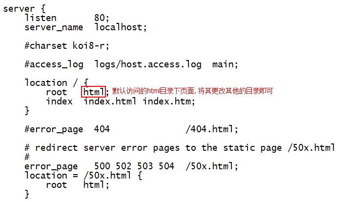
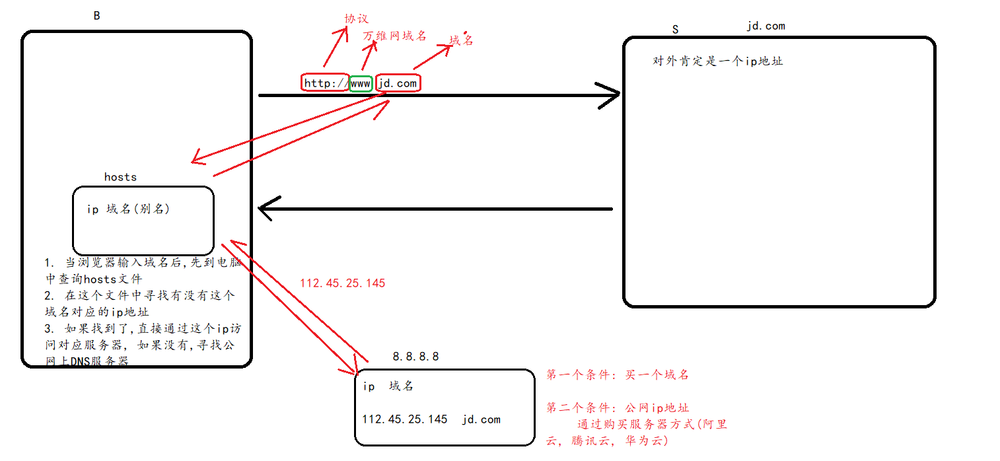
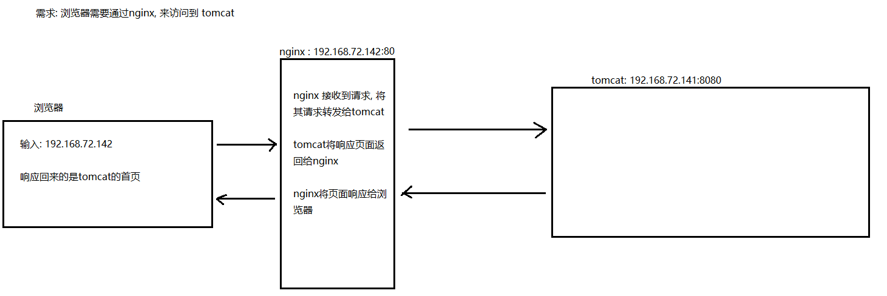

# 娱乐头条day02_nginx

课前回顾:

* git
  * 1) git的发展历史: 
  * 2) git 和 svn 对比 :
    * svn  集中式版本控制软件, 中央服务器(版本管理)
    * git:  分布式版本控制软件, 没有中央服务器的概念,更换为共享版本库, 每个人电脑自己一份版本库 
  * 3) git的工作流程 :  
    * 自己玩 :  添加到暂存区,提交代码到本地版本库
    * 共享版本库: 将本地版本库推送远端, 从远端将版本库克隆下来, 后续相关拉取的工作
  * 4) git的安装 
  * 5) 工作流程中自己玩的流程: CURD
  * 6) 案例: 提交java项目(忽略列表)
  * 7)  远端仓库:
    * GitHub
    * 码云
    * 私有的远端
  * 8) git的分支管理
    * 如何创建分支, 如何在分支提交代码, 如何合并分支
  * 9) git在idea中使用
* nginx
  * nginx的概念  :  nginx由C语言编写的 nginx的并发性能很高(5w)
  * 为什么要使用nginx(nginx作用):
    * 1) 静态服务器
    * 2) 虚拟主机: 
    * 3) 反向代理,负载均衡
  * nginx的安装:  

今日内容:

* nginx
  * 1) 发布一个静态的网站  (配置)
  * 2) 网站访问全过程
  * 3) 配置nginx的反向代理和负载均衡 (配置)
  * 4) nginx的高可用(了解)
* redis :
  * redis的基本概念
  * redis的特点 (理解)
  * redis的数据类型使用场景(记忆)
  * redis的安装
  * redis的API介绍: jedis (熟悉)
  * redis的连接池 (抽取连接池工具类)
  * redis的持久化 (理解)


## 1 什么是nginx

​	Nginx是一款高性能的http 服务器/反向代理服务器及电子邮件（IMAP/POP3）代理服务器。由俄罗斯的程序设计师Igor Sysoev所开发，官方测试nginx能够支支撑5万并发链接，并且cpu、内存等资源消耗却非常低，运行非常稳定。

## 2 为什么要使用nginx

* 1) **http服务器**。Nginx是一个http服务可以独立提供http服务。可以做网页静态服务器。

* 2) 虚拟主机。可以实现在一台服务器虚拟出多个网站。例如个人网站使用的虚拟主机。

* 3) **反向代理，负载均衡**。当网站的访问量达到一定程度后，单台服务器不能满足用户的请求时，需要用多台服务器集群可以使用nginx做反向代理。并且多台服务器可以平均分担负载，不会因为某台服务器负载高宕机而某台服务器闲置的情况。

## 3 安装nginx服务器

* 1) 安装依赖环境: 由于nginx为C语言开发, 需要C语言依赖环境

```
yum install -y gcc-c++ pcre pcre-devel zlib zlib-devel openssl openssl-devel
```

* 2)上传nginx安装包:

```
使用rz上传即可, 上传到 /export/software目录下
```

* 3) 进行解压操作:

```
tar -zxvf nginx-1.8.0.tar.gz
cd nginx-1.8.0
```

* 4) 设置编译参数

```
参数设置如下：直接将整个命令复制执行即可
./configure \
--prefix=/export/servers/nginx \
--pid-path=/export/data/nginx/nginx.pid \
--lock-path=/export/data/nginx.lock \
--error-log-path=/export/logs/nginx/error.log \
--http-log-path=/export/logs/nginx/access.log \
--with-http_gzip_static_module \
--http-client-body-temp-path=/export/data/nginx/client \
--http-proxy-temp-path=/export/data/nginx/proxy \
--http-fastcgi-temp-path=/export/data/nginx/fastcgi \
--http-uwsgi-temp-path=/export/data/nginx/uwsgi \
--http-scgi-temp-path=/export/data/nginx/scgi
```

* 5) 编译安装

```
mkdir -p /export/data/nginx
mkdir -p /export/logs/nginx

cd /export/servers/nginx-1.8.0    # 切换nginx根目录
make			  # 编译
make install	  # 安装, 安装后在 /export/server/nginx
```

* 6) 启动nginx

```
cd /export/server/nginx/sbin
./nginx   # 启动nginx

查看nginx启动进程
ps -ef | grep nginx


注意：执行./nginx启动nginx，这里可以-c指定加载的nginx配置文件，如下：
./nginx -c /export/servers/nginx/conf/nginx.conf
如果不指定-c，nginx在启动时默认加载conf/nginx.conf文件，此文件的地址也可以在编译安装nginx时指定./configure的参数（--conf-path= 指向配置文件（nginx.conf））


停止nginx:
	快速停止:
		cd /export/servers/nginx/sbin
		./nginx -s stop
		此方式相当于先查出nginx进程id再使用kill命令强制杀掉进程。
	
	完整停止(推荐使用):
		cd /usr/local/nginx/sbin
		./nginx -s quit
		此方式停止步骤是待nginx进程处理任务完毕进行停止。
		
重启nginx :
	先停止再启动（建议使用）：
		对nginx进行重启相当于先停止nginx再启动nginx，即先执行停止命令再执行启动命令。
		如下：
			./nginx -s quit
			./nginx

	重新加载配置文件：
		当nginx的配置文件nginx.conf修改后，要想让配置生效需要重启nginx，使用-s reload不用先停止nginx再启动nginx即可将配置信息在nginx中生效，如下：
			./nginx -s reload
```

* 7) 安装测试:


 	到这说明nginx基本上安装成功。此页面即为 nginx安装目录html目录的index页面

## 4  **发布网站到服务器中**

* 我们可以将写好的静态页面复制到nginx目录下的html的目录中即可，输入以下地址可以访问：

```
访问路径: http://ip地址
注意: 上面这个访问路径,表示已经访问到了,html目录的下,  默认访问到html的目录的index页面
```

* 另一种方式：我们可以将页面复制到nginx的目录下，然后访问

  * 使用此种方式, 需要修改nginx的配置文件:nginx.conf
  * 修改完配置文件后: 需要重新加载一下配置文件:  ./nginx -s reload

  

```

访问路径: http://ip地址/页面名称
注意: 这个路径, 默认访问到了配置文件中 root后面设置的路径下, 默认访问的index页面
```

 

​	但是我们可以发现这样，通过IP地址可以访问。但是IP其实相对来讲是很难记住的，我们通常会通过域名去访问一个网站。

## 5 **网站访问的过程**

### 5.1 **网站访问过程分析**

```
C:\Windows\System32\drivers\etc
```

 

### 5.2 修改hosts文件

* 进入电脑C:\Windows\System32\drivers\etc下查找一个hosts文件

```
192.168.72.142 www.baidu.com     # 如果使用的是公开的比较有名的域名, 可能会导致访问不到, 建议使用ie浏览器尝试, 或者换一个自定义域名
```

* 打开浏览器访问：http://www.baidu.com


## 6 配置nginx的反向代理, 实现网站发布(重点)



> 这个过程被称为是反向代理, 原来浏览器直接请求tomcat, 获得内容, 现在由nginx作为代理, 请求目标地址, 并将目标地址的数据返回给浏览器

如何配置呢?

* 1) 修改配置文件: conf/ nginx.conf文件, 添加如下内容
  * 提示: 可以直接打开配置文件, 拉到最下面, 在最后一个没有被注释的大括号前书写

```

upstream tomcat1 {
         server 192.168.72.142:8080;
}

server {
         listen 80;
         server_name pinyougou.com;

         location / {
                     proxy_pass http://tomcat1;
                     index index.html index.htm;
                     }
       }
```


> 在根据域名访问的时候, 一定要注意, 访问的那个域名是否在本地hosts文件中已经配置好
>
> 当访问http://jd.com  其实就是相当于 访问 http://192.168.52.210:8080/list.action

## 7. 负载均衡

​	负载均衡是由多台服务器以对称的方式组成一个服务器集合，每台服务器都具有等价的地位，都可以单独对外提供服务而无须其他服务器的辅助。

​	通过某种负载分担技术，将外部发送来的请求均匀分配到对称结构中的某一台服务器上，而接收到请求的服务器独立地回应客户的请求。均衡负载能够平均分配客户请求到服务器列阵，借此提供快速获取重要数据，解决**大量并发访问**服务问题。 (廉价的)

### 7.1 nginx的负载均衡

​	我们可以在nginx上配置多台服务器, 当大量并发访问的时候, 我们通过nginx将这些并发请求根据一定的规则平均分派到多台服务器, 提高服务器高可用


### 7.2 如何在nginx中配置负载均衡(重点)

* 1) 修改配置文件

```
upstream tomcat1 {
        server 192.168.72.142:8080;
}
server {
        listen 80;
        server_name pinyougou.com;
        location / {
                proxy_pass http://tomcat1;
                index index.html  index.htm;

        }
}
********** 上述代码是原始内容, 只需要更改upsteam中的server即可
#第一种方案: 配置多台server, nginx就会自动进行负载均衡, 将并发请求平均分配给这两个服务器 
upstream tomcat1 {
        server 192.168.72.142:8080;
        server 192.168.72.142:8081; 
       
}
#第二种方案: 可以根据服务器的实际情况调整服务器权重。权重越高分配的请求越多，权重越低，请求越少。默认是都是1 
upstream tomcat1 {
        server 192.168.72.142:8080;
        server 192.168.72.142:8081 weight=2; 
        #例如设置为2, 表示第二个服务器所能承受比第一台两倍的并发请求, 此时, nginx就会权重分配, 如果有6个并发请求, 第二台会承受4个请求, 而第一台只会承受2个请求
}

```


* 修改tomcat的端口号:

```
第一步:  进入到tomcat的conf目录下, 找到server.xml
cd /export/servers/tomcat2/conf
vi server.xml


注意: tomcat修改端口号, 一共修改三个端口号(8005 8080 8009)

```

* 8005


* 8080


* 8009


```
第二步: 将以上三个端口号进行修改即可, 习惯于直接+1
第三步: 执行保存退出即可:
	:wq
第四步: 启动tomcat
	cd /export/servers/tomcat2/bin
	./startup.sh 
	
```


### 7.3 了解nginx的高可用

​	负载均衡高可用:为了避免出现nginx出现宕机,可对nginx进行高可用,为nginx提供备用机,使用高可用监控程序(keepalived)来处理,一般的处理模式是,两台同时运行,实际提供服务的只有一台,监控中心与这台服务器之间会传输诸如'I am alive'这样得信息来监控对方的运行状况,一旦发现对方挂掉,就马上切换到另一台,如果挂掉的主服务器重新发送激活的状态 ,监控中心就会将请求交由主服务器

关于高可用的搭建可以参考此地址: http://blog.51cto.com/superpcm/2095395


> 如何能够发现某一台服务器出现宕机了呢?    监控系统+告警系统
>
> ​	告警系统就会给运维人员自动发送邮件或者短信,通知运维人员出现状况

