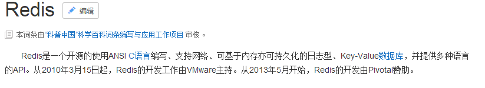

# 娱乐头条 -- day02 redis


## 1. Redis的概念



​	Redis是一款由C语言编写, 基于内存的持久化的数据库, 其中数据是以KEY-VALUE的形式存储的, Redis提供了丰富的数据类型

## 2. Redis的特点

* 1) Redis将数据存储到内存当中, 所以Redis的读写效率非常高:  读 11w/s  写 8w/s
* 2) redis提供了丰富的数据类型:  string , hash , list ,set , sortedSet
  * 注意: redis中数据类型, 主要是描述的key-value中value的数据类型, 而key只有string
* 3) Redis数据的移植非常快的

* 4) redis中所有的操作都是原子性的, 保证数据的完整性的

## 3. redis数据类型的使用场景和特点

* string:   可以使用json转换对象, 存储
  * 特点:  和 java中 string是类似的, 表示的就是字符串
  * 使用场景: 做缓存

* hash:  存储对象是比较方便的
  * 特点: 和 java中 hashMap是类似的
  * 使用场景:  做缓存 (hash使用较少)
* list:
  * 特点:  和 java中 linkedList是类似, 可以看做是队列(FIFO)先进先出
  * 使用场景:  任务队列

* set :
  * 特点:  和 java中set集合是类似的  去重 无序
  * 使用场景: 去重业务
* sortedSet
  * 特点:  和 java中 sortedSet(TreeSet)类型    有序   去重
  * 使用场景:  排序操作(排行榜)

## 4. redis安装

 见课件安装即可

## 5. redis的客户端工具: jedis

​	jedis是一款java连接redis客户端工具包, jedis提供了一套非常省力的API, jedis中最大的特点就是其API和redis中命令都是一样的, 大大的降低了学习成本, 只需要学习其中的一个就可以了

如果想要使用jedis, 首先先进行导包操作

```xml
		<dependency>
            <groupId>redis.clients</groupId>
            <artifactId>jedis</artifactId>
            <version>2.9.0</version>
        </dependency>
```

* jedis的入门程序

```java
@Test
    public void jedisTest01(){
        //1. 创建 jedis对象: 指定redis的ip地址 和  端口号
        // Jedis 可以将看做是 connection连接对象
        Jedis jedis = new Jedis("192.168.72.142",6379);

        //2. 执行相关的操作
        String pong = jedis.ping();
        System.out.println(pong);

        //3. 释放资源
        jedis.close();

    }
```


```
出现的原因主要有以下几个:
	1) 防火墙没有关闭, 或者没有开放6379端口号
	2) redis没有开启
	3) 代码中ip地址或者端口号写错了
```

### 5.1 jedis操作redis -- string

```java
//2. 使用jedis操作Redis --->  string

    @Test
    public void jedisTest02() throws InterruptedException {
        //1. 创建 jedis对象
        Jedis jedis = new Jedis("192.168.72.142",6379);

        //2. 执行相关操作
        //2.1 进行赋值操作: name :  隔壁老王
        jedis.set("name","隔壁老王");

        //2.2 取值操作
        String name = jedis.get("name");
        System.out.println(name);

        //2.3 想让 某一个key的值 ++  或者 --操作
        jedis.set("age","18");

        Long incr = jedis.incr("age");
        System.out.println(incr); //19

        Long decr = jedis.decr("age");
        System.out.println(decr);  //18

        //2.4 设置一个nickName的key, 要求: 这个key只能存活5秒, 5秒后消失
        jedis.setex("nickName",5,"给别人戴帽子");

        while(jedis.exists("nickName")){

            // 获取一下还剩下多少时间
            // 如果返回的是正数, 表示还剩下多少时间
            // 如果返回的-2 表示的当前这个key已经不存在了
            // 如果返回的是-1  表示的当前这个key是一个永久有效的key
            Long time = jedis.ttl("nickName");
            System.out.println(time);
            Thread.sleep(1000);
        }
        //2.5 给已经存在的key设置有效时间
        jedis.expire("age",5);

        while(jedis.exists("age")){

            // 获取一下还剩下多少时间
            // 如果返回的是正数, 表示还剩下多少时间
            // 如果返回的-2 表示的当前这个key已经不存在了
            // 如果返回的是-1  表示的当前这个key是一个永久有效的key
            Long time = jedis.ttl("age");
            System.out.println(time);
            Thread.sleep(1000);
        }

        //2.6 如何拼接字符串:  name  隔壁老王+隔壁老张
        jedis.append("name","隔壁老张");

       name = jedis.get("name");
        System.out.println(name);

        //2.7 通用的删除某一个key
        jedis.del("name");

        //3. 释放资源

        jedis.close();

    }
```

### 5.2 jedis操作redis -- list

```java
@Test
    public void jedisTest03(){
        //1. 创建jedis对象
        // 在使用list想相关的API的时候, 建议从左侧添加, 从右侧弹出, 或者 从右侧添加从左侧 弹出
        Jedis jedis = new Jedis("192.168.72.142",6379);
        //2. 执行相关的操作
        //0 清空数据
        jedis.del("list1");
        //2.1 从左侧添加数据, 从右侧弹出数据
        jedis.lpush("list1","a","b","c","d");

        String rpop = jedis.rpop("list1");
        System.out.println(rpop); // a
        //2.2  查看列表
        List<String> list = jedis.lrange("list1", 0, -1);
        System.out.println(list); // [b c d]  [d c b ]

        //2.3 获取集合的个数
        Long size = jedis.llen("list1");
        System.out.println(size);

        //2.4 想在 c这个元素的前面添加一个 数字 0
        //  参数1:  在那个key中操作
        // 参数2:  添加到哪里去  before after
        // 参数3:  在谁的前面或者后面
        // 参数4:  添加的元素内容
        jedis.linsert("list1", BinaryClient.LIST_POSITION.BEFORE,"c","0");

        list = jedis.lrange("list1", 0, -1);
        System.out.println(list);

        //2.5 从右侧弹出一个元素, 将弹出的这个元素在添加到这个集合的头部
        String key1 = jedis.rpoplpush("list1", "list1");
        System.out.println(key1);


        list = jedis.lrange("list1", 0, -1);
        System.out.println(list);

        //3. 释放资源
        jedis.close();


    }
```

### 5.3 jedis操作redis -- set

```java
 	//4. 使用jedis 操作 redis --- set
    // set特点:  无序  去重
    @Test
    public void jedisTest04(){
        //1. 创建 jedis对象
        Jedis jedis = new Jedis("192.168.72.142",6379);

        //2. 执行相关的操作
        //2.1  添加元素:
        jedis.sadd("set1","q","w","e","r","w","q");
        //2.2 遍历出来
        Set<String> set = jedis.smembers("set1");
        System.out.println(set);
        //2.3  判断某一个元素在set集合是否存在
        // 如果值存在的, 返回true , 如果不存在, false
        Boolean flag = jedis.sismember("set1", "d");

        System.out.println(flag);

        //2.4 获取set集合中数量
        Long size = jedis.scard("set1");
        System.out.println(size);

        //3. 释放资源
        jedis.close();

    }
```

### 5.4 jedis操作redis -- sortedSet

```java
@Test
    public void jedisTest05(){
        //1. 创建 jedis对象
        Jedis jedis =  new Jedis("192.168.72.142",6379);

        //2. 执行相关的操作
        //2.1 添加元素:
        jedis.zadd("bookList",95,"斗破苍穹");
        jedis.zadd("bookList",85,"斗罗大陆");
        jedis.zadd("bookList",500,"西游记");
        jedis.zadd("bookList",436,"红楼梦");
        jedis.zadd("bookList",147,"水浒传");
        jedis.zadd("bookList",800,"三国演义");

        //2.2  从大到小进行遍历
       // Set<String> set = jedis.zrevrange("bookList", 0, -1);
        Set<Tuple> bookList = jedis.zrevrangeWithScores("bookList", 0, -1);
        for (Tuple tuple : bookList) {
            String book = tuple.getElement();
            double score = tuple.getScore();
            System.out.println(book +"  "+ score);
        }
        //2.3  想要看一下红楼梦这本书从大到小排名第几
        Long rank = jedis.zrevrank("bookList", "红楼梦");
        System.out.println(rank);  // 2  因为 从0开始


        //2.4  返回某个分数范围元素一共有多少个

        Long size = jedis.zcount("bookList", 450, 1000);
        System.out.println(size);
        //3. 释放资源
        jedis.close();

    }
```

## 6. jedis连接池

​	jedis看做是一个连接对象, 频繁的创建一个连接, 比较耗时耗资源的 通常情况, 采用连接池的技术, 提前的创建好一部分的连接对象, 放置到容器中, 反复的使用即可

* jedis的连接池基本使用

```java
//6. jedis连接池技术
    @Test
    public void jedisTest06(){
        //1. 创建一个连接池对象
        JedisPoolConfig config = new JedisPoolConfig();
        config.setMaxTotal(100);  //最大连接数
        config.setMaxIdle(50);   // 最大闲时的数量
        config.setMinIdle(25);   // 最小闲时的数量

        JedisPool jedisPool = new JedisPool(config,"192.168.72.142",6379);

        //2. 从连接池中获取连接对象: jedis对象
        Jedis jedis = jedisPool.getResource();

        //3. 执行相关的操作
        String pong = jedis.ping();
        System.out.println(pong);

        //4. 释放资源(归还)

        jedis.close();

    }
```

* 提取成工具类

```java
package com.itheima.jedis;

import redis.clients.jedis.Jedis;
import redis.clients.jedis.JedisPool;
import redis.clients.jedis.JedisPoolConfig;

public class JedisUtils {
    private static JedisPool jedisPool;
    // 什么加载: 随着类的加载而加载, 一般只会加载一次
    static {
        JedisPoolConfig config = new JedisPoolConfig();
        config.setMaxTotal(100);  //最大连接数
        config.setMaxIdle(50);   // 最大闲时的数量
        config.setMinIdle(25);   // 最小闲时的数量
        // 注意:  千万别在等号左侧  写上 "JedisPool jedisPool " 而应该写成 "jedisPool"
        jedisPool = new JedisPool(config,"192.168.72.142",6379);
    }

    // 获取连接的方法

    public static Jedis getJedis(){


        return jedisPool.getResource() ;
    }
}

```

## 7. redis的持久化

持久化:  从内存到硬盘的过程

序列化: 从内存到硬盘的过程

反序列化 : 从硬盘到内存过程

> 监听器:   setAttribute(String name  Object value)

钝化 : 从内存到硬盘的过程

活化:  从硬盘内存过程

我们知道, redis是将数据存储在了内存当中, 那么当关闭服务器, 内存的资源也就会消失了, 这时存储在redis中的数据也会消失, 那么我们应该如何做呢?

- 在redis中已经提供了两种持久化的方案
  - RDB: redis提供的一种**基于快照机制**实现的持久化方案, 而快照就类似于照相机, 会将一个服务器某个时刻的一个状态整体保存下来, 快照文件一般都非常的小,只有几kb左右
    - 优点: 由于持久化的文件非常小, 适合于做灾难恢复
    - 缺点: 由于redis中持久化的时机问题, 会存在数据丢失的问题
  - AOF: redis提供的一种**基于日志机制**实现的持久化方案, 会将用户操作(增 删 改)的所有的命令整体的记录下来保存到日志文件中,一般文件都比较庞大
    - 优点: AOF机制可以让将用户所有的命令都记录下来, 顾其数据保存的比较完整, 不容易丢失
    - 缺点: 持久化的文件比较庞大, 不利于灾难恢复 
- RDB保存机制: redis默认是开启RDB机制

```text
save 900 1    :  在900秒之内,如果有一个数据进行修改,就会执行一下保存
save 300 10   : 在300秒之内, 如果有10个以上的数据被修改, 就会执行一下保存
save 60 10000 : 在60秒之内, 如果有10000个以上的数据被修改. 就会执行一下保存
```

- 当服务器宕机, 最大丢失数据量为在不到5分钟的时间里丢掉9999个数据
  - 一般情况下redis的不会出现宕机的现象, 除非redis中的数据将内存撑爆了, 但这个现象在大公司是不会出现的

------

- AOF的保存机制:redis默认不开启

如何开启AOF:

- 打开redis的配置文件,修改下列两个参数即可

```properties
appendonly yes    //默认此项是no,没有启动AOF机制
appendfsync everysec  //appendfsync的取值: [always everysec no]
```

- always: 总是, 只要有新的命令执行, 就将其保存到文件中
  - 优点: 数据保存最完整, 几乎不会丢掉数据
  - 缺点: 大大降低了redis的性能
- everysec: 每秒钟执行一次保存
  - 此种保存不会大幅度的降低redis的性能,但是会丢失最大1s的数据
- no: 不执行保存, 由操作系统自动调用保存(linux一般30分钟刷新一次内存)
  - 一般不使用

开发中:

​	一般小公司会采用AOF + RDB  大公司只会使用RDB


作业:

​	1) 昨天linux的环境统一

​	2) nginx的 静态网站的发布:  二种    ./nginx -s reload

​		一种: 放置在 html目录下

​		一种: 放置和 html目录同级

​	3) nginx的反向代理 和 负载均衡

```
upstream  别名 {
    server tomcat地址1;
    server tomcat地址2;
}

server {
    listen  80;
    servername  pinyougou.com;
    
    location / {
        proxy_pass http://别名;
    	index index.html  index.htm
    }	
    
    
}
```

​	4) redis : API (参考命令文档)

​	5) redis 提取 连接池工具类
