# 娱乐头条day11_kafka基础

课前回顾:

*  搜索实现:

  * 分页查询的展示功能:

    * 前端:  关键词, 当前页 , 每页显示条数
    * ssm门户项目:
      * controller :
        * 1) 接收前端请求参数
        * 2)  验证前端参数传递是否正确
        * 3) 执行service层查询数据, 得到 resultBean对象
        * 4)  将 resultBean返回前端
      * service
        * 1) 执行搜索服务项目 查询数据'
        * 2) 执行相关的操作:  -8小时
        * 3) 返回给controller即可

    * 搜索服务项目: solrCloud
      * 1) 从spring的容器中, 获取solrServer对象
      * 2) 封装查询请求条件: SolrQuery对象
        * 2.1) 主条件入口参数:  q    搜索关键词
        * 2.2) 分页的参数:  start  rows
        * 2.3) 执行查询.得到response对象
        * 2.4) 从response中获取数据, 封装PageBean对象
        * 2.5) 返回给调用者

  * 高亮展示数据

    * 搜索服务项目:
      * 封装查询条件:  添加高亮的条件
      * 封装数据的时候, 需要先获取高亮的内容, 将高亮的内容和结果数据结合在一起

  * 搜索工具的实现:

    * 前端: 关键词, 当前页 , 每页显示条数  , 搜索工具的参数(日期范围, 编辑, 来源)
    * 搜索服务项目:
      * 封装查询条件: 添加多个  过滤查询
        * 先判断前端是否需要根据搜索工具进行查询
          * 如果有, 才需要进行添加过滤查询

  * 热搜词展示操作: 热搜词采用静态的数据

    * 前端: 需要传递一个 num值(表示查询多少个热搜数据)
    * ssm门户项目:
      * controller:
        * 1) 接收前端的请求参数: num
        * 2) 验证参数传递是否正确, 如果没有传递, 设置默认值 5
        * 3) 调用service层
        * 4) 返回给前端页面
      * service:
        * 1) 获取jedis对象
        * 2) 根据num, 查询前num个热搜数据
        * 3)封装数据: List<Map<String,Object>
        * 4) 返回controller即可

  * 根据热搜查询数据:

    * 前端:  只需要动态的获取到用户点击了那个热搜词, 然后根据热搜词重新发起请求

今日内容:  kafka  中间件

* kafka基本概念
* kafka集群的架构
* 搭建kafka的集群 : 
* kafka的基本使用: - -会操作
  * 使用命令的方式操作kafka
  * 使用 JavaAPI操作kafka
* kafka的原理 :   ----理解
  * 分片和副本机制
  * kafka的数据不丢失机制
  * kafka的数据存储机制 和 查询机制
  * kafka的分发机制 
  * kafka的负载均衡机制
* kakfa的一键化启动方案


## 1. kafka基本概念

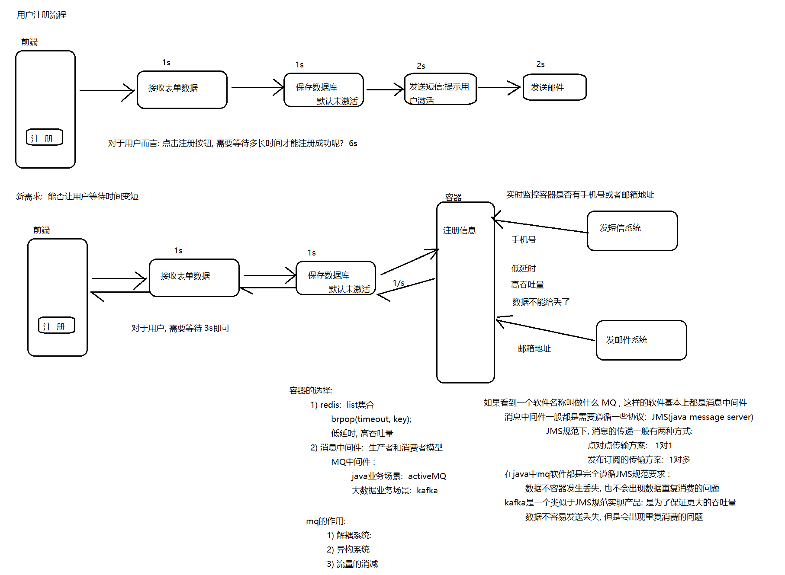

### 1.1 什么是kafka

* 1）  Apache Kafka 是一个开源的分布式消息队列（生产者消费者模式）

* 2）  Apache Kafka 目标：构建企业中统一的、高通量的、低延时的消息平台。

* 3）  大多的是消息队列（消息中间件）都是基于JMS标准实现的，Apache Kafka 类似于JMS的实现。

###  1.2 kafka的特点  

*  作为缓冲(流量消减)，来异构、解耦系统。
  * 用户注册需要完成多个步骤，每个步骤执行都需要很长时间。代表用户等待时间是所有步骤的累计时间。
  * 为了减少用户等待的时间，使用并行执行执行，有多少个步骤，就开启多少个线程来执行。代表用户等待时间是所有步骤中耗时最长的那个步骤时间。
  * 有了新得问题：开启多线程执行每个步骤，如果以一个步骤执行异常，或者严重超时，用户等待的时间就不可控了。
  * 通过消息队列来保证。
  * 注册时，立即返回成功。
  * 发送注册成功的消息到消息平台。
  * 对注册信息感兴趣的程序，可以消息消息

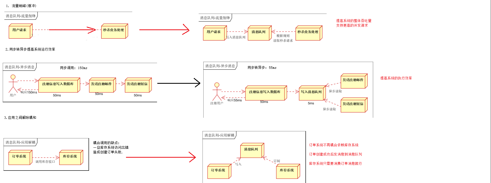

## 2. Apache kafka的基本架构

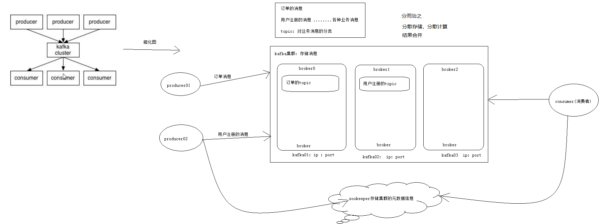

**Kafka Cluster**：由多个服务器组成。每个服务器单独的名字**broker**（掮客）。

**kafka broker**：kafka集群中包含的服务器

**Kafka Producer**：消息生产者、发布消息到 kafka 集群的终端或服务。

**Kafka consumer**：消息消费者、负责消费数据。

**Kafka Topic**: 主题，一类消息的名称。存储数据时将一类数据存放在某个topic下，消费数据也是消费一类数据。

​         订单系统：创建一个topic，叫做order。

​         用户系统：创建一个topic，叫做user。

​         商品系统：创建一个topic，叫做product。

 

注意：Kafka的元数据都是存放在zookeeper中。


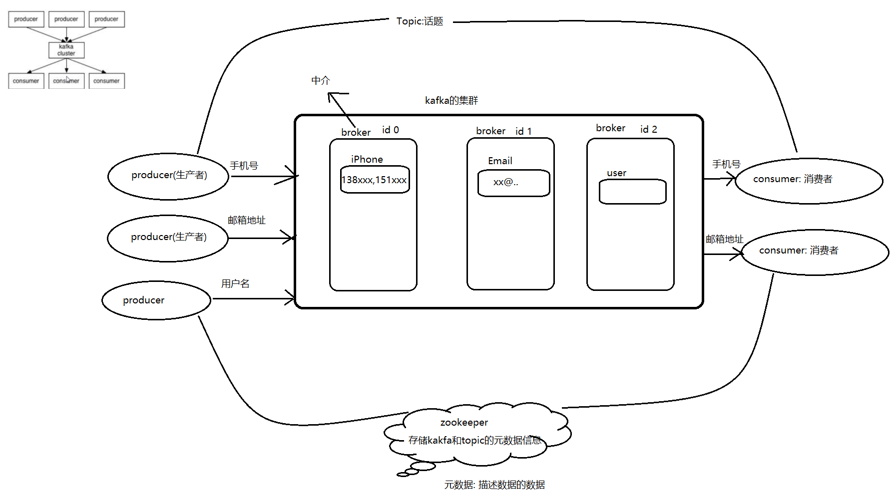

## 3. 搭建kafka集群

### 3.1 准备工作

* 1) 准备三台服务器, 安装jdk1.8 ,其中每一台虚拟机的hosts文件中都需要配置如下的内容

```
192.168.72.141 node01
192.168.72.142 node02
192.168.72.143 node03
```

* 2) 安装目录

```
安装包存放的目录：/export/software
安装程序存放的目录：/export/servers
数据目录：/export/data
日志目录：/export/logs

创建各级目录命令:
mkdir -p /export/servers/
mkdir -p /export/software/
mkdir -p /export/data/
mkdir -p /export/logs/ 
```

* 3)zookeeper集群已经安装好并启动

### 3.2 下载安装包


由于kafka是scala语言编写的，基于scala的多个版本，kafka发布了多个版本。

其中2.11是推荐版本.

* 推荐直接使用资料中的版本即可:


### 3.3 上传安装包并解压

```
使用 rz 命令将安装包上传至  /export/software
1)  切换目录上传安装包
cd /export/software
rz   # 选择对应安装包上传即可

2) 解压安装包到指定目录下
tar -zxvf kafka_2.11-1.0.0.tgz -C /export/servers/
cd /export/servers/

3) 重命名(由于名称太长)
mv kafka_2.11-1.0.0 kafka
```

### 3.4 修改kafka的核心配置文件

```properties
cd /export/servers/kafka/config/
vi   server.properties

主要修改一下四个地方:
	1) broker.id            需要保证每一台kafka都有一个独立的broker
	2) listeners = PLAINTEXT://当前虚拟机ip地址:9092
	3) log.dirs             数据存放的目录  
	4) zookeeper.connect    zookeeper的连接地址信息 
    

#broker.id 标识了kafka集群中一个唯一broker。   
broker.id=0   
num.network.threads=3   
num.io.threads=8   
socket.send.buffer.bytes=102400   
socket.receive.buffer.bytes=102400   
socket.request.max.bytes=104857600  

#listeners : 表示的监听的地址. 需要更改为当前虚拟机的ip地址, 保证其他主机都能连接
listeners = PLAINTEXT://当前虚拟机的ip地址:9092

# 存放生产者生产的数据 数据一般以topic的方式存放    
log.dirs=/export/data/kafka           
num.partitions=1   
num.recovery.threads.per.data.dir=1   
offsets.topic.replication.factor=1   
transaction.state.log.replication.factor=1   
transaction.state.log.min.isr=1   
log.retention.hours=168   
log.segment.bytes=1073741824   
log.retention.check.interval.ms=300000     

# zk的信息   
zookeeper.connect=node01:2181,node02:2181,node03:2181   
zookeeper.connection.timeout.ms=6000   
group.initial.rebalance.delay.ms=0  

```

### 3.5 将配置好的kafka分发到其他二台主机

```properties
cd /export/servers
scp -r kafka/ node02:$PWD  
scp -r kafka/ node03:$PWD
```

* 拷贝后, 需要修改每一台的broker.id

```properties
ip为141的服务器: broker.id=0
ip为142的服务器: broker.id=1
ip为143的服务器: broker.id=2
```

* 修改每一台的listeners的ip地址
* 在三台的服务器执行创建数据文件的命令

```properties
mkdir -p /export/data/kafka
```

### 3.6 启动集群

```properties
cd /export/servers/kafka/bin   
./kafka-server-start.sh /export/servers/kafka/config/server.properties 1>/dev/null 2>&1 &


注意：可以启动一台broker，单机版。也可以同时启动三台broker，组成一个kafka集群版
```


> 可以通过 jps 查看 kafka进
>
> 程是否已经启动了

### 3.7 查看集群

由于kafka集群并没有UI界面可以查看。

所以我们可以通过查看zookeeper, 来判断, kafka集群是否正常运行

* 1) 使用zookeeper的可视化工具查看


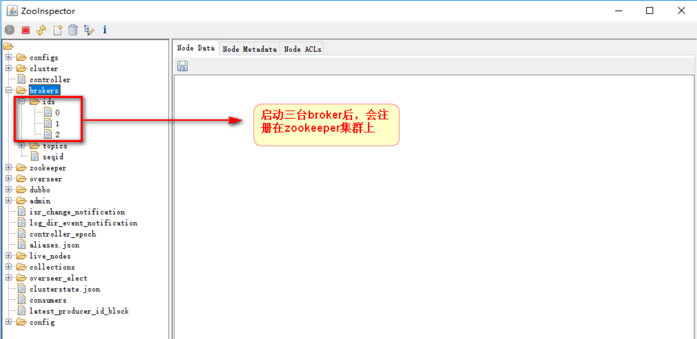

## 4. kafka的基本使用 

​	kafka其本身就是一个消息队列的中间件, 主要是用来实现系统与系统之间信息传输, 一般有两大角色, 一个是生产者, 一个是消费者.

​	故kafka的基本使用, 就是来学习如何使用生产者发送数据, 已经如何进行消费数据, kafka提供了两种方式来进行实现, 一种是采用kafka自带的脚本来操作, 另一种是使用相关的语言的API来进行操作

### 4.1 使用脚本操作kafka

```properties
说明:  索引执行的脚本文件都存放在kafka的bin目录中, 需要先进入bin目录才可以执行
cd /export/servers/kafka/bin
```

* 1) 创建一个topic:
  * topic:  指的是话题, 主题的意思, 在消息发送的时候, 我们需要对消息进行分类, 生产者和消费者需要在同一个topic下, 才可以进行发送和接收

```properties
./kafka-topics.sh --create --zookeeper node01:2181 --replication-factor 1 --partitions 1 --topic order
```

* 2)   使用Kafka自带一个命令行客户端启动一个生产者，生产数据

```properties
./kafka-console-producer.sh --broker-list node01:9092 --topic order
```

* 3) 使用Kafka自带一个命令行客户端启动一个消费者，消费数据

```properties
./kafka-console-consumer.sh --bootstrap-server node01:9092  --topic order
该消费语句，只能获取最新的数据，要想历史数据，需要添加选项--from-beginning

如：bin/kafka-console-consumer.sh --bootstrap-server node01:9092 --from-beginning --topic order
```

* 4) 查看有哪些topic

```properties
./kafka-topics.sh --list --zookeeper node01:2181
```


* 5) 查看某一个具体的Topic的详细信息

```properties
./kafka-topics.sh --describe --topic order --zookeeper node01:2181
```


* 6) 删除topic

```properties
./kafka-topics.sh --delete --topic order --zookeeper node01:2181
	只会标识一下, 这个topic已经被删除了

注意：彻底删除一个topic，需要在server.properties中配置delete.topic.enable=true，否则只是标记删除
配置完成之后，需要重启kafka服务。
	彻底删除, 描述将元数据信息彻底删除, 不会删除原始数据

原始数据, 必须手动删除即可

如果在使用中, 需要删除一个topic: 直接删除zookeeper中对应topic的节点即可, 
		如果要删除原始数据, 需要到对应目录下手动删除
```

### 4.2 使用java API 操作kafka

* 第一步: 添加kafka相关的依赖

```xml
<dependency>     
    <groupId>org.apache.kafka</groupId>     
    <artifactId>kafka-clients</artifactId>     
    <version>0.11.0.1</version>   
</dependency>
```

#### 4.2.1 编写生产者 : 

```java
package com.itheima.kafka;

import org.apache.kafka.clients.producer.KafkaProducer;
import org.apache.kafka.clients.producer.Producer;
import org.apache.kafka.clients.producer.ProducerRecord;

import java.util.Properties;

// kafka的生产者代码
public class KafkaProducerTest {

    public static void main(String[] args) {
        //1.1:  创建配置对象, 设置相关的属性
        Properties props = new Properties();
        props.put("bootstrap.servers", "node01:9092,node02:9092,node03:9092"); // 设置要连接那个kafka的集群呢?
        props.put("acks", "all"); // acks  消息确认机制: 用来保证数据不容易发生丢手   all 保证不会丢失
        props.put("key.serializer", "org.apache.kafka.common.serialization.StringSerializer");
        props.put("value.serializer", "org.apache.kafka.common.serialization.StringSerializer");

        props.put("retries", 0);  // 重试的次数
        props.put("batch.size", 16384); // 批量发送数据的大小
        props.put("linger.ms", 1); //  什么时候发送: 毫秒
        props.put("buffer.memory", 33554432); // 缓冲区的大小  32M


        //1)  创建  kafka的生产者的核心类对象:  kafkaProducer, 需要传递配置对象
        Producer<String, String> producer = new KafkaProducer<String, String>(props);
        // 2)  发送数据:  通过 send方法
        for (int i = 0; i < 100; i++) {
            //2.1: 在发送的时候需要传递一个  ProducerRecord对象 :   ProducerRecord 数据传递的载体
            producer.send(new ProducerRecord<String, String>("your-topic", Integer.toString(i), Integer.toString(i)));
        }

        producer.close();

    }
}


```

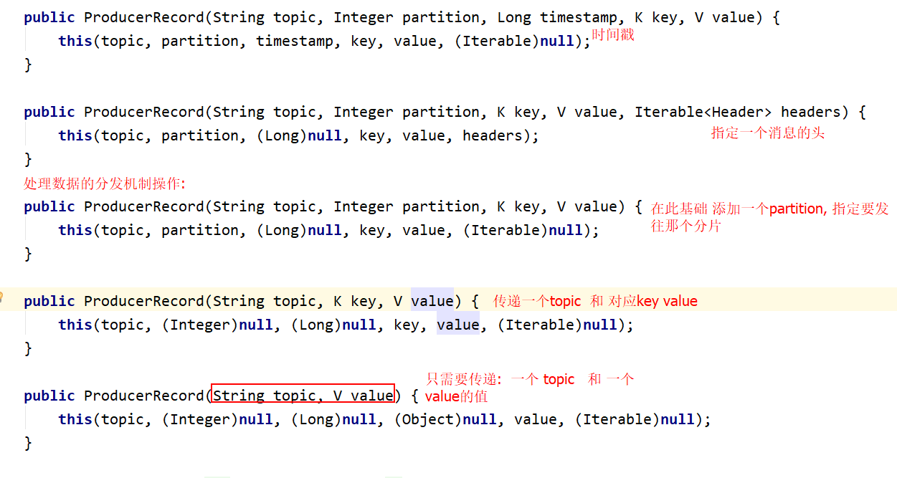

#### 4.2.2 编写消费者

```java
package com.itheima.kafka;

import org.apache.kafka.clients.consumer.ConsumerRecord;
import org.apache.kafka.clients.consumer.ConsumerRecords;
import org.apache.kafka.clients.consumer.KafkaConsumer;

import java.util.Arrays;
import java.util.Properties;

//  kafka的消费者的代码实现
public class KafkaConsumerTest {

    public static void main(String[] args) {
        //1.1 创建配置对象, 设置相关的信息
        Properties props = new Properties();
        props.setProperty("bootstrap.servers", "node01:9092,node02:9092,node03:9092"); // 设置要连接那个kafka
        props.setProperty("group.id", "test"); //  表示一个组id
        props.setProperty("enable.auto.commit", "true"); //  开启自动提交   提交数据的偏移量
        props.setProperty("auto.commit.interval.ms", "1000"); // 每一次提交间隔时间
        props.setProperty("key.deserializer", "org.apache.kafka.common.serialization.StringDeserializer");
        props.setProperty("value.deserializer", "org.apache.kafka.common.serialization.StringDeserializer");

        //1. 创建 kafka的消费者核心类对象:  KafkaConsumer   在创建对象的时候, 需要传入配置对象
        KafkaConsumer<String, String> consumer = new KafkaConsumer<String, String>(props);
        //2. 指定当前这个消费者, 要监听那个topic中数据 :  参数是一个List, 一个消费者可以从监听多个topic中数据
        consumer.subscribe(Arrays.asList("your-topic"));

        //3. 使用consumer对象获取数据: 参数 timeout 表示阻塞的时间
        while (true) {
            // ConsumerRecords:  获取到数据的集合的载体
            ConsumerRecords<String, String> records = consumer.poll(1000);
            // ConsumerRecord : 获取到数据的信息:  偏移量, key  ,value  head
            for (ConsumerRecord<String, String> record : records) {
                System.out.println("offset = "+record.offset()+", key = "+ record.key()+", value = "+record.value() );
            }
        }
    }
}

```

 说明：可以通过kafka控制台和Java客户端进行相互测试：例如，Java客户端发送消息，控制台创建消费者消费数据。


## 5. Apache kafka原理

### 5.1 分片与副本机制 :  topic

此处的分片指的是对topic中数据进行分片和建立副本, 一个个topic理解为solrCloud中一个个大的索引库

​	分片机制：主要解决了**单台服务器存储容量有限**的问题

​	当数据量非常大的时候，一个服务器存放不了，就将数据分成两个或者多个部分，存放在多台服务器上。每个服务器上的数据，叫做一个分片

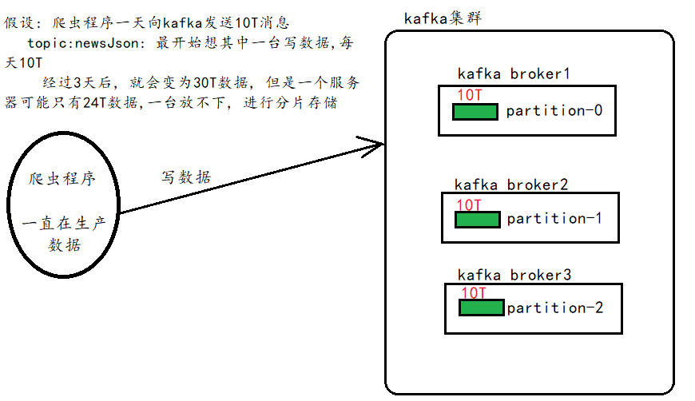


​	**副本**：副本备份机制解决了**数据存储的高可用**问题

​	当数据只保存一份的时候，有丢失的风险。为了更好的容错和容灾，将数据拷贝几份，保存到不同的机器上。

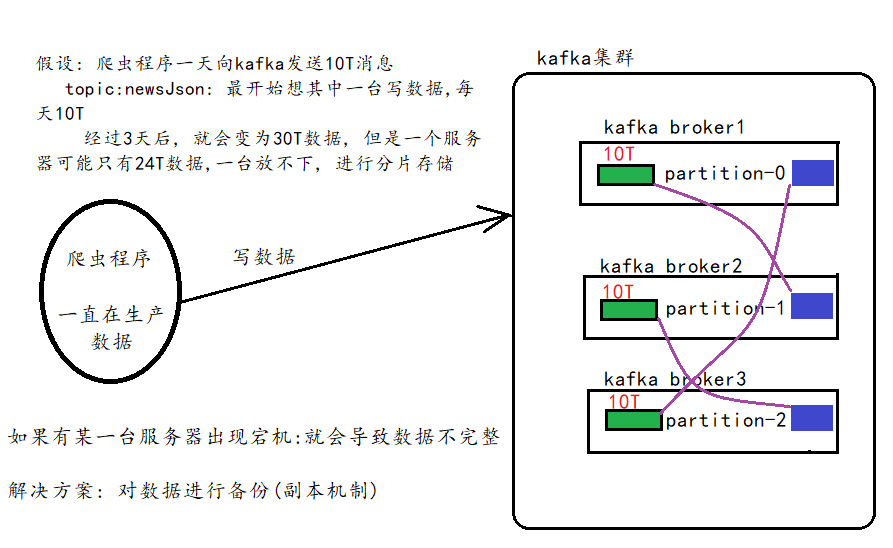

### 5.2 kafka保证数据不丢失机制

#### 5.2.1 保证生产者端不丢失

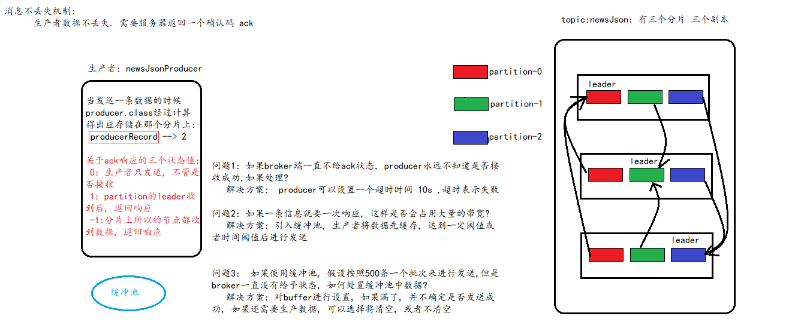

1）  消息生产分为同步模式和异步模式

2）  消息确认分为三个状态

​	a) 0：生产者只负责发送数据

​	b) 1：某个partition的leader收到数据给出响应

​	c) -1(all)：某个partition的所有副本都收到数据后给出响应

3）  在同步模式下  :  

​	a) 生产者等待10S，如果broker没有给出ack响应，就认为失败。

​	b) 生产者重试3次，如果还没有响应，就报错。 props.put("retries", 0)

4）  在异步模式下

​	a) 先将数据保存在生产者端的buffer中。Buffer大小是2万条。

​	b) 满足数据阈值或者数量(时间)阈值其中的一个条件就可以发送数据。

​			props.put("batch.size", 16384); 数据阈值

​			props.put("linger.ms", 1); 时间阈值

​	c) 发送一批数据的大小是500条。

**如果broker迟迟不给ack，而buffer又满了。**

**开发者可以设置是否直接清空buffer中的数据。**

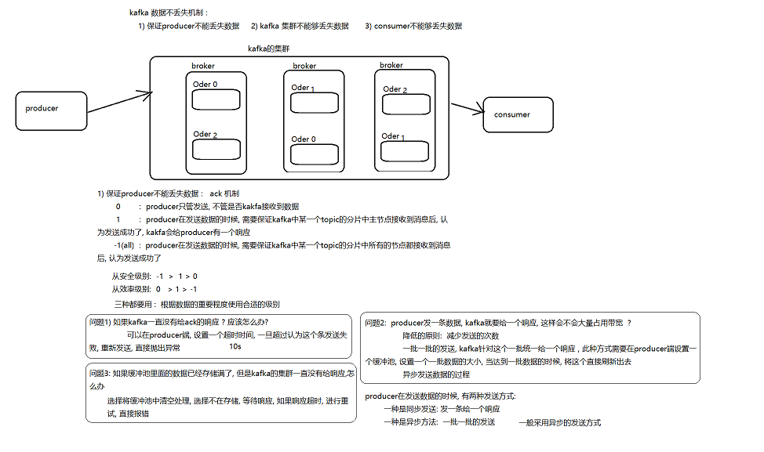

#### 5.2.2 broker端消息不丢失

broker端的消息不丢失，其实就是用partition副本机制(高可用)来保证。

Producer  ack  -1(all). 能够保证所有的副本都同步好了数据。其中一台机器挂了，并不影响数据的完整性。

#### 5.2.3 消费端消息不丢失

> offset  : 偏移量
>
> ​	记录消费者消费到那个数据上

​	通过offset commit 来保证数据的不丢失，kafka自己记录了每次消费的offset数值，下次继续消费的时候，会接着上次的offset进行消费。

而offset的信息在kafka0.8版本之前保存在zookeeper中，在0.8版本之后保存到topic中，即使消费者在运行过程中挂掉了，再次启动的时候会找到offset的值，找到之前消费消息的位置，接着消费，由于offset的信息写入的时候并不是每条消息消费完成后都写入的，所以这种情况有可能会造成重复消费，但是不会丢失消息。


如何判断某一个消费者的偏移量放置在50个分组中那个组当中: 通过消费者的groupid

​	(groupid对hashCode()) & 50  得到


kafka会存在重复消费的问题:


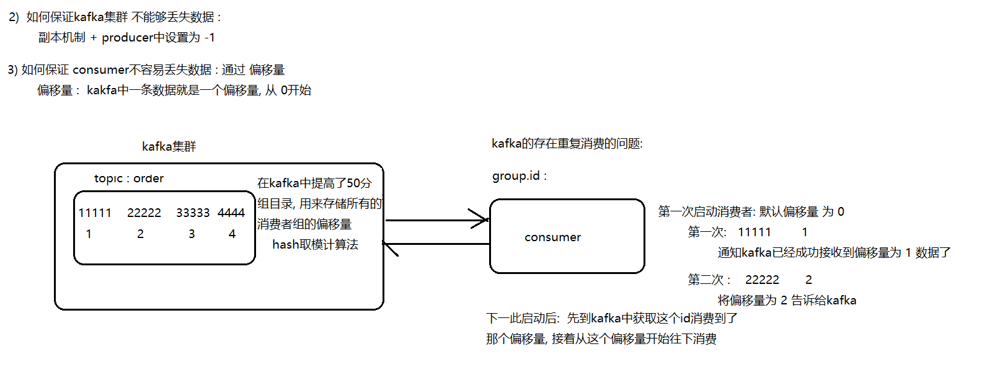  

### 5.3 消息存储及查询机制

#### 5.3.1 文件存储机制


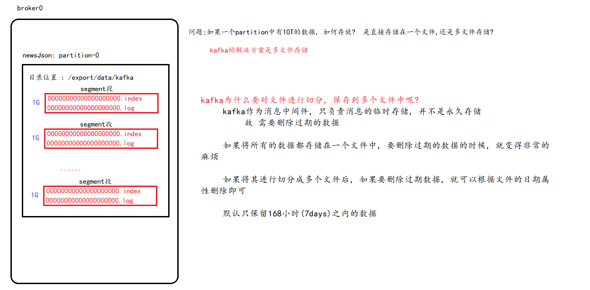

​	segment段中有两个核心的文件一个是log,一个是index。 当log文件等于1G时，新的会写入到下一个segment中。

通过下图中的数据，可以看到一个segment段差不多会存储70万条数据。

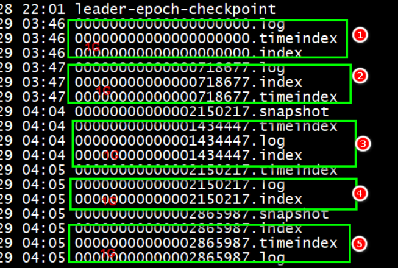


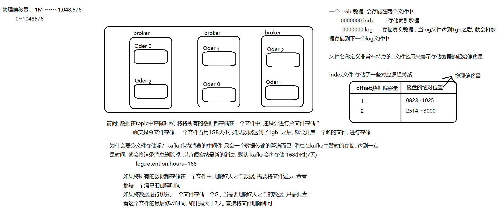

#### 5.3.2 文件查询机制 : 

> 需求: 读取 offset=368776 的message消息数据

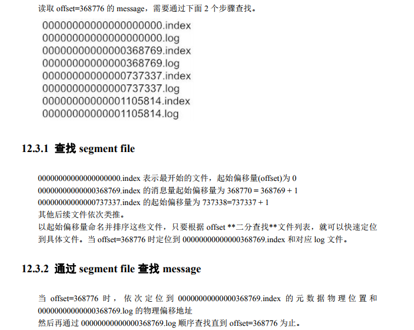

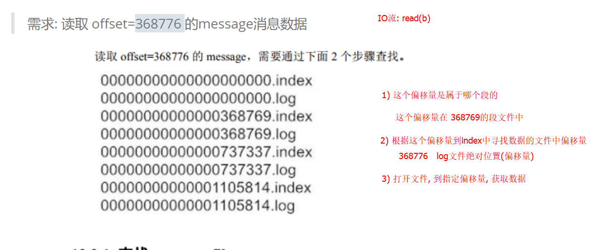


### 5.4 生产者数据分发策略

​	kafka在数据生产的时候，有一个数据分发策略。默认的情况使用DefaultPartitioner.class类。

这个类中就定义数据分发的策略。


````
数据分发:  ProducerRecord对象
	参数1:  发往topic的名称   参数2: 表示要发送到那个分片上  参数3: key值  参数4: 数据value
	public ProducerRecord(String topic, Integer partition, K key, V value) {
        this(topic, partition, (Long)null, key, value, (Iterable)null);
    }
	1) 执行要往那个分片上发送数据, 如果指定了分片, 那么就不会使用系统默认的分发策略
````

1） 如果是用户制定了partition，生产就不会调用DefaultPartitioner.partition()方法

​	数据分发策略的时候，可以指定数据发往哪个partition。

​	当ProducerRecord 的构造参数中有partition的时候，就可以发送到对应partition上

```java
/**
 * Creates a record to be sent to a specified topic and partition
 *
 * @param topic The topic the record will be appended to
 * @param partition The partition to which the record should be sent
 * @param key The key that will be included in the record
 * @param value The record contents
 */
public ProducerRecord(String topic, Integer partition, K key, V value) {
    this(topic, partition, null, key, value, null);
}
```

2） 当用户指定key，使用hash算法。如果key一直不变，同一个key算出来的hash值是个固定值。如果是固定值，这种hash取模就没有意义。

```
Utils.toPositive(Utils.murmur2(keyBytes)) % numPartitions
```

​	如果生产者没有指定partition，但是发送消息中有key，就key的hash值。

```java
/**
 * Create a record to be sent to Kafka
 * 
 * @param topic The topic the record will be appended to
 * @param key The key that will be included in the record
 * @param value The record contents
 */
public ProducerRecord(String topic, K key, V value) {
    this(topic, null, null, key, value, null);
}      
```

3） 当用户既没有指定partition也没有key。

​	使用轮询的方式发送数据。

```java
/**
 * Create a record with no key
 * 
 * @param topic The topic this record should be sent to
 * @param value The record contents
 */
public ProducerRecord(String topic, V value) {
    this(topic, null, null, null, value, null);
}
```


### 5.5 消费者负载均衡机制

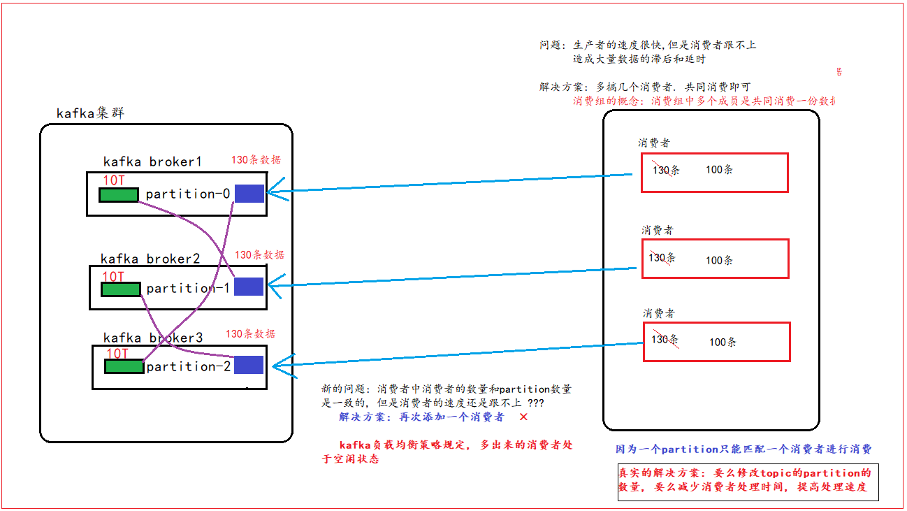

​	一个partition可以被一个组中某一个成员消费

​	所以如果消费组中有多于partition数量的消费者，那么一定会有消费者无法消费数据。

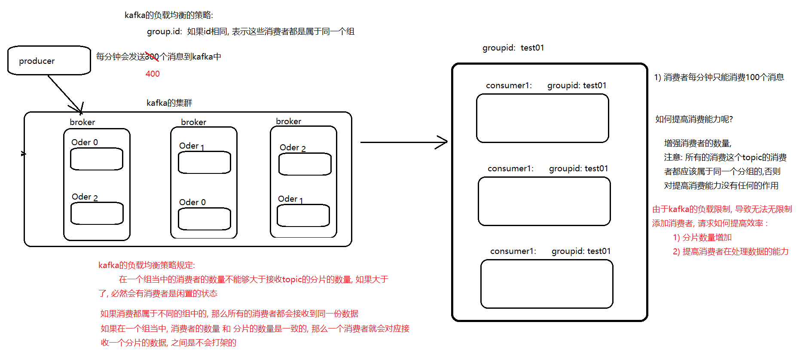

## 6. kafka的自动化脚本

> 创建一个sbin的目录

```
mkdir -p /export/servers/kafka/sbin
cd /export/servers/kafka/sbin
参考下图, 创建对应的文件和脚本即可:  直接上传资料中的脚本内容即可

使用rz上传即可

上传后需要对.sh文件赋权限:  
cd /export/servers/kafka/sbin
chmod 755 *.sh
```

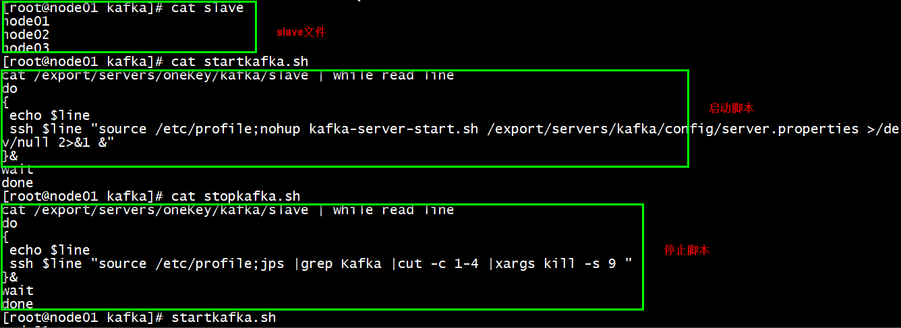


> 原理:  先按照听完课后, 自己先进行理解(不要看视频)
>
> ​	在看一下视频,   

