#  娱乐头条-日志监控告警系统

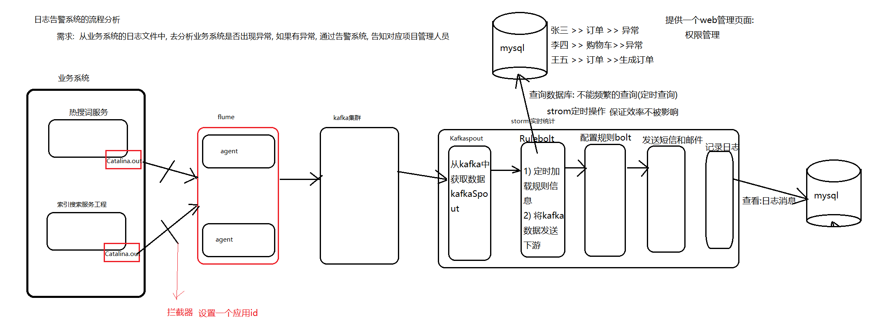

## 1.日志采集框架Flume

### 1.1.Flume介绍

​	使用flume, 不需要编写一行的代码, 只需要进行简单配置即可, 学习flume就是学习如何配置

#### 1.1.1.概述

官网：http://flume.apache.org/

cdh官网网址:  http://archive.cloudera.com/cdh5/cdh/5/

* Flume是一个分布式、可靠、和高可用的海量日志采集、聚合和传输的系统。

* Flume可以采集文件，socket数据包、文件、文件夹、kafka等各种形式源数据，又可以将采集到的数据(下沉sink)输出到HDFS、hbase、hive、kafka等众多外部存储系统中

* 一般的采集需求，**通过对flume的简单配置即可实现**

* Flume针对特殊场景也具备良好的自定义扩展能力

因此，flume可以适用于大部分的日常数据采集场景

#### 1.1.2.运行机制

* Flume分布式系统中**最核心的角色是agent**，flume采集系统就是由一个个agent所连接起来形成

* **每一个agent相当于一个数据传递员，内部有三个组件：**
  * Source：采集组件，用于跟数据源对接，以获取数据
  * Sink：下沉组件，用于往下一级agent传递数据或者往最终存储系统传递数据
  * Channel：传输通道组件，用于从source将数据传递到sink

#### 1.1.3.系统结构

* 简单结构

  单个agent采集数据

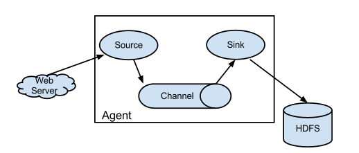

* 复杂结构

  多级agent之间串联

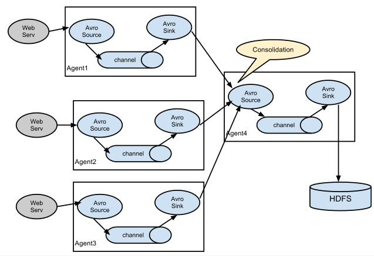

### 1.2Flume实战

#### 1.2.1.Flume的部署安装

下载地址：<http://archive.cloudera.com/cdh5/cdh/5/flume-ng-1.6.0-cdh5.14.0.tar.gz>

案例：使用网络telent命令向一台机器发送一些网络数据，然后通过flume采集网络端口数据

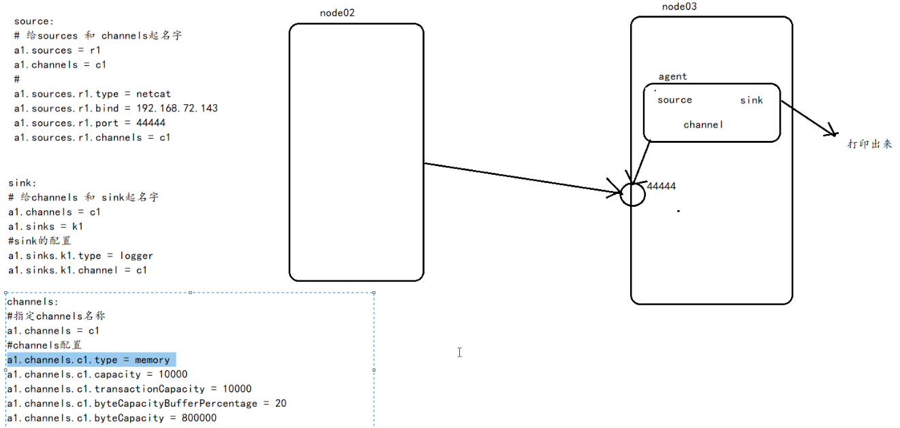

**第一步：下载解压修改配置文件**

Flume的安装很简单(143)

```properties
#上传解压
tar -zxvf flume-ng-1.6.0-cdh5.14.0.tar.gz -C /export/servers/
cd /export/servers/apache-flume-1.6.0-cdh5.14.0-bin/conf
#获取配置文件
cp flume-env.sh.template flume-env.sh
#查看JDK安装目录
echo $JAVA_HOME
#修改配置文件
vim flume-env.sh
export JAVA_HOME=/export/servers/jdk1.8.0_144
```

**第二步：开发配置文件**

​	根据数据采集的需求**配置采集方案**，描述在配置文件中(文件名可任意自定义)

 	参考：

​	http://archive.cloudera.com/cdh5/cdh/5/

​	http://archive.cloudera.com/cdh5/cdh/5/flume-ng-1.6.0-cdh5.14.0/

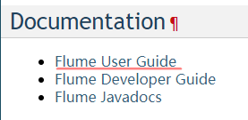

**配置我们的网络收集的配置文件**

**source**--端口

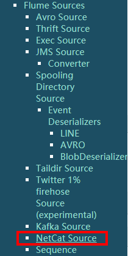

**channel**--内存

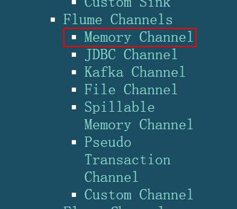

**sink**--日志打印

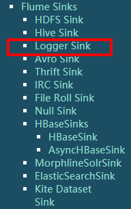

在flume的conf目录下新建一个配置文件（采集方案）

```properties
vim /export/servers/apache-flume-1.6.0-cdh5.14.0-bin/conf/netcat-logger.conf
```

```properties
# 定义这个agent中各组件的名字
a1.sources = r1
a1.sinks = k1
a1.channels = c1

# 描述和配置source组件：r1
a1.sources.r1.type = netcat
a1.sources.r1.bind = 192.168.72.143
a1.sources.r1.port = 44444

# 描述和配置sink组件：k1
a1.sinks.k1.type = logger


# 描述和配置channel组件，此处使用是内存缓存的方式
a1.channels.c1.type = memory
a1.channels.c1.capacity = 1000
a1.channels.c1.transactionCapacity = 100

# 描述和配置source  channel   sink之间的连接关系
a1.sources.r1.channels = c1
a1.sinks.k1.channel = c1
```

**第三步：启动配置文件**

​	**指定采集方案配置文件**，在相应的节点上启动flume agent

​	先用一个最简单的例子来测试一下程序环境是否正常

启动agent去采集数据

```properties
cd ${flume-HOME}/bin/

./flume-ng agent -c ../conf -f ../conf/netcat-logger.conf -n a1 -Dflume.root.logger=INFO,console

-c conf   					指定flume自身的配置文件所在目录
-f conf/netcat-logger.conf  指定我们所描述的采集方案
-n a1  						指定我们这个agent的名字
```

**第四步：安装telent准备测试**

在node02(142)机器上面安装telnet客户端，用于模拟数据的发送

```properties
yum -y install telnet
#使用telnet模拟数据发送
telnet node03 44444
```

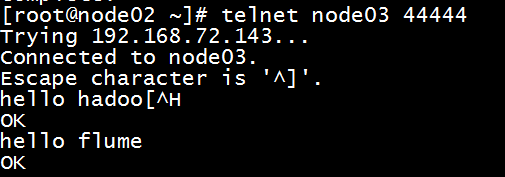


#### 1.2.2.Flume与kafka的整合

需求:

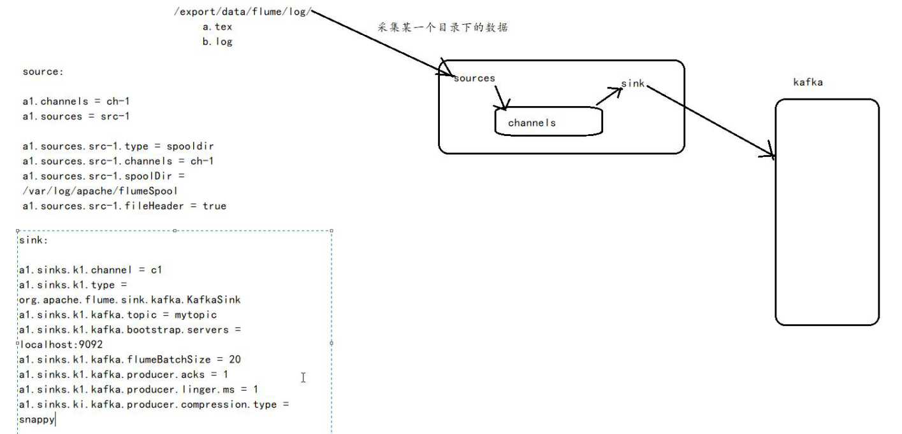

source--文件夹

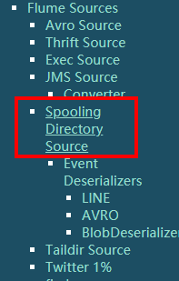

sink--kafka

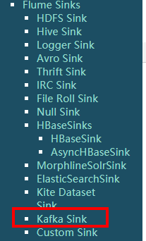

```properties
mkdir -p /export/data/flumedata
vim /export/servers/apache-flume-1.6.0-cdh5.14.0-bin/conf/flume_kafka.conf
```

flume_kafka.conf

```properties
#为我们的source channel  sink起名
a1.sources = r1
a1.channels = c1
a1.sinks = k1
#指定我们的source收集到的数据发送到哪个管道
a1.sources.r1.channels = c1
#指定我们的source数据收集策略
a1.sources.r1.type = spooldir
a1.sources.r1.spoolDir = /export/data/flumedata
a1.sources.r1.deletePolicy = never
a1.sources.r1.fileSuffix = .COMPLETED
a1.sources.r1.ignorePattern = ^(.)*\\.tmp$
a1.sources.r1.inputCharset = GBK
#指定我们的channel为memory,即表示所有的数据都装进memory当中
a1.channels.c1.type = memory
#指定我们的sink为kafka  sink，并指定我们的sink从哪个channel当中读取数据
a1.sinks.k1.channel = c1
a1.sinks.k1.type = org.apache.flume.sink.kafka.KafkaSink
a1.sinks.k1.kafka.topic = flume-test
a1.sinks.k1.kafka.bootstrap.servers = node01:9092,node02:9092,node03:9092
a1.sinks.k1.kafka.flumeBatchSize = 20
a1.sinks.k1.kafka.producer.acks = 1
```

先启动kafka的集群

创建测试topic：flume-test

```properties
cd /export/servers/kafka/bin

./kafka-topics.sh --create --zookeeper node01:2181 --topic flume-test --replication-factor 2 --partitions 3
#启动消费者

./kafka-console-consumer.sh --zookeeper node01:2181 --topic flume-test
```

启动flume

```properties
cd /export/servers/apache-flume-1.6.0-cdh5.14.0-bin/bin

./flume-ng agent -c ../conf -f ../conf/flume_kafka.conf -n a1 -Dflume.root.logger=INFO,console
```

上传测试文件到检测文件夹目录


消费结果


**注意**：这里相同的文件不要重复上传，flume很脆弱呀：（


如果是上传一个同名文件,第一次会进行收集,第二次上传相同名称的文件,就无法进行修改文件的名称,然后就会报错

一旦报错,flume就无法收集了,需要将错误解决到,重启flume

## 2.日志监控告警系统

### 2.1.需求分析

​	实现项目中日志监控的功能，需要做到日志监控实时告警，例如系统中出现任何异常，触发任何的告警规则，都可以实时通过短信或者邮件告知相关系统负责人

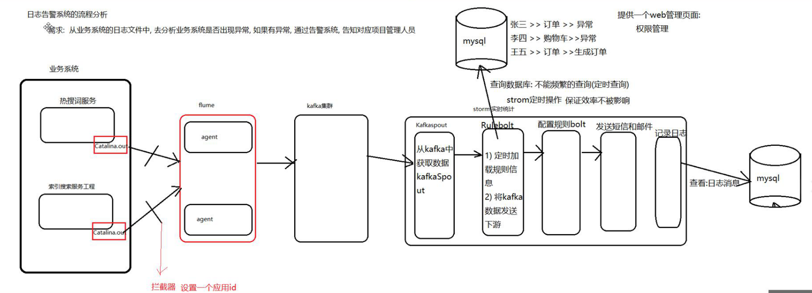

### 2.2.开发准备

#### 2.2.1.错误日志生成

上传日志生成jar及脚本任意位置（node03上）: 放置的目录: 

mkdir -p /export/servers/jar


错误日志生成，直接运行loggen.sh这个脚本(启动前先赋值权限chmod 755 loggen.sh)，就会在/export/data/flume/click_log  这个目录下生成一个文件叫做error.log的日志文件

```
mkdir -p /export/data/flume/click_log  
```


运行测试


#### 2.2.2 创建日志topic

```properties
进入到kafka的bin目录下创建topic
cd /export/servers/kafka/bin

./kafka-topics.sh --create  --partitions 3 --replication-factor 2 --topic log-monitor --zookeeper node01:2181,node02:2181,node03:2181


```

#### 2.2.3 Flume自定义拦截器(了解)

功能需求：Flume需要清楚每条日志来源的系统，实现在每条日志前面加上一个appId来做唯一标识。

**注意：资料当中已经提供好了的jar包，直接放到flume的lib目录下即可**

```
cd /export/servers/apache-flume-1.6.0-cdh5.14.0-bin/lib
```


#### 2.2.4配置flume配置文件

source--检测文件

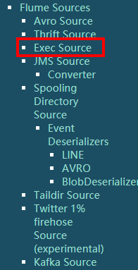

在flume的conf目录创建app_interceptor.conf

```
cd /export/servers/apache-flume-1.6.0-cdh5.14.0-bin/conf

vi app_interceptor.conf
```

```properties
a1.sources = r1
a1.channels = c1
a1.sinks = k1

a1.sources.r1.type = exec
a1.sources.r1.command = tail -F /export/data/flume/click_log/error.log
a1.sources.r1.channels = c1
a1.sources.r1.interceptors = i1
a1.sources.r1.interceptors.i1.type = cn.itcast.realtime.flume.AppInterceptor$AppInterceptorBuilder
a1.sources.r1.interceptors.i1.appId = 1

a1.channels.c1.type=memory
a1.channels.c1.capacity=10000
a1.channels.c1.transactionCapacity=100

a1.sinks.k1.type = org.apache.flume.sink.kafka.KafkaSink
a1.sinks.k1.topic = log-monitor
a1.sinks.k1.brokerList = node01:9092
a1.sinks.k1.requiredAcks = 1
a1.sinks.k1.batchSize = 20
a1.sinks.k1.channel = c1
```

启动flume

```properties
cd /export/servers/apache-flume-1.6.0-cdh5.14.0-bin/bin

./flume-ng agent -n a1 -c ../conf -f ../conf/app_interceptor.conf -Dflume.root.logger=INFO,console
```

在kafka的bin目录启动:控制台启动kafka消费者测试

```properties
./kafka-console-consumer.sh  --topic log-monitor --zookeeper node01:2181,node02:2181,node03:2181
```


#### 2.2.5.创建数据库表

```sql
USE `log_monitor`;
/*Table structure for table `log_monitor_app` */
DROP TABLE IF EXISTS `log_monitor_app`;
CREATE TABLE `log_monitor_app` (
  `appId` int(11) NOT NULL AUTO_INCREMENT COMMENT '应用编号',
  `name` varchar(100) DEFAULT NULL COMMENT '应用名称',
  `desc` varchar(250) DEFAULT NULL COMMENT '应用简要描述',
  `isOnline` int(1) DEFAULT NULL COMMENT '应用是否在线',
  `typeId` int(1) DEFAULT NULL COMMENT '应用类型对应的ID',
  `createDate` timestamp NOT NULL DEFAULT CURRENT_TIMESTAMP ON UPDATE CURRENT_TIMESTAMP COMMENT '应用录入时间',
  `updateaDate` timestamp NOT NULL DEFAULT '0000-00-00 00:00:00' COMMENT '应用信息修改时间',
  `createUser` varchar(100) DEFAULT NULL COMMENT '创建用户',
  `updateUser` varchar(100) DEFAULT NULL COMMENT '修改用户',
  PRIMARY KEY (`appId`)
) ENGINE=InnoDB AUTO_INCREMENT=3 DEFAULT CHARSET=utf8;

/*Data for the table `log_monitor_app` */

insert  into `log_monitor_app`(`appId`,`name`,`desc`,`isOnline`,`typeId`,`createDate`,`updateaDate`,`createUser`,`updateUser`) values (1,'storm集群','storm集群',1,1,'2018-01-10 10:43:22','2015-11-11 16:58:21','laowang','laowang'),(2,'java应用','java应用',1,1,'2018-02-27 15:50:23','2015-11-12 09:55:45','laowang','laowang');

/*Table structure for table `log_monitor_rule` */

DROP TABLE IF EXISTS `log_monitor_rule`;

CREATE TABLE `log_monitor_rule` (
  `ruleId` int(11) NOT NULL AUTO_INCREMENT COMMENT '规则编号，自增长',
  `name` varchar(100) DEFAULT NULL COMMENT '规则名称',
  `desc` varchar(250) DEFAULT NULL COMMENT '规则描述',
  `keyword` varchar(100) DEFAULT NULL COMMENT '规则关键词',
  `isValid` int(1) DEFAULT NULL COMMENT '规则是否可用',
  `appId` int(11) DEFAULT NULL COMMENT '规则所属应用',
  `createDate` timestamp NOT NULL DEFAULT CURRENT_TIMESTAMP ON UPDATE CURRENT_TIMESTAMP COMMENT '规则创建时间',
  `updateDate` timestamp NOT NULL DEFAULT '0000-00-00 00:00:00' COMMENT '规则修改时间',
  `createUser` varchar(100) DEFAULT NULL COMMENT '创建用户',
  `updateUser` varchar(100) DEFAULT NULL COMMENT '修改用户',
  PRIMARY KEY (`ruleId`)
) ENGINE=InnoDB AUTO_INCREMENT=4 DEFAULT CHARSET=utf8;

/*Data for the table `log_monitor_rule` */

insert  into `log_monitor_rule`(`ruleId`,`name`,`desc`,`keyword`,`isValid`,`appId`,`createDate`,`updateDate`,`createUser`,`updateUser`) values (1,'exe','Exception','Exception',1,1,'2018-01-10 10:44:14','2015-11-11 16:57:25','laowang','laowang'),(2,'sys','测试数据','sys',1,2,'2018-01-11 14:21:21','2015-11-11 16:57:25','laowang','laowang'),(3,'error','错误信息','error',1,3,'2018-01-10 10:44:14','2015-11-12 16:00:58','laowang','laowang');

/*Table structure for table `log_monitor_rule_record` */

DROP TABLE IF EXISTS `log_monitor_rule_record`;

CREATE TABLE `log_monitor_rule_record` (
  `recordId` bigint(20) NOT NULL AUTO_INCREMENT COMMENT '告警信息编号',
  `appId` int(11) DEFAULT NULL COMMENT '告警信息所属应用编号',
  `ruleId` int(11) DEFAULT NULL COMMENT '告警信息所属规则编号',
  `isEmail` int(11) DEFAULT '0' COMMENT '是否邮件告知，0：未告知  1：告知',
  `isPhone` int(11) DEFAULT '0' COMMENT '是否短信告知，0：未告知  1：告知',
  `isClose` int(11) DEFAULT '0' COMMENT '是否处理完毕，0：未处理  1：已处理',
  `noticeInfo` varchar(500) DEFAULT NULL COMMENT '告警信息明细',
  `createDate` datetime DEFAULT NULL COMMENT '告警信息入库时间',
  `updateDate` datetime DEFAULT NULL COMMENT '告警信息修改时间',
  PRIMARY KEY (`recordId`)
) ENGINE=InnoDB AUTO_INCREMENT=9 DEFAULT CHARSET=utf8;

/*Data for the table `log_monitor_rule_record` */

insert  into `log_monitor_rule_record`(`recordId`,`appId`,`ruleId`,`isEmail`,`isPhone`,`isClose`,`noticeInfo`,`createDate`,`updateDate`) values (1,1,NULL,1,1,1,'尊敬的项目负责人，你的项目出现了问题，请及时查看1error Exception in thread main java.lang.NumberFormatException: null 20. .','2018-03-20 16:29:39','2018-03-20 16:29:39'),(2,1,NULL,1,1,1,'尊敬的项目负责人，你的项目出现了问题，请及时查看1error java.lang.IllegalArgumentException','2018-03-20 16:29:39','2018-03-20 16:29:39'),(3,1,NULL,1,1,1,'尊敬的项目负责人，你的项目出现了问题，请及时查看1error C2555: \'B::f1\': overriding virtual function differs from \'A::f1\' only by return type or calling convention','2018-03-20 16:29:42','2018-03-20 16:29:42'),(4,1,NULL,1,1,1,'尊敬的项目负责人，你的项目出现了问题，请及时查看1error Unable to connect to any of the specified MySQL hosts.','2018-03-20 16:29:45','2018-03-20 16:29:45'),(5,1,NULL,1,1,1,'尊敬的项目负责人，你的项目出现了问题，请及时查看1error org.apache.jasper.servlet.JspServletWrapper.handleJspException(JspServletWrapper.java:467','2018-03-20 16:29:47','2018-03-20 16:29:47'),(6,1,NULL,1,1,1,'尊敬的项目负责人，你的项目出现了问题，请及时查看1error java.lang.StackOverflowError','2018-03-20 16:29:51','2018-03-20 16:29:51'),(7,1,NULL,1,1,1,'尊敬的项目负责人，你的项目出现了问题，请及时查看1error java.lang.ClassNotFoundException','2018-03-20 16:29:53','2018-03-20 16:29:53'),(8,1,NULL,1,1,1,'尊敬的项目负责人，你的项目出现了问题，请及时查看1error:Java.lang.IllegalStateException','2018-03-20 16:29:56','2018-03-20 16:29:56');

/*Table structure for table `log_monitor_user` */

DROP TABLE IF EXISTS `log_monitor_user`;

CREATE TABLE `log_monitor_user` (
  `userId` bigint(20) NOT NULL AUTO_INCREMENT COMMENT '用户编号，自增长',
  `name` varchar(20) DEFAULT NULL COMMENT '用户名称',
  `mobile` varchar(11) DEFAULT NULL COMMENT '用户手机号码',
  `email` varchar(50) DEFAULT NULL COMMENT '用户的邮箱地址，默认为公司邮箱',
  `isValid` int(1) DEFAULT NULL COMMENT '用户是否有效',
  `createDate` timestamp NOT NULL DEFAULT CURRENT_TIMESTAMP ON UPDATE CURRENT_TIMESTAMP COMMENT '用户录入时间',
  `updateDate` timestamp NOT NULL DEFAULT '0000-00-00 00:00:00' COMMENT '用户信息修改时间',
  `createUser` varchar(100) DEFAULT NULL COMMENT '创建用户',
  `updateUser` varchar(100) DEFAULT NULL COMMENT '修改用户',
  `chargeAppId` int(6) DEFAULT NULL COMMENT '该人所负责的appId',
  PRIMARY KEY (`userId`)
) ENGINE=InnoDB AUTO_INCREMENT=4 DEFAULT CHARSET=utf8;

/*Data for the table `log_monitor_user` */

insert  into `log_monitor_user`(`userId`,`name`,`mobile`,`email`,`isValid`,`createDate`,`updateDate`,`createUser`,`updateUser`,`chargeAppId`) values (1,'zhangsan','13391508372','zhaojiale@itcast.cn',1,'2018-01-11 14:51:56','2015-11-11 16:59:13','laowang','laowang',1),(2,'lisi','17600600238','zhaojiale@itcast.cn',1,'2018-01-11 14:52:01','2015-11-12 15:00:16','laowang','laowang',1),(3,'wangwu','17600600238','zhaojiale@itcast.cn',1,'2018-01-11 14:52:05','2015-11-12 15:01:13','laowang','laowang',1);
```

### 2.3系统开发

#### 2.3.1.工程搭建

创建jar工程gossip-log-monitor

添加pom依赖

```xml
<dependencies>
    <!--邮件发送-->
    <dependency>
        <groupId>javax.mail</groupId>
        <artifactId>mail</artifactId>
        <version>1.4.1</version>
    </dependency>
    <!--storm-->
    <dependency>
        <groupId>org.apache.storm</groupId>
        <artifactId>storm-core</artifactId>
        <version>1.1.1</version>
        <!--<scope>provided</scope>-->
    </dependency>
	<!--spring相关-->
    <dependency>
        <groupId>org.springframework</groupId>
        <artifactId>spring-jdbc</artifactId>
        <version>4.2.4.RELEASE</version>
    </dependency>
    <dependency>
        <groupId>org.springframework</groupId>
        <artifactId>spring-core</artifactId>
        <version>4.2.4.RELEASE</version>
    </dependency>
    <dependency>
        <groupId>org.springframework</groupId>
        <artifactId>spring-context</artifactId>
        <version>4.2.4.RELEASE</version>
    </dependency>

    <dependency>
        <groupId>org.springframework</groupId>
        <artifactId>spring-beans</artifactId>
        <version>4.2.4.RELEASE</version>
    </dependency>
    <dependency>
        <groupId>org.springframework</groupId>
        <artifactId>spring-expression</artifactId>
        <version>4.2.4.RELEASE</version>
    </dependency>
    <!--连接池-->
    <dependency>
        <groupId>com.alibaba</groupId>
        <artifactId>druid</artifactId>
        <version>1.0.18</version>
    </dependency>
    <!--http-->
    <dependency>
        <groupId>org.apache.httpcomponents</groupId>
        <artifactId>httpclient</artifactId>
        <version>4.5.4</version>
    </dependency>
    <!--
    <dependency>
        <groupId>org.apache.httpcomponents</groupId>
        <artifactId>httpcore</artifactId>
        <version>4.5.4</version>
    </dependency>
	-->
    <!--日志-->
    <dependency>
        <groupId>log4j</groupId>
        <artifactId>log4j</artifactId>
        <version>1.2.17</version>
    </dependency>
    <!--json转化-->
    <dependency>
        <groupId>com.alibaba</groupId>
        <artifactId>fastjson</artifactId>
        <version>1.2.41</version>
    </dependency>
    <!--storm集成kafka-->
    <dependency>
        <groupId>org.apache.storm</groupId>
        <artifactId>storm-kafka-client</artifactId>
        <version>1.1.1</version>
    </dependency>
	<!--kafka连接-->
    <dependency>
        <groupId>org.apache.kafka</groupId>
        <artifactId>kafka-clients</artifactId>
        <version>0.10.0.0</version>
    </dependency>
	<!--mysql驱动-->
    <dependency>
        <groupId>mysql</groupId>
        <artifactId>mysql-connector-java</artifactId>
        <version>5.1.38</version>
    </dependency>
</dependencies>

<!-- 编译和打包插件 -->
<build>
        <plugins>
            <plugin>
                <groupId>org.apache.maven.plugins</groupId>
                <artifactId>maven-compiler-plugin</artifactId>
                <version>3.7.0</version>
                <configuration>
                    <source>1.8</source>
                    <target>1.8</target>
                </configuration>
            </plugin>
            <plugin>
                <groupId>org.apache.maven.plugins</groupId>
                <artifactId>maven-shade-plugin</artifactId>
                <version>1.4</version>
                <configuration>
                    <createDependencyReducedPom>true</createDependencyReducedPom>
                </configuration>
                <executions>
                    <execution>
                        <phase>package</phase>
                        <goals>
                            <goal>shade</goal>
                        </goals>
                        <configuration>
                            <transformers>
                                <transformer
                                        implementation="org.apache.maven.plugins.shade.resource.ServicesResourceTransformer"/>
                                <transformer
                                        implementation="org.apache.maven.plugins.shade.resource.ManifestResourceTransformer">
        <!--主程序入口-->                            <mainClass>cn.itcast.realtime.flume.logmonitor.LogMonitorTopo</mainClass>
                                </transformer>
                            </transformers>
                        </configuration>
                    </execution>
                </executions>
            </plugin>
        </plugins>
    </build>
```

导入日志监控告警系统参考代码，注意修改数据库连接参数


注意: 导入后, 要求修改jdbc中连接信息

#### 2.3.2.开发定时任务Bolt

StormTickBolt

​	定时缓存Bolt,并且将从kafka获取到的数据向下游发送

```java
package com.itheima.storm;

import com.itheima.utils.CommonUtils;
import org.apache.storm.Config;
import org.apache.storm.Constants;
import org.apache.storm.topology.BasicOutputCollector;
import org.apache.storm.topology.OutputFieldsDeclarer;
import org.apache.storm.topology.base.BaseBasicBolt;
import org.apache.storm.tuple.Fields;
import org.apache.storm.tuple.Tuple;
import org.apache.storm.utils.Container;

import java.util.Arrays;
import java.util.Map;

// 定时查询规则信息
public class StormTickBolt extends BaseBasicBolt {
    private CommonUtils commonUtils = new CommonUtils();
    @Override
    public Map<String, Object> getComponentConfiguration() {
        Config config = new Config();
        config.put(Config.TOPOLOGY_TICK_TUPLE_FREQ_SECS,5);
        return config;
    }

    @Override
    public void execute(Tuple tuple, BasicOutputCollector collector) {

        if (tuple.getSourceComponent().contains(Constants.SYSTEM_COMPONENT_ID) &&
                tuple.getSourceStreamId().contains(Constants.SYSTEM_TICK_STREAM_ID)){
            // 说明是一个系统的tuple
            // 需要定时将规则读取到内存中
            commonUtils.monitorApp();
            commonUtils.monitorRule();
            commonUtils.monitorUser();

        }else{
            String logs = tuple.getStringByField("value");//获取第五个数据
            System.out.println(logs);
            collector.emit(Arrays.asList(logs));
        }

    }

    @Override
    public void declareOutputFields(OutputFieldsDeclarer declarer) {
        declarer.declare(new Fields("logs"));
    }
}


```

#### 2.3.3.开发规则匹配Bolt

​	规则匹配bolt,获取错误日志，切割后交由工具类校验规则

```java
package com.itheima.storm;

import com.itheima.utils.CommonUtils;
import org.apache.storm.topology.BasicOutputCollector;
import org.apache.storm.topology.OutputFieldsDeclarer;
import org.apache.storm.topology.base.BaseBasicBolt;
import org.apache.storm.tuple.Fields;
import org.apache.storm.tuple.Tuple;

import java.util.Arrays;

public class ProcessDataBolt extends BaseBasicBolt {
    @Override
    public void execute(Tuple tuple, BasicOutputCollector collector) {

        //1. 从tuple中读取数据
        String logs = tuple.getStringByField("logs");

        //2. 将logs切割处理, 获取 APPid  和数据

        String[] split = logs.split("\001");
        String appId = split[0];
        String errorLog = split[1];

        //3. 寻找规则信息:
        String rules = CommonUtils.checkRules(appId, errorLog);

        if(rules != null && !"".equals(rules)){
            // 认为找到了规则了, 往下游发送数据, 让下游发送邮件和短信
            collector.emit(Arrays.asList(logs,rules));
        }
        // 如果没找到规则, 直接丢弃, 不要了 ,
    }

    @Override
    public void declareOutputFields(OutputFieldsDeclarer declarer) {
        declarer.declare(new Fields("logs","rules"));
    }
}


```

#### 2.3.4.短信与邮件通知bolt

```java
package com.itheima.storm;

import com.itheima.utils.CommonUtils;
import org.apache.storm.topology.BasicOutputCollector;
import org.apache.storm.topology.OutputFieldsDeclarer;
import org.apache.storm.topology.base.BaseBasicBolt;
import org.apache.storm.tuple.Fields;
import org.apache.storm.tuple.Tuple;

import java.util.Arrays;

public class NotifyMessageBolt extends BaseBasicBolt {
    @Override
    public void execute(Tuple tuple, BasicOutputCollector collector) {
        try {
            //1. 获取上游的数据
            String logs = tuple.getStringByField("logs");
            String rules = tuple.getStringByField("rules");

            //2. 发送短信和邮件
            CommonUtils.notifyPeople(rules,logs);

            //3. 如果发送完毕, 需要将此条发送记录, 记录到数据库中, 作为备份
            collector.emit(Arrays.asList(rules,logs));
        } catch (Exception e) {
            e.printStackTrace();
        }

    }

    @Override
    public void declareOutputFields(OutputFieldsDeclarer declarer) {
        declarer.declare(new Fields("rules","logs"));
    }
}


```

#### 2.3.5.开发保存日志Bolt

```java
package com.itheima.storm;

import com.itheima.utils.CommonUtils;
import org.apache.storm.topology.BasicOutputCollector;
import org.apache.storm.topology.OutputFieldsDeclarer;
import org.apache.storm.topology.base.BaseBasicBolt;
import org.apache.storm.tuple.Tuple;

public class SaveToDBBolt extends BaseBasicBolt {
    @Override
    public void execute(Tuple tuple, BasicOutputCollector collector) {
        //1. 获取上游的数据
        String rules = tuple.getStringByField("rules");
        String logs = tuple.getStringByField("logs");
        
        //2. 将记录保存数据库中
        CommonUtils.insertToDb(rules,logs);
    }

    @Override
    public void declareOutputFields(OutputFieldsDeclarer declarer) {

    }
}

```

#### 2.3.6.开发程序入口主函数

```java
package com.itheima.storm;

import org.apache.storm.Config;
import org.apache.storm.LocalCluster;
import org.apache.storm.StormSubmitter;

import org.apache.storm.kafka.spout.KafkaSpout;
import org.apache.storm.kafka.spout.KafkaSpoutConfig;
import org.apache.storm.topology.TopologyBuilder;

public class TopologyMain {

    public static void main(String[] args) throws Exception {
        //1. 创建 构建器
        TopologyBuilder builder = new TopologyBuilder();

        KafkaSpoutConfig<String,String> kafkaSpoutConfig = KafkaSpoutConfig
                .builder("node01:9092,node02:9092,node03:9092","log-monitor")
                .setGroupId("test01")
                .setFirstPollOffsetStrategy(KafkaSpoutConfig.FirstPollOffsetStrategy.UNCOMMITTED_LATEST) //从未提交的最后一条数据读
                .build();

        builder.setSpout("KafkaSpout",new KafkaSpout<String,String>(kafkaSpoutConfig));

        builder.setBolt("StormTickBolt",new StormTickBolt()).localOrShuffleGrouping("KafkaSpout");
        builder.setBolt("ProcessDataBolt",new ProcessDataBolt()).localOrShuffleGrouping("StormTickBolt");
        builder.setBolt("NotifyMessageBolt",new NotifyMessageBolt()).localOrShuffleGrouping("ProcessDataBolt");
        builder.setBolt("SaveToDBBolt",new SaveToDBBolt()).localOrShuffleGrouping("NotifyMessageBolt");

        //2. 提交任务
        Config config = new Config();
        if(args != null && args.length >0 ){
            StormSubmitter.submitTopology(args[0],config,builder.createTopology());
        }else {
            LocalCluster cluster = new LocalCluster();

            cluster.submitTopology("log-monitor",config,builder.createTopology());
        }
    }
}

```

运行测试

​	这里发送短信和邮件的测试可能会失败，发送和接收的邮件账户可以换成同学们自己的进行测试，这里能够将数据保存到数据库，说明测试成功。
