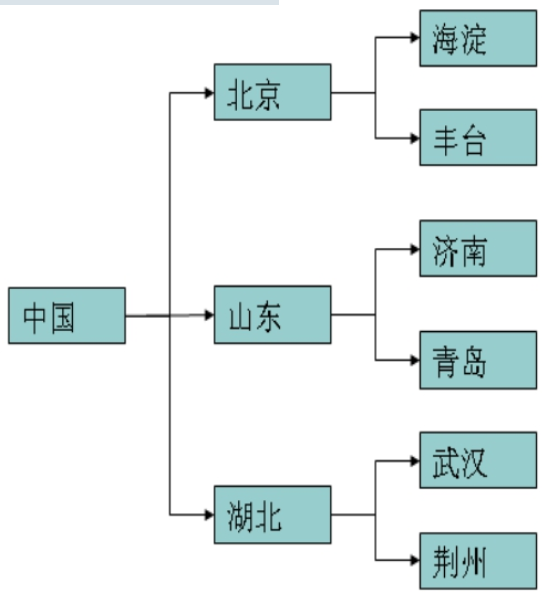
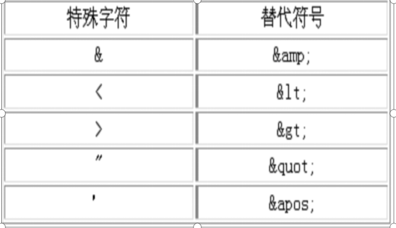

第08天 java基础进阶xml

今日内容介绍

- xml文件的概述与应用场景
- xml文件的组成部分&如何编写xml
- xml的两种解析方式的原理
- *\* Dom4J开源工具的使用

# 第1章 xml的概述与如何编写xml文件

## 1.1 xml语言的概述

### 1.1.1 xml介绍

xml语言是具有结构性的标记语言,  可以灵活的存储一对多的数据关系.

 

​	举例:



​		

​	以上这种数据, 如果通过我们学习的集合来存储的话, 需要通过多个集合的嵌套使用. 

​	那么很显然, 数据存储的过程就非常麻烦, 但是我们今天所学习的xml文件就可以很简单的存储这种一对多的数据

​	至于怎样存储, 我们稍后会详细讲解, 目前需要掌握的是关于xml的使用场景

​		**用来存储一对多的数据** 

​	另外, xml还有一些其他的应用方面:

​		之前学习过properties配置文件, 通过这种配置文件, 可以使代码的编写更加灵活.

​		但是这种配置文件也只能存储一个键值对的映射关系, 如果需要存储多个呢?

​		没错, 可以使用xml , 所以xml的另一方面应用就展示出来了		

​		**用来当做配置文件存储数据**

### 1.1.2 问题: xml文件是用来做什么的?

核心思想：

​		答：存储数据

​			延伸问题： xml是怎样存储数据的？

​				答：以标签的形式存储  

​				例:  <name>Jack</name>

## 1.2 xml的文档声明

### 1.2.1 Xml文件的组成部分

文档声明

元素

元素的属性

注释

*CDATA区*

*特殊字符*

*处理指令(PI:Processing Instruction)：了解*

 

​	斜体标注的内容：不作为掌握，了解即可

### 1.2.2 文档声明

什么是文档声明?

​	在编写XML文档时，需要先使用文档声明来声明XML文档。且必须出现在文档的第一行

​	这就好比我们在写java文件的时候需要声明class一样, 就是个硬性的规定.

 

如何编写文档声明?

​	<?xml version='1.0' encoding='UTF-8'?>

 

​	xml表示标签的名字

​	version表示当前文件的版本号

​	encoding表示当前编码, 需要跟文件的编码产生对应关系

 

​	ps: standalone表示标记此文档是否独立

​		了解即可

## 1.3 xml的元素

### 1.3.1 什么是元素? 元素该如何编写? 

1:	 xml中的元素其实就是一个个的标签

 2:	 标签分为两种
            a: 包含标签体
                理解: 尖括号全部成对儿出现, 所有的数据都用一对儿尖括号存储
                例:

```xml
<student>
    <name>zhangsan</name>
    <age>18</age>
</student>
```

         b: 不包含标签体
                理解: 只有最外层的一个尖括号,括号用/标识结束, 内部的数据都用属性来编写

````xml
<student 
         name="zhangsan"
         age="18"
         />
````

                 两种方式都需要掌握, 但是第二种编写起来会更加方便

### 1.3.2 标签(元素的书写规范)

严格区分大小写；<p><P>
只能以字母或下划线开头；abc _abc

不能以xml(或XML、Xml等)开头----W3C保留日后使用；

名称字符之间不能有空格或制表符；

名称字符之间不能使用冒号 : (有特殊用途)

### 1.3.3 元素中属性的注意事项

​           一个元素可以有多个属性，每个属性都有它自己的名称和取值。
​            属性值一定要用引号(单引号或双引号)引起来。
​            属性名称的命名规范与元素的命名规范相同
​            元素中的属性是不允许重复的
​            在XML技术中，标签属性所代表的信息也可以被改成用子元素的形式来描述
​                例如：

```xml
<?xml version="1.0" encoding="UTF-8"?>
<students>
	<student name="zhangsan" age="18" />
	
	
	<student>
		<name>zhangsan</name>
		<age>18</age>
	</student>
</students>
```

## 1.4 xml的注释

### 1.4.1 格式编写

格式:

​	<!—被注释的内容 -- >

### 1.4.2 注意事项

注意: 注释不能嵌套定义

## 1.5 xml的其他组成部分

### 1.5.1 引入CDATA区

为什么要使用CDATA区域?

 

​	如果我们在标签中写入的内容, 想要带有标签的标记符号的话, 就需要对这段内容进行转义

​	就好比java中的打印语句, 想要打印出”这个字符就必须用/进行转义.

 

​	标签也是一样, 想要将<itheima>当做内容存储的话, 就需要对他进行转义.

 

如何转义?

 

注意:

​	这种转移可以达到效果, 但是如果操作的数据过多, 编写起来会非常痛苦, 所以, 可以使用CDATA区来解决此问题

 

### 1.5.2 实例代码

````xml
<?xml version="1.0" encoding="UTF-8"?>
<!-- 
	如果有一个包含标签体的标签，
	他的标签体是一个普通文本，不是子标签，
	而普通文本中包含了一个标签，那这样可以吗？
-->

<students>
	<student>
		<name>zhangsan</name>
		<url>
			<![CDATA[
				<itheima>www.itheima.com</itheima>
				<itcast>www.itcast.cn</itcast>
			]]>
		</url>
	</student>
	
	
	<student>
		<name>zhangsan</name>
		<url>
			&lt;itheima&gt;www.itheima.com&lt;/itheima&gt;
		</url>
	</student>
</students>
````

## 1.6 DTD的入门案例

### 1.6.1 为什么要有约束 (DTD)?

XML都是用户自定义的标签，若出现小小的错误，软件程序将不能正确地获取文件中的内容而报错。(如：Tomcat)

XML技术中，可以编写一个文档来约束一个XML的书写规范，这个文档称之为约束

### 1.6.2 如何使用DTD约束文件?

1. 编写DTD文件

   ```xml
   <?xml version="1.0" encoding="UTF-8"?>
   <!ELEMENT 书架(书+)>
   	<!ELEMENT 书 (书名,作者,售价)>
   	<!ELEMENT 书名 (#PCDATA)>
   	<!ELEMENT 作者 (#PCDATA)>
   	<!ELEMENT 售价 (#PCDATA)>
   ```

2. 在xml文件中引入DTD文件

   ````xml
   <!DOCTYPE 书架 SYSTEM "book.dtd">
   ````

​	引入了写好的DTD文件后, 格式就必须跟DTD文件保持一致

## 1.7 DTD的细节

### 1.7.1 语法细节

在DTD文档中使用ELEMENT关键字来声明一个XML元素。

• 语法：<!ELEMENT 元素名称 使用规则>

- 使用规则：
  - (#PCDATA):指示元素的主体内容只能是普通的文本.(Parsed Character Data)
  -  EMPTY：用于指示元素的主体为空。比如<br/>
  - ANY:用于指示元素的主体内容为任意类型。
  - (子元素)：指示元素中包含,的子元素

• 定义子元素及描述它们的关系:

– 如果子元素用逗号分开，说明必须按照声明顺序去编写XML文档。

- 如: <!ELEMENT FILE (TITLE,AUTHOR,EMAIL)

– 如果子元素用"|"分开，说明任选其一。

- 如:<!ELEMENT FILE (TITLE|AUTHOR|EMAIL)

– 用+、*、？来表示元素出现的次数

- 如果元素后面没有+*?:表示必须且只能出现一次

- +:表示至少出现一次，一次或多次

- *：表示可有可无，零次、一次或多次

- ?:表示可以有也可以无，有的话只能有一次。零次或一次

 

### 1.7.2 定义属性

• 在DTD文档中使用ATTLIST关键字来为一个元素声明属性。

• 语法：

​		<!ATTLIST 元素名

​			属性名1 属性值类型 设置说明

​			属性名2 属性值类型 设置说明

​			…

​		>

• 属性值类型：

– CDATA：表示属性的取值为普通的文本字符串

– ENUMERATED (DTD没有此关键字)：表示枚举，只能从枚举列表中任选其一，如(鸡肉|牛肉|猪肉|鱼肉)

– ID:表示属性的取值不能重复

• 设置说明

– #REQUIRED：表示该属性必须出现

– #IMPLIED：表示该属性可有可无

– #FIXED:表示属性的取值为一个固定值。语法：#FIXED "固定值"

直接值：表示属性的取值为该默认值

### 1.7.3 实例代码1

```xml
<!ATTLIST 商品
		类别 CDATA #REQUIRED
		颜色 CDATA #IMPLIED
>
<?xml version = "1.0" encoding="GB2312" standalone="yes"?>
	<商品 类别="服装"颜色="黄色" />
```

### 1.7.4 实例代码2

````xml
<?xml version = "1.0" encoding="GB2312" standalone="yes"?>
<!DOCTYPE 购物篮 [
   <!ELEMENT 购物篮 (肉+)>
	<!ELEMENT 肉 EMPTY>
	<!ATTLIST 肉 品种 ( 鸡肉 | 牛肉 | 猪肉 | 鱼肉 ) "鸡肉">
]> 
<购物篮>
	<肉 品种="鱼肉"/>
	<肉 品种="牛肉"/>
	<肉/>
</购物篮>
````

## 1.8 Schema的概述

### 1.8.1 概述

Schema约束自身就是一个XML文件，但它的扩展名通常为.xsd

一个XML Schema文档通常称之为模式文档(约束文档)，遵循这个文档书写的xml文件称之为实例文档。\

XML Schema对名称空间支持得非常好

 

理解:

​	名称空间: 相当于package			

约束文档: 编写好的Person类 		

​	实例文档: 通过Person类创建对象

## 1.9 Schema入门案例

### 1.9.1 实例代码

约束文档:

 ```xml
<?xml version='1.0' encoding='UTF-8' ?> 
<xs:schema xmlns:xs='http://www.w3.org/2001/XMLSchema' 
					 //标准的名称空间
					  targetNamespace='http://www.itheima.com'
						//将该schema文档绑定到http://www.itheima.com名称空间
				>
	<xs:element name='书架' >
		<xs:complexType>
			<xs:sequence maxOccurs='unbounded' >
				<xs:element name='书' >
					<xs:complexType>
						<xs:sequence>
							<xs:element name='书名' type='xs:string' />
							<xs:element name='作者' type='xs:string' />
							<xs:element name='售价' type='xs:string' />
						</xs:sequence>
					</xs:complexType>
				</xs:element>
			</xs:sequence>
		</xs:complexType>
	</xs:element>
	</xs:schema>
 ```

**实例文档**:

````xml
<?xml version="1.0" encoding="UTF-8"?>
<itheima:书架 xmlns:itheima="http://www.itheima.com"
				xmlns:xsi="http://www.w3.org/2001/XMLSchema-instance"
				xsi:schemaLocation="http://www.itheima.com book.xsd">
	<itheima:书>
		<itheima:书名>JavaScript网页开发</itheima:书名>
		<itheima:作者>张孝祥</itheima:作者>
		<itheima:售价>28.00元</itheima:售价>
	</itheima:书>
</itheima:书架>
````

**名称空间**:

```xml
<itheima:书架 xmlns:itheima="http://www.itheima.com"
xmlns:xsi="http://www.w3.org/2001/XMLSchema-instance"
xsi:schemaLocation="http://www.itheima.com book.xsd">
```

### 1.9.2 使用默认名称空间

• 基本格式：

​	xmlns="URI"  

• 举例：

```xml
<书架 xmlns="http://www.it315.org/xmlbook/schema"
		xmlns:xsi="http://www.w3.org/2001/XMLSchema-instance"
		xsi:schemaLocation="http://www.it315.org/xmlbook/schema book.xsd">
		<书>
		<书名>JavaScript网页开发</书名>
		<作者>张孝祥</作者>
		<售价>28.00元</售价>
		</书>
	<书架>

```

# 第2章 解析xml文件

## 2.1 XML解析的两种方式

### 2.1.1 DOM方式和SAX方式

### DOM：Document Object Model，文档对象模型。这种方式是

### W3C推荐的处理XML的一种方式。

### SAX：Simple API for XML。这种方式不是官方标准，属于开源社区XML-DEV，几乎所有的XML解析器都支持它。

### XML解析开发包JAXP：是SUN公司推出的解析标准实现。

### Dom4J：是开源组织推出的解析开发包。(牛，大家都在用，包括SUN公司的一些技术的实现都在用。)

### Dom for java four

### Log4j 

### 2.1.2 总结:

DOM: 将整棵树一口气全部加载到内存当中, 我们可以非常方便的操作任意的标签和属性.

但是, 如果整棵树特别大的时候, 会出现内存溢出的问题

节点: 标签、属性、文本、甚至是换行都称之为节点

SAX: 一个节点一个节点的进行解析(暂不掌握)

## 2.2 Dom4J的方法概述

\* Dom4J的常用方法：

 \* 		Document

 \* 			 Element getRootElement() :获取根元素对象（根标签）

 \* 		Element

 \* 			 List elements() ：获取所有的子元素

 \* 			 List elements(String name)：根据指定的元素名称来获取相应的所有的子元素

 \* 			 Element element(String name)：根据指定的元素名称来获取子元素对象,如果元素名称重复，则获取第一个元素 

 \* 			 String	elementText(String name) ：根据指定的子元素名称，来获取子元素中的文本

 \* 			 String	getText() ：获取当前元素对象的文本

 \* 			 void setText(String text)：设置当前元素对象的文本

 \* 			 String	attributeValue(String name)：根据指定的属性名称获取其对应的值

 \* 			 public Element addAttribute(String name,String value)：根据指定的属性名称和值进行添加或者修改BeanUtils的常用方法

## 2.3 Dom4J的案例 (获取).

### 2.3.1 功能分析

//1、得到某个具体的节点内容:打印"郑州"

//2、遍历所有元素节点:打印他们的元素名称。

​		Ps: 因为不知道有多少个元素节点, 所以需要递归.

 

### 2.3.2 案例代码

````xml
private static void method2() throws Exception {
		//2、遍历所有元素节点:打印他们的元素名称。
		//获取根元素
		Document document = Dom4JUtils.getDocument();
		Element rootElement = document.getRootElement();
		treeWalk(rootElement);
	}
	
	
	public static void treeWalk(Element element) {
		//输出元素的名称
		System.out.println(element.getName());
		
		//获取指定元素的所有子元素
		List<Element> es = element.elements();
		for (Element e : es) {
			treeWalk(e);
		}
	}

	private static void method() throws Exception {
		//1、得到某个具体的节点内容:打印"郑州"
		Document document = Dom4JUtils.getDocument(); 
		//获取根元素
		Element rootElement = document.getRootElement();
		//获取根元素下的所有子元素
		List<Element> elements = rootElement.elements();
		//根据索引获取第一个City元素
		Element cityElement = elements.get(0);
		//根据子元素的名称来获取子元素的文本
		String text = cityElement.elementText("Name");
		System.out.println(text);
	}

<?xml version="1.0" encoding="UTF-8"?>

<State Code="37" Name="河南" 
	description="郑州" GDP="99999亿"> 
  <City> 
    <Name>郑州</Name>  
    <Region>高薪区</Region> 
  </City>  
  <City>三门峡</City>  
  <City>洛阳</City>  
  <City>安阳</City>  
  <City>南阳</City> 
</State>
````

## 2.4 Dom4J的案例(删除和修改)

### 2.4.1 功能分析

//3、修改某个元素节点的主体内容:信阳-->安阳

//6、删除指定元素节点:删除元素开封

 

​	注意: 调用方法完毕, 仅仅是在内存中进行了修改, 需要用到OutputFormat和XMLWirter两个类配合使用

将数据写入到文件

### 2.4.2 实例代码

```java
public static void write2XML(Document document) throws IOException {
OutputFormat format = OutputFormat.createPrettyPrint();
		//format.setEncoding("UTF-8");//默认的编码就是UTF-8
		XMLWriter writer = new XMLWriter( new FileOutputStream("src/com/itheima_04/city.xml"), format );
        writer.write( document );
	}


private static void method3() throws Exception, IOException {
		//3、修改某个元素节点的主体内容:信阳-->安阳
		Document document = Dom4JUtils.getDocument();
		//获取根元素
		Element rootElement = document.getRootElement();
		//获取根元素下的所有子元素
		List<Element> es = rootElement.elements();
		//根据索引可以获取指定的元素
		Element cityElement = es.get(3);
		//修改文本
		cityElement.setText("安阳");
		//写回文件
		Dom4JUtils.write2XML(document);
	}

private static void method4() throws Exception, IOException {
		//6、删除指定元素节点:删除元素开封	
		Document document = Dom4JUtils.getDocument();
		//获取根元素
		Element rootElement = document.getRootElement();
		//获取根元素下的所有子元素
		List<Element> es = rootElement.elements();
		Element cityElement = es.get(1);
		//无法自杀，找他爹
		Element parentElement = cityElement.getParent();
		parentElement.remove(cityElement);
		//写回文件
		Dom4JUtils.write2XML(document);
	}
```

## 2.5 Dom4J的案例(添加)

### 2.5.1 功能分析

​		//4、向指定元素节点中增加子元素节:添加一个新城市<City>南阳</City>

​		//5、向指定元素节点上增加同级元素节点:在洛阳前面，添加一个<City>三门峡</City>

### 2.5.2 案例代码

````java
private static void method5() throws Exception, IOException {
		//4、向指定元素节点中增加子元素节:添加一个新城市<City>南阳</City>
		Document document = Dom4JUtils.getDocument();
		//获取根元素
		Element rootElement = document.getRootElement();
		//添加元素
		Element cityElement = rootElement.addElement("City");
		//设置文本
		cityElement.setText("南阳");
		//写回文件
		Dom4JUtils.write2XML(document);
}

private static void method6() throws Exception, IOException {
		//5、向指定元素节点上增加同级元素节点:在洛阳前面，添加一个<City>三门峡</City>
		//创建一个新的元素对象
		Element cityElement = DocumentHelper.createElement("City");
		//设置文本
		cityElement.setText("三门峡");
		
		Document document = Dom4JUtils.getDocument();
		//获取根元素
		Element rootElement = document.getRootElement();
		//获取根元素下所有的子元素
		List<Element> es = rootElement.elements();
		//将新的元素添加到子元素列表中
		es.add(1, cityElement);
		
		//写会文件
		Dom4JUtils.write2XML(document);
}
````

## 2.6 Dom4J的案例（属性获取和添加）

### 2.6.1 功能分析

​		//7、操作XML文件属性:打印State的Name

​		//8、添加属性：State： GDP="99999亿"

### 2.6.2 案例代码

```java
private static void method7() throws Exception {
		//7、操作XML文件属性:打印State的Name
		Document document = Dom4JUtils.getDocument();
		//获取根元素
		Element rootElement = document.getRootElement();
		//根据属性名称获取值
		String value = rootElement.attributeValue("Name");
		System.out.println(value);
}

public static void main(String[] args) throws Exception  {
		//7、操作XML文件属性:打印State的Name
		//8、添加属性：State： GDP="99999亿"
		Document document = Dom4JUtils.getDocument();
		//获取根元素
		Element rootElement = document.getRootElement();
		//添加新的属性和对应的值
		rootElement.addAttribute("GDP", "99999亿");
		
		//写回文件
		Dom4JUtils.write2XML(document);
}
```